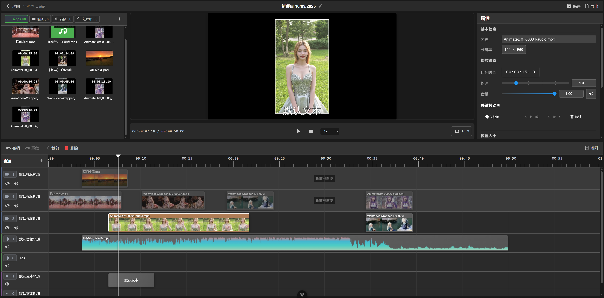

# 光影绘梦 (LightCut)

一个基于Web技术的AI视频编辑器，支持本地文件和远程网络素材的处理与编辑。

## 项目简介

光影绘梦是一个现代化的视频编辑平台，采用前后端分离架构，前端使用Vue 3和TypeScript构建，后端使用Python FastAPI提供API服务。项目实现了统一异步源架构，支持多种媒体格式的处理和编辑。

### 核心特性

- **统一异步源架构**：解决双重类型系统的复杂性问题，提供一致的数据处理接口
- **多格式支持**：支持视频、音频、图片等多种媒体格式
- **本地与远程素材**：支持本地文件上传和远程网络素材下载
- **实时预览**：基于WebAV技术实现视频实时预览和编辑
- **项目管理**：完整的项目创建、编辑、保存和管理功能
- **状态驱动设计**：采用状态机模式，清晰的状态转换流程

## 技术栈

### 前端

- **框架**：Vue 3 + TypeScript
- **状态管理**：Pinia
- **路由**：Vue Router 4
- **UI组件**：自定义组件库
- **视频处理**：WebAV (@webav/av-canvas, @webav/av-cliper)
- **构建工具**：Vite
- **样式**：CSS变量系统，支持主题切换

### 后端

- **框架**：FastAPI
- **服务器**：Uvicorn
- **CORS支持**：跨域资源共享
- **文件处理**：支持多种媒体格式
- **流式传输**：带网速限制的文件流传输

## 项目结构

```
aivideoeditor/
├── frontend/                 # 前端应用
│   ├── src/
│   │   ├── components/      # Vue组件
│   │   ├── views/           # 页面视图
│   │   ├── unified/         # 统一架构核心
│   │   ├── utils/           # 工具函数
│   │   ├── router/          # 路由配置
│   │   └── composables/     # 组合式函数
│   ├── public/              # 静态资源
│   └── package.json         # 前端依赖
├── backend/                 # 后端应用
│   ├── main.py             # FastAPI应用入口
│   ├── requirements.txt    # Python依赖
│   └── README.md           # 后端文档
├── docs/                   # 项目文档
│   ├── 重构文档/           # 架构重构文档
│   └── async-processing-design.md  # 异步处理设计
└── README.md              # 项目说明文档
```

## 核心架构

### 统一异步源架构

项目采用统一异步源架构，主要包含以下核心系统：

1. **统一数据源系统**：管理不同类型的数据源（用户选择文件、远程文件等）
2. **统一媒体项目系统**：管理不同类型的媒体项目
3. **统一时间轴项目系统**：管理时间轴上的媒体项目
4. **统一轨道系统**：管理不同类型的轨道

### 状态驱动设计

采用状态机模式，实现清晰的状态转换流程：
- 数据源状态：idle → processing → ready/error
- 媒体项目状态：idle → processing → ready/error
- 时间轴项目状态：idle → processing → ready/error

### 职责分离

- **数据源**：负责文件获取
- **媒体项目**：负责文件处理
- **管理器**：负责任务调度

## 安装与运行

### 前端开发环境

1. 进入前端目录
```bash
cd frontend
```

2. 安装依赖
```bash
npm install
```

3. 启动开发服务器
```bash
npm run dev
```

### 后端开发环境

1. 进入后端目录
```bash
cd backend
```

2. 安装Python依赖
```bash
pip install -r requirements.txt
```

3. 启动后端服务器
```bash
python main.py
```

或者使用提供的启动脚本（Windows）：
```bash
start.bat
```

## 使用说明

### 项目管理

1. **设置工作目录**：首次使用时需要选择本地文件夹作为项目工作目录
2. **创建项目**：点击"新建项目"按钮创建新的视频编辑项目
3. **打开项目**：点击项目卡片打开现有项目进行编辑
4. **项目管理**：右键点击项目卡片可以进行编辑或删除操作

### 视频编辑

1. **导入素材**：支持本地文件和远程网络素材的导入
2. **时间轴编辑**：在时间轴上排列和剪辑媒体素材
3. **实时预览**：实时查看编辑效果
4. **保存项目**：自动保存和手动保存项目进度
5. **导出项目**：将编辑好的项目导出为视频文件

### 快捷键

- `Ctrl + S`：保存项目
- `Ctrl + E`：导出项目
- `Ctrl + D`：调试（打印项目JSON）

## API文档

### 后端API

后端服务运行在 `http://localhost:8900`，主要提供以下API：

#### 1. 获取媒体文件
- **URL**: `GET /media/{file_name}`
- **描述**: 根据文件名获取媒体文件
- **参数**: `file_name` - 要获取的文件名
- **示例**: `GET /media/video.mp4`

#### 2. 列出所有媒体文件
- **URL**: `GET /media`
- **描述**: 获取所有可用媒体文件的列表
- **支持的格式**:
  - 视频: mp4, avi, mov, mkv, wmv, flv, webm, m4v, 3gp
  - 音频: mp3, wav, aac, flac, ogg, m4a, wma
  - 图片: jpg, jpeg, png, gif, bmp, webp, svg, tiff

#### 3. 健康检查
- **URL**: `GET /`
- **描述**: 检查服务器是否正常运行

#### 4. 网速配置
- **URL**: `GET /config/download-speed`
- **描述**: 获取当前下载速度限制

- **URL**: `POST /config/download-speed/{speed_mbps}`
- **描述**: 设置下载速度限制（MB/s）
- **参数**: `speed_mbps` - 速度限制（MB/s）

## 开发指南

### 前端开发

前端采用Vue 3组合式API开发，主要目录结构：

- `components/`：可复用的Vue组件
- `views/`：页面级组件
- `unified/`：统一架构核心实现
- `utils/`：工具函数和类
- `composables/`：组合式函数

### 后端开发

后端采用FastAPI框架，主要功能：

- 媒体文件服务
- 网速限制模拟
- 错误场景模拟
- CORS支持

### 代码规范

- 使用TypeScript进行类型定义
- 遵循Vue 3组合式API最佳实践
- 使用ESLint和Prettier进行代码格式化
- 遵循Python PEP 8编码规范

## 贡献指南

1. Fork项目
2. 创建功能分支 (`git checkout -b feature/AmazingFeature`)
3. 提交更改 (`git commit -m 'Add some AmazingFeature'`)
4. 推送到分支 (`git push origin feature/AmazingFeature`)
5. 创建Pull Request

## 许可证

本项目采用MIT许可证 - 查看 [LICENSE](LICENSE) 文件了解详情。

## 联系方式

项目名称：光影绘梦 (LightDream)  
项目类型：AI视频编辑器  
技术栈：Vue 3 + TypeScript + FastAPI

## 致谢

感谢所有为这个项目做出贡献的开发者。