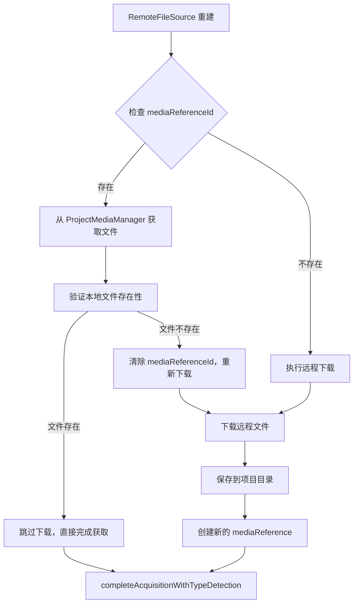
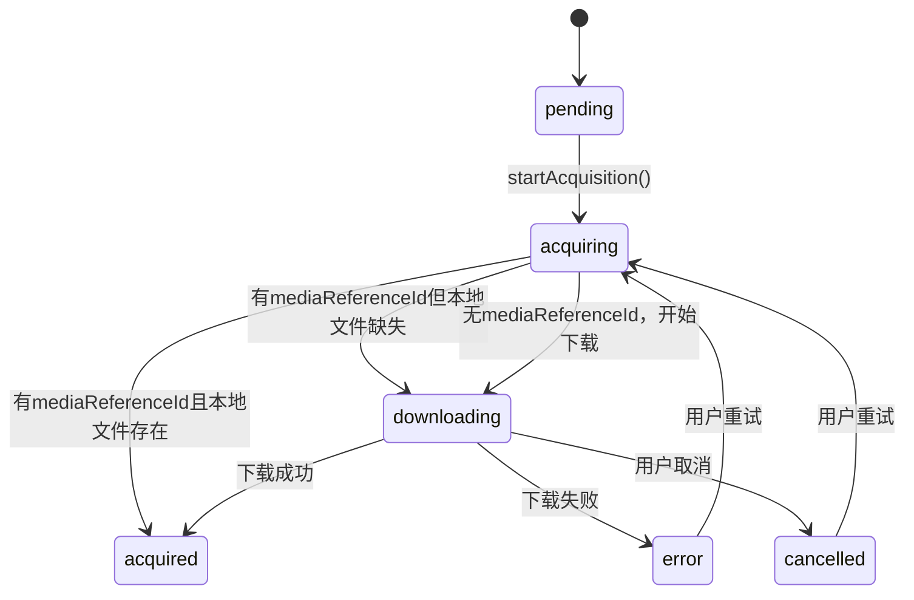

# RemoteFileSourceData 支持 mediaReferenceId 重建方案

## 概述

本文档描述了为 RemoteFileSourceData 添加从 mediaReferenceId 重建功能的完整方案。该方案使 RemoteFileSourceData 能够像 UserSelectedFileSourceData 一样，在已有媒体引用的情况下跳过下载直接使用本地文件，从而提高性能和用户体验。

## 问题分析

### 当前实现对比

#### UserSelectedFileSourceData 的 mediaReferenceId 支持

在 `frontend/src/unified/managers/UserSelectedFileManager.ts` 中，已经实现了完整的 mediaReferenceId 重建逻辑：

```typescript
// 检查是否有 mediaReferenceId，如果有则从 globalProjectMediaManager 获取文件
if (source.mediaReferenceId) {
  // 从 globalProjectMediaManager 获取项目ID
  const projectId = globalProjectMediaManager.currentProjectId
  if (!projectId) {
    throw new Error('ProjectMediaManager 未初始化，请先调用 initializeForProject')
  }

  // 从 globalProjectMediaManager 获取媒体引用
  const mediaReference = globalProjectMediaManager.getMediaReference(source.mediaReferenceId)
  if (!mediaReference) {
    throw new Error(`找不到媒体引用: ${source.mediaReferenceId}`)
  }

  // 从项目目录加载文件
  file = await globalProjectMediaManager.loadMediaFromProject(
    projectId,
    mediaReference.storedPath
  )

  // 更新 selectedFile
  source.selectedFile = file
} else {
  // 使用原始文件
  file = source.selectedFile
}
```

#### RemoteFileSourceData 的缺失

在 `frontend/src/unified/managers/RemoteFileManager.ts` 中，`executeAcquisition` 方法没有检查 mediaReferenceId，直接进入下载流程，导致无法利用已有的本地文件。

## 解决方案

### 方案架构图



### 具体实现方案

修改 `frontend/src/unified/managers/RemoteFileManager.ts` 中的 `executeAcquisition` 方法：

```typescript
private async executeAcquisition(source: RemoteFileSourceData): Promise<void> {
  try {
    // 设置为获取中状态
    RuntimeStateBusinessActions.startAcquisition(source)

    let file: File
    let url: string

    // 🆕 检查是否有 mediaReferenceId，如果有则尝试从本地加载
    if (source.mediaReferenceId) {
      // 从 globalProjectMediaManager 获取项目ID
      const projectId = globalProjectMediaManager.currentProjectId
      if (!projectId) {
        throw new Error('ProjectMediaManager 未初始化，请先调用 initializeForProject')
      }

      // 从 globalProjectMediaManager 获取媒体引用
      const mediaReference = globalProjectMediaManager.getMediaReference(source.mediaReferenceId)
      if (mediaReference) {
        try {
          // 尝试从项目目录加载文件
          file = await globalProjectMediaManager.loadMediaFromProject(
            projectId,
            mediaReference.storedPath
          )
          url = URL.createObjectURL(file)

          // 🎯 跳过下载，直接完成获取（这是你提到的关键优化）
          await RuntimeStateBusinessActions.completeAcquisitionWithTypeDetection(
            source,
            file,
            url,
            async (src) => await this.detectAndSetMediaType(src as RemoteFileSourceData),
          )
          
          console.log(`✅ [RemoteFileManager] 从本地重建成功: ${source.mediaReferenceId}`)
          return
        } catch (error) {
          // 本地文件加载失败，清除 mediaReferenceId，继续下载流程
          console.warn(`⚠️ [RemoteFileManager] 本地文件缺失，将重新下载: ${mediaReference.storedPath}`)
          source.mediaReferenceId = undefined // 清除无效的引用
          // 继续执行下载逻辑
        }
      } else {
        // 媒体引用不存在，清除 mediaReferenceId，继续下载流程
        console.warn(`⚠️ [RemoteFileManager] 媒体引用不存在，将重新下载: ${source.mediaReferenceId}`)
        source.mediaReferenceId = undefined // 清除无效的引用
        // 继续执行下载逻辑
      }
    }

    // 原有的下载逻辑（当没有 mediaReferenceId 或本地文件不存在时执行）
    // 验证URL
    if (!this.isValidUrl(source.remoteUrl)) {
      RuntimeStateBusinessActions.setError(source, '无效的URL地址')
      return
    }

    // 预先检测媒体类型
    const predictedType = await this.detectMediaTypeFromUrl(source.remoteUrl)
    if (predictedType === 'unknown') {
      const extensionType = this.detectMediaTypeFromUrlExtension(source.remoteUrl)
      await this.setPredictedMediaType(source, extensionType)
    } else {
      await this.setPredictedMediaType(source, predictedType)
    }

    // 合并配置
    const config = {
      ...DEFAULT_REMOTE_CONFIG,
      headers: source.headers || DEFAULT_REMOTE_CONFIG.headers,
      timeout: source.timeout || DEFAULT_REMOTE_CONFIG.timeout,
      retryCount: source.retryCount || DEFAULT_REMOTE_CONFIG.retryCount,
      retryDelay: source.retryDelay || DEFAULT_REMOTE_CONFIG.retryDelay,
    }

    // 开始下载
    await this.downloadFile(source, config)
    
    // 注意：下载成功后，mediaReferenceId 会在 UnifiedMediaModule.startWebAVProcessing 中自动设置
    // 无需在此处手动设置，避免重复操作
    
  } catch (error) {
    const errorMessage = error instanceof Error ? error.message : '获取失败'
    RuntimeStateBusinessActions.setError(source, errorMessage)
  }
}
```

### 状态流转图



## 关键改进点

### 1. 智能降级
当本地文件不存在时，清除无效的 `mediaReferenceId` 并自动降级到下载模式，确保用户体验不受影响。

### 2. 自动修复
利用现有的 WebAV 解析流程，在 `UnifiedMediaModule.startWebAVProcessing` 中自动创建媒体引用并设置 `mediaReferenceId`，无需额外的重复逻辑。

### 3. 无缝体验
用户无需手动处理文件缺失的情况，系统自动重新下载，保持操作的一致性。

### 4. 性能优化
当本地文件存在时，直接跳过下载流程，显著提高加载速度和用户体验。

### 5. 避免重复操作
不在下载管理器中重复设置 `mediaReferenceId`，而是依赖现有的 WebAV 解析流程，保持代码的简洁性和一致性。

## 处理逻辑总结

1. **有 mediaReferenceId 且本地文件存在** → 直接使用本地文件，跳过下载
2. **有 mediaReferenceId 但本地文件不存在** → 清除引用，重新下载
3. **没有 mediaReferenceId** → 正常下载流程
4. **WebAV 解析成功后** → 系统自动创建新的媒体引用（在 `UnifiedMediaModule.startWebAVProcessing` 中）

## 依赖要求

需要在 `RemoteFileManager.ts` 顶部添加导入：

```typescript
import { globalProjectMediaManager } from '@/unified/utils/ProjectMediaManager'
```

## 兼容性说明

- **向后兼容**：没有 mediaReferenceId 的现有功能保持不变
- **向前兼容**：新功能为可选特性，不影响现有代码
- **一致性**：与 UserSelectedFileSourceData 的重建逻辑保持一致

## 测试建议

1. **重建测试**：验证已有 mediaReferenceId 且本地文件存在时的重建流程
2. **降级测试**：验证本地文件不存在时的自动降级和重新下载
3. **新建测试**：验证没有 mediaReferenceId 时的正常下载流程
4. **引用创建测试**：验证下载成功后自动创建媒体引用的功能
5. **错误处理测试**：验证各种异常情况下的处理逻辑

## 预期效果

- **性能提升**：有本地文件时跳过下载，显著减少加载时间
- **用户体验**：无缝的文件重建和降级机制
- **资源优化**：避免重复下载，节省带宽和存储空间
- **系统稳定性**：智能的错误处理和自动修复机制