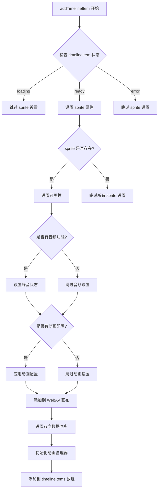

# UnifiedTimelineModule.addTimelineItem 函数分析

## 概述

本文档分析了 `frontend/src/unified/modules/UnifiedTimelineModule.ts` 文件中 `addTimelineItem()` 函数对 `timelineItem.runtime.sprite` 设置的内容。

## 主要设置内容

### 1. 可见性设置 (第206行)
```typescript
timelineItem.runtime.sprite.visible = track.isVisible
```
- 根据轨道的可见性状态设置 sprite 的可见性
- 当轨道可见时，sprite 也可见；轨道隐藏时，sprite 也隐藏

### 2. 音频静音状态设置 (第209-211行)
```typescript
if (timelineItem.runtime.sprite && hasAudioCapabilities(timelineItem.runtime.sprite)) {
  timelineItem.runtime.sprite.setTrackMuted(track.isMuted)
}
```
- 仅对具有音频功能的 sprite 设置静音状态
- 根据轨道的静音状态 (`track.isMuted`) 来设置 sprite 的静音状态
- 使用 `setTrackMuted()` 方法而不是直接赋值

### 3. 动画配置应用 (第220-239行)
```typescript
if (
  timelineItem.animation &&
  timelineItem.animation.isEnabled &&
  timelineItem.animation.keyframes.length > 0 &&
  timelineItem.runtime.sprite
) {
  // 使用 WebAVAnimationManager 来应用动画
  await updateWebAVAnimation(timelineItem)
}
```
- 当时间轴项目有启用动画且有关键帧时，对 sprite 应用动画配置
- 通过 `updateWebAVAnimation()` 函数处理动画配置

### 4. 添加到 WebAV 画布 (第248-250行)
```typescript
if (timelineItem.runtime.sprite) {
  await webavModule.addSprite(timelineItem.runtime.sprite)
}
```
- 将 sprite 添加到 WebAV 画布中进行渲染
- 这是 sprite 最终显示的必要步骤

## 设置流程图



## 条件判断

需要注意的是，这些设置都是在特定条件下进行的：

1. **状态条件**：只有当 `timelineItem` 处于 `ready` 状态时才会进行 sprite 相关设置
2. **存在性检查**：每次操作前都会检查 `timelineItem.runtime.sprite` 是否存在
3. **功能检查**：音频静音设置会检查 sprite 是否具有音频功能
4. **动画检查**：动画配置应用会检查是否有启用动画且有关键帧

## 总结

这些设置确保了 sprite 在时间轴上的正确显示和行为，包括可见性、音频状态、动画效果等关键属性。通过条件判断和分步设置，系统能够根据时间轴项目的不同状态和功能需求，灵活地配置 sprite 的各种属性。