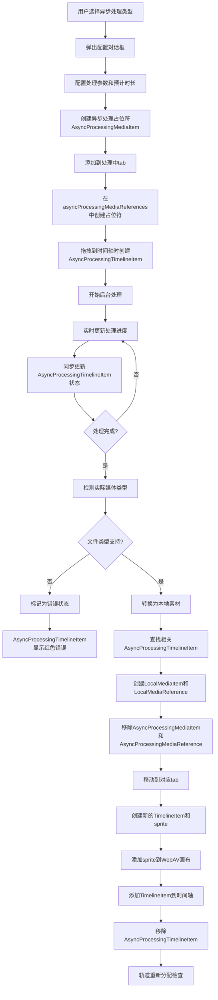

# 异步处理素材支持设计方案

## 📊 当前进度总结

**整体进度：Phase 1-4 完成 ✅，Phase 3.5 完成 ✅，Phase 5-7 待实现 ❌**

- ✅ **Phase 1: 基础类型扩展** - 已完成所有类型定义和接口设计
- ✅ **Phase 2: 媒体库UI扩展** - 已完成"处理中"tab、远程下载对话框和样式修复
- ✅ **Phase 3: 网络下载处理器** - 已完成核心下载逻辑、管理器和UI集成
- ✅ **Phase 3.5: 错误状态媒体项持久化** - 已完成错误状态媒体项的持久化支持
- ✅ **Phase 4: 异步处理时间轴组件** - 已完成占位符组件和渲染逻辑
- 🟡 **Phase 5: 转换和重建机制** - 已设计优化流程，待实现隐藏转换和clip重建逻辑
- 🟡 **Phase 6: 持久化支持** - 部分实现基础框架，待完善保存/加载逻辑
- ❌ **Phase 7: 集成和测试** - 待实现完整的功能集成和测试

**下一步建议：实现 Phase 5 的优化转换机制（关键环节）**

**重要说明**：Phase 4 实际已完成，时间轴异步处理组件功能完整。Phase 5 已完成核心流程设计，解决了时间轴clip丢失的关键问题，现需实现具体的隐藏转换和clip重建逻辑。

### 🎯 Phase 2 完成详情
**已实现的核心功能**：
- ✅ 媒体库"处理中"tab，支持异步处理项目管理
- ✅ 远程下载对话框，支持URL输入和格式选择
- ✅ 完整的状态管理系统（Pinia store）
- ✅ 进度显示和取消功能
- ✅ 样式系统修复，确保UI一致性

**技术实现**：
- ✅ `MediaLibrary.vue` - 添加处理中tab和UI逻辑
- ✅ `RemoteDownloadDialog.vue` - 完整的远程下载对话框组件
- ✅ `mediaStore.ts` - 异步处理状态管理
- ✅ CSS变量修复 - 统一使用设计系统变量

### 🎯 Phase 3 完成详情
**已实现的核心功能**：
- ✅ AsyncProcessingManager 核心管理器，支持处理器注册和任务管理
- ✅ RemoteDownloadProcessor 网络下载处理器，支持进度回调和取消操作
- ✅ 实时状态同步机制，确保UI响应式更新
- ✅ 完整的错误处理和用户反馈系统
- ✅ 中文文件名支持和智能文件名提取
- ✅ 优化的UI显示，包括进度圆环和状态指示器

**技术实现**：
- ✅ `AsyncProcessingManager.ts` - 异步处理管理器单例类
- ✅ `RemoteDownloadProcessor.ts` - 网络下载处理器实现
- ✅ `mediaModule.ts` - 扩展支持异步处理素材管理
- ✅ `MediaLibrary.vue` - 集成下载逻辑和UI优化
- ✅ 后端网速限制功能 - 支持动态调整下载速度用于测试

**UI/UX优化**：
- ✅ 异步处理项目专用显示布局（无缩略图，显示状态）
- ✅ 40px进度圆环，白色百分比文字，清晰可见
- ✅ 不同状态的图标和颜色区分（等待/处理/完成/失败）
- ✅ Tooltip提示显示详细状态信息
- ✅ 完美适配50px缩略图容器高度

### 🎯 Phase 3.5 完成详情 - 错误状态媒体项持久化
**已实现的核心功能**：
- ✅ 扩展LocalMediaReference类型定义，支持错误状态字段
- ✅ MediaLibrary.vue错误处理逻辑增强，自动保存错误状态媒体引用
- ✅ MediaManager功能扩展，支持错误状态媒体项的保存和恢复
- ✅ 项目保存/加载完整支持错误状态媒体项持久化
- ✅ 三种错误类型支持：webav解析错误、文件加载错误、不支持格式

**技术实现**：
- ✅ `types/index.ts` - 扩展LocalMediaReference接口和MediaErrorType枚举
- ✅ `MediaLibrary.vue` - 添加saveErrorMediaReference辅助函数和错误处理逻辑
- ✅ `MediaManager.ts` - 新增saveErrorMediaReference和restoreErrorMediaItem方法
- ✅ `MediaManager.ts` - 扩展loadAllMediaForProject方法支持错误状态恢复
- ✅ 项目保存/加载流程 - 确保错误状态媒体引用的完整持久化

**用户体验改进**：
- ✅ 导入失败的媒体文件不再消失，保留在素材区显示错误状态
- ✅ 项目重新打开时错误状态媒体项被正确恢复
- ✅ 文件加载失败时自动转换为错误状态，不影响项目使用
- ✅ 保留原始文件信息，为未来重试功能奠定基础
- ✅ 详细错误信息记录，便于问题诊断和用户反馈

**数据完整性保障**：
- ✅ 错误状态媒体项完整的元数据保存（文件名、大小、类型、时间戳）
- ✅ 错误类型和错误信息的详细记录
- ✅ 与正常媒体引用统一的管理机制，避免数据不一致
- ✅ 项目加载时的错误状态自动检测和转换

**Phase 3.5 详细技术实现**：

1. **类型定义扩展** (`frontend/src/types/index.ts`)：
```typescript
// 扩展LocalMediaReference接口支持错误状态
export interface LocalMediaReference extends BaseMediaReference {
  type: MediaType
  storedPath: string // 正常状态：实际存储路径；错误状态：空字符串

  // 新增：状态管理字段
  status?: 'normal' | 'error'  // 默认为normal，兼容现有数据

  // 新增：错误状态相关字段（仅当status为error时有值）
  errorType?: 'webav_parse_error' | 'file_load_error' | 'unsupported_format'
  errorMessage?: string
  errorTimestamp?: string

  // 新增：保留原始文件信息用于重试功能
  originalFile?: {
    name: string
    size: number
    type: string
    lastModified: number
  }
}

// 新增错误类型枚举
export type MediaErrorType =
  | 'webav_parse_error'    // WebAV解析失败（如格式不支持、文件损坏）
  | 'file_load_error'      // 文件加载失败（如文件不存在、权限问题）
  | 'unsupported_format'   // 不支持的文件格式
```

2. **MediaLibrary.vue错误处理增强**：
```typescript
// 新增保存错误媒体引用的辅助函数
const saveErrorMediaReference = async (
  mediaItemId: string,
  file: File,
  mediaType: MediaType,
  errorType: MediaErrorType,
  errorMessage: string
) => {
  if (!videoStore.currentProjectId) return

  try {
    const { MediaManager } = await import('../utils/MediaManager')
    const mediaManager = MediaManager.getInstance()

    const errorReference = await mediaManager.saveErrorMediaReference(
      mediaItemId, file, videoStore.currentProjectId, mediaType, errorType, errorMessage
    )

    videoStore.addMediaReference(mediaItemId, errorReference)
    console.log(`💾 错误状态媒体引用已保存: ${file.name}`)
  } catch (referenceError) {
    console.warn(`保存错误状态媒体引用失败: ${file.name}`, referenceError)
  }
}

// 在addVideoItem、addImageItem、addAudioItem的catch块中调用
catch (error) {
  // ... 创建错误状态MediaItem ...
  videoStore.updateLocalMediaItem(errorMediaItem)

  // 新增：保存错误状态的媒体引用到项目
  await saveErrorMediaReference(mediaItemId, file, 'video', 'webav_parse_error', error.message)

  resolve()
}
```

3. **MediaManager.ts功能扩展**：
```typescript
// 新增保存错误状态媒体引用方法
async saveErrorMediaReference(
  mediaId: string,
  file: File,
  projectId: string,
  mediaType: MediaType,
  errorType: MediaErrorType,
  errorMessage: string
): Promise<LocalMediaReference> {
  const errorReference: LocalMediaReference = {
    originalFileName: file.name,
    storedPath: '', // 错误状态没有实际存储路径
    type: mediaType,
    fileSize: file.size,
    checksum: '', // 错误状态没有文件校验和
    status: 'error',
    errorType,
    errorMessage,
    errorTimestamp: new Date().toISOString(),
    originalFile: {
      name: file.name,
      size: file.size,
      type: file.type,
      lastModified: file.lastModified
    }
  }
  return errorReference
}

// 新增恢复错误状态媒体项方法
private restoreErrorMediaItem(mediaId: string, reference: LocalMediaReference): LocalMediaItem {
  return {
    id: mediaId,
    name: reference.originalFileName,
    createdAt: reference.errorTimestamp || new Date().toISOString(),
    file: null as any, // 错误状态没有实际文件对象
    url: '', // 错误状态没有URL
    duration: 0,
    type: reference.originalFile?.type || '',
    mediaType: reference.type,
    mp4Clip: null,
    imgClip: null,
    audioClip: null,
    isReady: false,
    status: 'error'
  }
}

// 扩展loadAllMediaForProject方法支持错误状态
async loadAllMediaForProject(...): Promise<LocalMediaItem[]> {
  // ... 批处理逻辑 ...
  const batchPromises = batch.map(async ([mediaId, reference]) => {
    if (reference.status === 'error') {
      // 恢复错误状态的媒体项
      return this.restoreErrorMediaItem(mediaId, reference)
    } else {
      // 正常加载流程
      try {
        return await this.rebuildMediaItemFromLocal(mediaId, reference, projectId)
      } catch (error) {
        // 加载失败，转换为错误状态
        const updatedReference: LocalMediaReference = {
          ...reference,
          status: 'error',
          errorType: 'file_load_error',
          errorMessage: error instanceof Error ? error.message : String(error),
          errorTimestamp: new Date().toISOString()
        }
        return this.restoreErrorMediaItem(mediaId, updatedReference)
      }
    }
  })
  // ...
}
```

4. **项目保存/加载流程验证**：
- ✅ `projectModule.ts` 的 `saveCurrentProject` 方法已正确保存所有媒体引用
- ✅ `ProjectManager.loadProjectContent` 使用 `MediaManager.loadAllMediaForProject` 加载媒体
- ✅ 错误状态媒体引用与正常引用统一管理，确保数据一致性

**测试验证场景**：
1. **导入失败测试**：导入损坏文件 → 显示错误状态 → 保存项目 → 重新打开 → 验证恢复
2. **文件丢失测试**：删除项目媒体文件 → 重新打开项目 → 验证自动转换为错误状态
3. **混合状态测试**：正常+错误状态媒体项 → 保存/加载 → 验证状态正确恢复

## 概述

本文档描述了为视频编辑器添加异步处理素材支持的完整设计方案。异步处理素材包括远程文件下载、本地大文件转码、AI处理等需要长时间处理的素材类型，支持占位符机制和自动类型转换。

## 功能需求

### 核心功能
- **远程下载**：通过URL导入远程媒体文件
- **本地转码**：大文件格式转换、压缩、优化等
- **AI处理**：智能剪辑、自动字幕、背景移除等
- **批量处理**：多文件同时处理
- 支持预计时长设置和进度显示
- 处理完成后自动转换为对应的本地媒体类型
- 时间轴占位符支持，处理期间限制编辑功能
- 项目持久化时保存处理状态和恢复机制

### 异步处理类型（当前实现）
1. **远程下载**：从URL下载远程媒体文件

### 异步处理类型（未来扩展）
2. **格式转码**：将不支持的格式转换为支持的格式（如AVI→MP4）
3. **文件压缩**：大文件自动压缩优化
4. **AI增强**：视频超分辨率、降噪、稳定等
5. **内容生成**：AI生成背景音乐、字幕、特效等
6. **批量导入**：大量文件的批量处理和导入

### 用户交互流程
1. 选择处理类型 → 显示对应的输入界面
2. 配置处理参数 → 确认开始处理
3. 异步处理tab显示进度 → 可拖拽到时间轴占位
4. 处理完成 → 自动转换为对应类型并移动到相应tab
5. 时间轴clip自动重建为正确类型

## 技术设计

### 1. 数据结构扩展

#### 1.1 类型定义扩展
```typescript
// types/index.ts

// 核心MediaType类型定义
export type MediaType = 'video' | 'image' | 'audio' | 'text'

// 异步处理素材在处理前使用 'unknown' 类型，处理后使用实际检测到的类型
export type MediaTypeOrUnknown = MediaType | 'unknown'

// 异步处理素材状态枚举
export type AsyncProcessingStatus = 'pending' | 'processing' | 'completed' | 'error' | 'cancelled' | 'unsupported'

// 异步处理类型枚举（当前只支持远程下载）
export type AsyncProcessingType = 'remote-download'

// 基础时间范围接口 - 所有时间范围的共同基础
export interface BaseTimeRange {
  /** 时间轴开始时间（帧数） - 在整个项目时间轴上的开始位置 */
  timelineStartTime: number
  /** 时间轴结束时间（帧数） - 在整个项目时间轴上的结束位置 */
  timelineEndTime: number
}

// 异步处理时间轴项目专用时间范围接口 - 继承基础时间范围
export interface AsyncProcessingTimeRange extends BaseTimeRange {
  // 继承 timelineStartTime 和 timelineEndTime
  // 可以在未来添加异步处理特有的时间范围属性
}

/**
 * 时间范围继承关系设计说明：
 *
 * BaseTimeRange (基础时间范围)
 *   ├── AsyncProcessingTimeRange (异步处理时间范围)
 *   ├── VideoTimeRange (视频时间范围) - 扩展了 clipStartTime, clipEndTime 等
 *   └── ImageTimeRange (图片时间范围) - 扩展了 displayDuration 等
 *
 * 这种设计的优势：
 * 1. 统一的基础接口：所有时间范围都有 timelineStartTime 和 timelineEndTime
 * 2. 类型安全：可以在需要基础时间范围的地方使用 BaseTimeRange
 * 3. 扩展性：各种具体的时间范围可以添加自己特有的属性
 * 4. 转换便利：异步处理时间范围可以方便地转换为其他具体类型
 */
```

#### 1.2 继承关系设计

```typescript
/**
 * 基础媒体项目接口 - 所有媒体项目的共同基础
 */
export interface BaseMediaItem {
  id: string
  name: string
  createdAt: string
}

/**
 * 本地媒体项目接口 - 继承基础接口，添加本地文件相关属性
 */
export interface LocalMediaItem extends BaseMediaItem {
  mediaType: MediaType
  file: File
  url: string
  duration: number // 素材时长（帧数）
  type: string
  mp4Clip: Raw<MP4Clip> | null
  imgClip: Raw<ImgClip> | null
  audioClip: Raw<AudioClip> | null
  isReady: boolean
  status: MediaStatus
  thumbnailUrl?: string
  isAsyncProcessing?: false // 明确标识为本地媒体
}

/**
 * 异步处理媒体项目接口 - 继承基础接口，添加异步处理相关属性
 */
export interface AsyncProcessingMediaItem extends BaseMediaItem {
  mediaType: MediaTypeOrUnknown // 处理前为'unknown'，处理后为实际类型
  isAsyncProcessing: true // 标识为异步处理媒体
  processingType: AsyncProcessingType // 处理类型
  processingStatus: AsyncProcessingStatus // 处理状态
  processingProgress: number // 处理进度 0-100
  expectedDuration: number // 用户输入的预计时长（帧数）

  // 处理配置和参数
  processingConfig: AsyncProcessingConfig // 处理配置（根据类型不同）

  // 处理过程中的临时数据
  processedFile?: File // 处理完成的文件对象
  errorMessage?: string // 错误信息

  // UI显示相关
  thumbnailUrl?: string // 默认图标或预览图

  // 时间戳
  startedAt?: string // 开始处理时间
  completedAt?: string // 完成处理时间

  // 转换状态标记
  isConverting: boolean // 转换中标记，UI层面隐藏显示（必须字段）
}
```

#### 1.3 异步处理配置类型

```typescript
/**
 * 异步处理配置联合类型（当前只支持远程下载）
 */
export type AsyncProcessingConfig = RemoteDownloadConfig

/**
 * 远程下载配置
 */
export interface RemoteDownloadConfig {
  type: 'remote-download'
  url: string // 远程URL
  headers?: Record<string, string> // 自定义请求头
  timeout?: number // 超时时间（毫秒）
}

```

#### 1.4 时间轴项目类型（激进重构后）

```typescript
/**
 * 基础时间轴项目接口 - 所有时间轴项目的共同基础
 */
export interface BaseTimelineItem {
  id: string
  mediaItemId: string
  trackId: string
  mediaType: MediaTypeOrUnknown
}

/**
 * 本地时间轴项目数据接口（持久化数据）
 * 继承基础属性，添加本地时间轴项目的持久化数据
 */
export interface LocalTimelineItemData<T extends MediaType = MediaType> extends BaseTimelineItem {
  mediaType: T
  timeRange: T extends 'video'
    ? VideoTimeRange
    : T extends 'audio'
      ? VideoTimeRange
      : ImageTimeRange
  config: GetMediaConfig<T>
  animation?: AnimationConfig<T>
  mediaName: string
}

/**
 * 本地时间轴项目接口 - 继承 LocalTimelineItemData，添加运行时属性
 */
export interface LocalTimelineItem<T extends MediaType = MediaType> extends LocalTimelineItemData<T> {
  sprite: Raw<CustomSprite>
  thumbnailUrl?: string
  isAsyncProcessingPlaceholder?: false
}

/**
 * 异步处理时间轴项目接口 - 继承基础接口，添加异步处理相关属性
 */
export interface AsyncProcessingTimelineItem extends BaseTimelineItem {
  mediaType: MediaTypeOrUnknown // 处理前为'unknown'，处理后为实际类型
  mediaItemId: string // 指向 AsyncProcessingMediaItem.id

  // 时间范围 - 使用基础时间范围接口
  timeRange: AsyncProcessingTimeRange

  // 异步处理状态相关
  processingType: AsyncProcessingType
  processingStatus: AsyncProcessingStatus
  processingProgress: number // 0-100
  errorMessage?: string

  // 占位符配置
  config: {
    name: string // 显示名称
    expectedDuration: number // 预计时长（帧数）
  }

  // 标识字段
  isAsyncProcessingPlaceholder: true
  sprite: null // 异步处理占位符不创建sprite
}

/**
 * 类型守卫函数（激进重构后直接使用联合类型）
 */
export function isLocalTimelineItem(item: LocalTimelineItem<MediaType> | AsyncProcessingTimelineItem): item is LocalTimelineItem<MediaType> {
  return !('isAsyncProcessingPlaceholder' in item) || item.isAsyncProcessingPlaceholder === false
}

export function isAsyncProcessingTimelineItem(item: LocalTimelineItem<MediaType> | AsyncProcessingTimelineItem): item is AsyncProcessingTimelineItem {
  return 'isAsyncProcessingPlaceholder' in item && item.isAsyncProcessingPlaceholder === true
}
```

#### 1.5 激进重构说明

**重构策略**：采用激进重构方式，删除所有旧的类型别名，强制使用新的命名约定。

**删除的类型别名**：
- ~~`TimelineItem<T> = LocalTimelineItem<T>`~~ ❌
- ~~`TimelineItemData<T> = LocalTimelineItemData<T>`~~ ❌

**最终的类型架构**：
```typescript
BaseTimelineItem
  ↓ extends
LocalTimelineItemData<T>
  ↓ extends
LocalTimelineItem<T>

// 独立的异步处理接口
AsyncProcessingTimelineItem extends BaseTimelineItem
```

**重构优势**：
- 没有历史包袱，类型系统更加清晰
- 强制使用新的命名约定（Local* 前缀）
- 为异步处理功能提供清晰的架构
- 直接使用联合类型，避免额外的抽象层

### 2. UI 层改造

#### 2.1 Tab 系统扩展
在 `MediaLibrary.vue` 中添加异步处理tab：

```typescript
const tabs = [
  // ... 现有tabs
  {
    type: 'processing' as TabType,
    label: '处理中',
    icon: 'M12,4V2A10,10 0 0,0 2,12H4A8,8 0 0,1 12,4Z' // 加载图标
  }
]

type TabType = 'all' | 'video' | 'audio' | 'processing'
```

#### 2.2 导入菜单扩展
扩展右键菜单支持多种处理方式：

```typescript
const currentMenuItems = computed((): MenuItem[] => {
  if (contextMenuType.value === 'empty') {
    return [
      {
        label: '导入本地文件',
        icon: 'M19,13H13V19H11V13H5V11H11V5H13V11H19V13Z',
        onClick: () => handleImportLocalFiles(),
      },
      {
        label: '异步处理',
        icon: 'M12,4V2A10,10 0 0,0 2,12H4A8,8 0 0,1 12,4Z',
        children: [
          {
            label: '远程下载',
            icon: 'M12,2A10,10 0 0,0 2,12A10,10 0 0,0 12,22A10,10 0 0,0 22,12A10,10 0 0,0 12,2M11,19.93C7.05,19.44 4,16.08 4,12C4,11.38 4.08,10.78 4.21,10.21L9,15V16A1,1 0 0,0 10,17H11V19.93M17.9,17.39C17.64,16.58 16.9,16 16,16H15V13A1,1 0 0,0 14,12H8V10H10A1,1 0 0,0 11,9V7H13A2,2 0 0,0 15,5V4.59C17.93,5.77 20,8.64 20,12C20,14.08 19.2,15.97 17.9,17.39Z',
            onClick: () => handleRemoteDownload(),
          },
          {
            label: '格式转换',
            icon: 'M12,2A2,2 0 0,1 14,4C14,4.74 13.6,5.39 13,5.73V7.27C13.6,7.61 14,8.26 14,9A2,2 0 0,1 12,11A2,2 0 0,1 10,9C10,8.26 10.4,7.61 11,7.27V5.73C10.4,5.39 10,4.74 10,4A2,2 0 0,1 12,2Z',
            onClick: () => handleFormatConversion(),
          },
          {
            label: 'AI增强',
            icon: 'M12,2A10,10 0 0,0 2,12A10,10 0 0,0 12,22A10,10 0 0,0 22,12A10,10 0 0,0 12,2M12,4A8,8 0 0,1 20,12A8,8 0 0,1 12,20A8,8 0 0,1 4,12A8,8 0 0,1 12,4M12,6A6,6 0 0,0 6,12A6,6 0 0,0 12,18A6,6 0 0,0 18,12A6,6 0 0,0 12,6Z',
            onClick: () => handleAIEnhancement(),
          },
          {
            label: '批量导入',
            icon: 'M19,13H13V19H11V13H5V11H11V5H13V11H19V13Z',
            onClick: () => handleBatchImport(),
          }
        ]
      }
    ]
  }
  // ... 其他菜单逻辑
})
```

#### 2.3 异步处理配置对话框
创建新组件 `AsyncProcessingDialog.vue`：
- **远程下载**：URL输入框、请求头配置、超时设置
- **格式转换**：文件选择、目标格式、质量设置、分辨率配置
- **文件压缩**：文件选择、压缩级别、最大文件大小
- **AI增强**：文件选择、增强类型（超分辨率/降噪/稳定/上色）、参数配置
- **内容生成**：生成类型、提示词、时长设置
- **批量导入**：文件列表、处理选项（自动压缩/转换/生成缩略图）
- 预计时长输入框（默认5秒，自动转换为帧数）
- 素材名称输入框（可选，默认从配置提取）
- 支持格式提示和参数验证
- 确认/取消按钮

### 3. TimelineAsyncProcessingClip 组件设计

#### 3.1 组件特性
- 专门用于渲染 AsyncProcessingTimelineItem
- 根据 processingStatus 和 processingType 显示不同的视觉状态
- 支持基本操作：选中、删除、拖拽移动
- 禁用编辑功能：裁剪、复制、分割、动画等
- 实时显示处理进度、处理类型图标和错误状态

#### 3.2 视觉状态设计
```scss
.timeline-async-processing-clip {
  // 状态样式
  &.status-processing {
    .clip-background {
      background: linear-gradient(135deg, #3498db, #2980b9);
      border: 2px solid #2980b9;
    }
  }

  &.status-pending {
    .clip-background {
      background: linear-gradient(135deg, #f39c12, #e67e22);
      border: 2px solid #e67e22;
    }
  }

  &.status-unsupported,
  &.status-error {
    .clip-background {
      background: linear-gradient(135deg, #e74c3c, #c0392b);
      border: 2px solid #c0392b;
    }
  }

  &.status-completed {
    .clip-background {
      background: linear-gradient(135deg, #27ae60, #229954);
      border: 2px solid #229954;
    }
  }

  // 处理类型样式
  &.type-remote-download .processing-icon { color: #3498db; }
  &.type-format-conversion .processing-icon { color: #9b59b6; }
  &.type-file-compression .processing-icon { color: #e67e22; }
  &.type-ai-enhancement .processing-icon { color: #e74c3c; }
  &.type-content-generation .processing-icon { color: #1abc9c; }
  &.type-batch-import .processing-icon { color: #34495e; }
}
```

### 4. 异步处理素材管理器

#### 4.1 AsyncProcessingManager 核心类
```typescript
/**
 * 异步处理器接口 - 所有处理器的基础接口
 */
export interface AsyncProcessor {
  readonly type: AsyncProcessingType

  /**
   * 开始处理
   * @param config 处理配置
   * @param onProgress 进度回调
   * @returns 处理结果
   */
  process(
    config: AsyncProcessingConfig,
    onProgress: (progress: number) => void
  ): Promise<File>

  /**
   * 取消处理
   */
  cancel(): void

  /**
   * 验证配置
   * @param config 处理配置
   * @returns 是否有效
   */
  validateConfig(config: AsyncProcessingConfig): boolean
}

export class AsyncProcessingManager {
  private static instance: AsyncProcessingManager
  private processingTasks = new Map<string, AbortController>()
  private asyncProcessingMediaItems = new Map<string, AsyncProcessingMediaItem>()
  private processors = new Map<AsyncProcessingType, AsyncProcessor>()

  constructor() {
    // 注册默认处理器
    this.registerProcessor(new RemoteDownloadProcessor())
    this.registerProcessor(new FormatConversionProcessor())
    this.registerProcessor(new FileCompressionProcessor())
    this.registerProcessor(new AIEnhancementProcessor())
    this.registerProcessor(new ContentGenerationProcessor())
    this.registerProcessor(new BatchImportProcessor())
  }

  /**
   * 注册处理器
   * @param processor 处理器实例
   */
  registerProcessor(processor: AsyncProcessor): void {
    this.processors.set(processor.type, processor)
  }

  /**
   * 创建异步处理素材项目
   * @param processingType 处理类型
   * @param config 处理配置
   * @param expectedDuration 预计时长（帧数）
   * @param name 素材名称
   * @returns 异步处理素材项目
   */
  createAsyncProcessingMediaItem(
    processingType: AsyncProcessingType,
    config: AsyncProcessingConfig,
    expectedDuration: number,
    name?: string
  ): AsyncProcessingMediaItem

  /**
   * 开始异步处理
   * @param asyncProcessingMediaItem 异步处理素材项目
   * @returns Promise<void>
   */
  async startProcessing(asyncProcessingMediaItem: AsyncProcessingMediaItem): Promise<void>

  /**
   * 取消异步处理
   * @param mediaItemId 媒体项目ID
   */
  cancelProcessing(mediaItemId: string): void
}
```

#### 4.2 远程下载处理器实现示例
```typescript
export class RemoteDownloadProcessor implements AsyncProcessor {
  readonly type: AsyncProcessingType = 'remote-download'
  private abortController?: AbortController

  async process(
    config: AsyncProcessingConfig,
    onProgress: (progress: number) => void
  ): Promise<File> {
    if (config.type !== 'remote-download') {
      throw new Error('Invalid config type for RemoteDownloadProcessor')
    }

    const downloadConfig = config as RemoteDownloadConfig
    this.abortController = new AbortController()

    try {
      const response = await fetch(downloadConfig.url, {
        signal: this.abortController.signal,
        headers: downloadConfig.headers || {}
      })

      if (!response.ok) {
        throw new Error(`HTTP ${response.status}: ${response.statusText}`)
      }

      const contentLength = response.headers.get('content-length')
      const total = contentLength ? parseInt(contentLength, 10) : 0
      let loaded = 0

      const reader = response.body?.getReader()
      if (!reader) {
        throw new Error('Failed to get response reader')
      }

      const chunks: Uint8Array[] = []

      while (true) {
        const { done, value } = await reader.read()

        if (done) break

        chunks.push(value)
        loaded += value.length

        if (total > 0) {
          onProgress(Math.round((loaded / total) * 100))
        }
      }

      // 合并所有chunks
      const blob = new Blob(chunks)
      const fileName = this.extractFileNameFromUrl(downloadConfig.url)

      return new File([blob], fileName, { type: blob.type })

    } catch (error) {
      if (error.name === 'AbortError') {
        throw new Error('Download cancelled')
      }
      throw error
    }
  }

  cancel(): void {
    this.abortController?.abort()
  }

  validateConfig(config: AsyncProcessingConfig): boolean {
    if (config.type !== 'remote-download') return false

    const downloadConfig = config as RemoteDownloadConfig
    try {
      new URL(downloadConfig.url)
      return true
    } catch {
      return false
    }
  }

  private extractFileNameFromUrl(url: string): string {
    try {
      const urlObj = new URL(url)
      const pathname = urlObj.pathname
      const fileName = pathname.split('/').pop() || 'download'
      return fileName.includes('.') ? fileName : `${fileName}.bin`
    } catch {
      return 'download.bin'
    }
  }
}
```

### 5. 工作流程设计

#### 5.1 异步处理素材流程


#### 5.2 不同处理类型的具体流程

**远程下载流程**：
1. 用户输入URL和预计时长
2. 验证URL格式和可访问性
3. 创建RemoteDownloadConfig配置
4. 开始下载，实时更新进度
5. 下载完成后检测文件类型
6. 转换为本地素材

**格式转换流程**：
1. 用户选择源文件和目标格式
2. 配置转换参数（质量、分辨率等）
3. 创建FormatConversionConfig配置
4. 使用FFmpeg或WebCodecs进行转换
5. 实时更新转换进度
6. 转换完成后替换原文件

**AI增强流程**：
1. 用户选择源文件和增强类型
2. 配置AI模型参数
3. 创建AIEnhancementConfig配置
4. 调用AI服务进行处理
5. 实时更新处理进度
6. 处理完成后生成增强版本

#### 5.3 异步处理素材转换流程（优化版）

**核心设计原则**：解决WebAV解析耗时期间的时间轴clip丢失问题，通过隐藏异步素材而非删除来保持时间轴clip的连续性。

1. **处理完成检测**：AsyncProcessingMediaItem 的 processedFile 字段不为空

2. **类型检测**：根据处理后的文件头信息检测实际媒体类型

3. **类型支持检查**：
   ```typescript
   if (!isSupportedMediaType(processedFile)) {
     // 标记为不支持的文件类型
     asyncProcessingMediaItem.processingStatus = 'unsupported'
     asyncProcessingMediaItem.errorMessage = `不支持的文件类型: ${processedFile.type}`
     // 保持占位符状态，不进行转换
     return
   }
   ```

4. **隐藏异步素材**（仅当文件类型支持时）：
   ```typescript
   // 标记为转换中，UI层面隐藏显示
   asyncProcessingMediaItem.isConverting = true
   ```
   - 媒体库过滤掉 `isConverting: true` 的异步素材
   - 时间轴clip保持显示，引用关系不变
   - 避免用户看到重复的素材项

5. **创建本地素材**（仅当文件类型支持时）：
   - 使用现有的 `processFiles` 逻辑处理 processedFile
   - 创建 LocalMediaItem 对象（与直接导入的本地素材完全相同）
   - WebAV 开始解析，创建对应类型的 Clip（MP4Clip/ImgClip/AudioClip）
   - 生成缩略图

6. **等待本地素材解析完成**：
   ```typescript
   // 监听本地素材的 isReady 状态
   await waitForMediaItemReady(localMediaItem)
   ```

7. **保存时间轴clip信息**（在删除前）：
   ```typescript
   const timelineClipInfos = timelineItems
     .filter(item => isAsyncProcessingTimelineItem(item) && item.mediaItemId === asyncProcessingMediaItem.id)
     .map(item => ({
       trackId: item.trackId,
       timelineStartTime: item.timeRange.timelineStartTime,
       originalDuration: item.timeRange.timelineEndTime - item.timeRange.timelineStartTime,
       config: item.config,
       // 保存其他需要的配置信息
     }))
   ```

8. **删除异步素材**：
   - 从异步处理列表中移除 AsyncProcessingMediaItem
   - 连带删除所有相关的 AsyncProcessingTimelineItem
   - 清理 AsyncProcessingMediaReference

9. **重建时间轴clip**（基于保存的信息）：
   ```typescript
   for (const clipInfo of timelineClipInfos) {
     // 创建新的sprite
     const newSprite = await createSpriteFromMediaItem(localMediaItem)

     // 时长调整：使用实际时长
     const actualDuration = localMediaItem.duration
     const newTimeRange = {
       timelineStartTime: clipInfo.timelineStartTime,
       timelineEndTime: clipInfo.timelineStartTime + actualDuration,
       // ... 其他时间范围属性
     }

     // 创建新的LocalTimelineItem
     const newTimelineItem: LocalTimelineItem = {
       id: generateNewTimelineItemId(),
       mediaItemId: localMediaItem.id,
       trackId: clipInfo.trackId,
       mediaType: localMediaItem.mediaType,
       timeRange: newTimeRange,
       sprite: markRaw(newSprite),
       config: createDefaultConfigForMediaType(localMediaItem.mediaType),
       mediaName: localMediaItem.name
     }

     // 添加到时间轴
     addTimelineItem(newTimelineItem)
     addSpriteToCanvas(newSprite)
   }
   ```

10. **完成转换**：
    - 本地素材正常显示在对应tab中
    - 时间轴clip无缝切换到新的LocalTimelineItem
    - 用户看到的是连续的转换过程，没有clip消失

11. **错误状态处理**（当文件类型不支持或转换失败时）：
    - 重新显示异步素材（`isConverting = false`）
    - 更新状态为错误：`processingStatus = 'error'`
    - 时间轴占位符显示红色错误状态
    - 属性面板显示错误信息和重新配置选项

**重要说明**：优化后的转换策略解决了时间轴clip丢失问题：

**核心问题**：WebAV解析文件需要时间，在这个时间窗口内如果删除异步素材，会导致时间轴clip丢失。

**解决方案**：**隐藏而非删除**的策略：
- **隐藏异步素材**：标记 `isConverting: true`，UI层面过滤不显示
- **保持引用关系**：时间轴clip的 `mediaItemId` 引用保持有效
- **等待解析完成**：本地素材完全准备好后再进行替换
- **信息保存重建**：保存旧clip信息，删除后基于这些信息重建新clip

**转换策略对比**：

**时间轴转换**：**保存信息 → 删除旧clip → 重建新clip**的过程：
- **数据安全**：通过信息保存避免clip配置丢失
- **类型安全**：AsyncProcessingTimelineItem 和 LocalTimelineItem 是不同的类型
- **时长准确**：根据实际文件时长调整clip范围，而不是使用预估时长
- **用户体验**：避免clip突然消失又找不回来的问题

**媒体库转换**：**隐藏 → 创建本地素材 → 等待解析 → 删除异步素材**的过程：
- **避免重复显示**：通过隐藏机制防止同时显示两个素材
- **时序控制**：确保本地素材完全准备好后再清理异步素材
- **错误恢复**：转换失败时可以重新显示异步素材

#### 5.4 异步处理时间轴clip处理

**AsyncProcessingTimelineItem 特性**：
- 专门的异步处理clip类型，不创建 WebAV sprite
- 根据 processingStatus 和 processingType 显示不同的视觉效果：
  - `pending`：橙色背景，显示等待图标和处理类型
  - `processing`：蓝色背景，显示处理进度条、百分比和处理类型图标
  - `unsupported`：红色背景，中央显示"错误"文字
  - `error`：红色背景，显示具体错误信息
  - `completed`：绿色背景，显示完成状态（短暂显示后转换）
- 禁用所有编辑功能（裁剪、复制、分割、动画等）
- 支持基本操作：选中、删除、拖拽移动
- 属性面板显示处理信息（类型、配置、进度、预计时长、错误信息）

**AsyncProcessingTimelineItem 转换流程**：
```typescript
// 1. 查找需要转换的异步处理时间轴项目
const asyncProcessingTimelineItems = timelineItems.value.filter(
  item => isAsyncProcessingTimelineItem(item) && item.mediaItemId === asyncProcessingMediaItem.id
) as AsyncProcessingTimelineItem[]

// 2. 根据异步处理素材状态处理
if (asyncProcessingMediaItem.processingStatus === 'unsupported') {
  // 文件类型不支持，更新AsyncProcessingTimelineItem显示错误状态
  for (const asyncProcessingItem of asyncProcessingTimelineItems) {
    asyncProcessingItem.processingStatus = 'unsupported'
    asyncProcessingItem.errorMessage = asyncProcessingMediaItem.errorMessage
    // 保持AsyncProcessingTimelineItem状态，不转换
  }
} else if (asyncProcessingMediaItem.processingStatus === 'completed') {
  // 文件类型支持，转换为LocalTimelineItem
  for (const asyncProcessingItem of asyncProcessingTimelineItems) {
    // 保存原有配置
    const originalTimeRange = asyncProcessingItem.timeRange
    const originalTrackId = asyncProcessingItem.trackId
    const originalId = asyncProcessingItem.id

    // 1. 创建新的sprite（基于转换后的本地素材）
    const newSprite = await createSpriteFromLocalMediaItem(localMediaItem)

    // 2. 处理时长不匹配的情况
    const originalDuration = originalTimeRange.timelineEndTime - originalTimeRange.timelineStartTime
    const actualDuration = localMediaItem.duration // 实际文件时长（帧数）

    let newTimeRange: VideoTimeRange | ImageTimeRange
    if (actualDuration !== originalDuration) {
      // 实际时长与预估时长不符，使用实际时长
      console.log(`⏱️ 时长调整: 预估${originalDuration}帧 → 实际${actualDuration}帧`)
    }

    // 根据实际媒体类型创建对应的时间范围
    if (localMediaItem.mediaType === 'video' || localMediaItem.mediaType === 'audio') {
      newTimeRange = {
        clipStartTime: 0,
        clipEndTime: actualDuration,
        timelineStartTime: originalTimeRange.timelineStartTime,
        timelineEndTime: originalTimeRange.timelineStartTime + actualDuration,
        effectiveDuration: actualDuration,
        playbackRate: 1.0
      } as VideoTimeRange
    } else {
      // 图片类型
      newTimeRange = {
        timelineStartTime: originalTimeRange.timelineStartTime,
        timelineEndTime: originalTimeRange.timelineStartTime + actualDuration,
        displayDuration: actualDuration
      } as ImageTimeRange
    }

    newSprite.setTimeRange(newTimeRange)

    // 3. 检查轨道兼容性，必要时重新分配
    let targetTrackId = originalTrackId
    if (needsTrackReassignment(originalTrackId, localMediaItem.mediaType)) {
      targetTrackId = findCompatibleTrack(localMediaItem.mediaType)
      console.log(`🔄 轨道重新分配: ${originalTrackId} → ${targetTrackId}`)
    }

    // 4. 创建新的LocalTimelineItem
    const newTimelineItem: LocalTimelineItem = {
      id: generateNewTimelineItemId(), // 生成新的ID
      mediaItemId: localMediaItem.id,
      trackId: targetTrackId,
      mediaType: localMediaItem.mediaType,
      timeRange: newSprite.getTimeRange(), // 使用sprite返回的正确时间范围类型
      sprite: markRaw(newSprite),
      config: createDefaultConfigForMediaType(localMediaItem.mediaType),
      mediaName: localMediaItem.name
    }

    // 5. 添加sprite到WebAV画布
    avCanvas.addSprite(newSprite)
    console.log(`🎨 添加sprite到画布: ${newTimelineItem.id}`)

    // 6. 添加新的LocalTimelineItem到时间轴
    timelineItems.value.push(newTimelineItem)
    console.log(`✅ 添加新LocalTimelineItem: ${newTimelineItem.id}`)

    // 7. 从时间轴移除AsyncProcessingTimelineItem
    const asyncProcessingItemIndex = timelineItems.value.findIndex(item => item.id === originalId)
    if (asyncProcessingItemIndex !== -1) {
      timelineItems.value.splice(asyncProcessingItemIndex, 1)
      console.log(`🗑️ 移除AsyncProcessingTimelineItem: ${originalId}`)
    }

    // 8. 触发UI更新（如果当前选中的是被替换的项目）
    if (selectedTimelineItemId.value === originalId) {
      selectedTimelineItemId.value = newTimelineItem.id
    }
  }
}
```

**轨道重新分配逻辑**：
- 异步处理→视频：移动到最近的视频轨道
- 异步处理→音频：移动到最近的音频轨道
- 异步处理→图片：移动到最近的视频轨道（图片使用视频轨道）
- 如果目标轨道不存在，自动创建新轨道

**AsyncProcessingTimelineItem 拖拽规则**：
- 可以拖拽到任何轨道（因为实际类型未知）
- 转换时根据实际类型重新分配到合适轨道
- 错误状态的AsyncProcessingTimelineItem可以删除但不能转换

### 6. 持久化设计

#### 6.1 项目保存结构（project.json）

基于现有的ProjectConfig接口和新的继承关系设计：

```json
{
  "id": "project_1234567890",
  "name": "我的视频项目",
  "description": "包含异步处理素材的视频项目",
  "createdAt": "2024-01-01T00:00:00.000Z",
  "updatedAt": "2024-01-01T12:00:00.000Z",
  "version": "1.0.0",
  "thumbnail": "thumbnails/project_thumb.jpg",
  "duration": "00:02:30",

  // 项目设置
  "settings": {
    "videoResolution": {
      "name": "1080p",
      "width": 1920,
      "height": 1080,
      "aspectRatio": "16:9"
    },
    "frameRate": 30,
    "timelineDurationFrames": 1800
  },

  // 时间轴数据（不包含运行时状态）
  "timeline": {
    "tracks": [
      {
        "id": "track_video_1",
        "name": "视频轨道 1",
        "type": "video",
        "isVisible": true,
        "isMuted": false,
        "height": 60
      },
      {
        "id": "track_audio_1",
        "name": "音频轨道 1",
        "type": "audio",
        "isVisible": true,
        "isMuted": false,
        "height": 40
      }
    ],

    // 时间轴项目数据（包含本地和异步处理项目）
    "timelineItems": [
      // 本地时间轴项目（持久化数据，不包含sprite等运行时状态）
      {
        "id": "timeline_local_001",
        "mediaItemId": "local_item_123",
        "trackId": "track_video_1",
        "mediaType": "video",
        "timeRange": {
          "clipStartTime": 0,
          "clipEndTime": 300,
          "timelineStartTime": 0,
          "timelineEndTime": 300,
          "effectiveDuration": 300,
          "playbackRate": 1.0
        },
        "config": {
          "x": 0,
          "y": 0,
          "width": 1920,
          "height": 1080,
          "rotation": 0,
          "opacity": 1,
          "volume": 1,
          "isMuted": false
        },
        "mediaName": "本地视频.mp4"
      },

      // 异步处理时间轴项目（持久化数据）
      {
        "id": "timeline_async_001",
        "mediaItemId": "async_item_456",
        "trackId": "track_audio_1",
        "mediaType": "unknown",
        "timeRange": {
          "timelineStartTime": 300,
          "timelineEndTime": 450
        },
        "config": {
          "name": "网络音频",
          "expectedDuration": 150
        },
        "isAsyncProcessingPlaceholder": true,
        "processingType": "remote-download",
        "processingStatus": "pending"
        // 注意：processingProgress 不持久化，重新打开时从0开始
      }
    ],

    // 媒体项目数据（包含本地和异步处理项目，不包含运行时状态）
    "mediaItems": [
      // 本地媒体项目数据
      {
        "id": "local_item_123",
        "name": "本地视频.mp4",
        "mediaType": "video",
        "duration": 300,
        "type": "video/mp4",
        "createdAt": "2024-01-01T10:00:00.000Z"
      },

      // 异步处理媒体项目数据
      {
        "id": "async_item_456",
        "name": "网络音频.mp3",
        "mediaType": "unknown",
        "isAsyncProcessing": true,
        "processingType": "remote-download",
        "processingStatus": "pending",
        "expectedDuration": 150,
        "processingConfig": {
          "type": "remote-download",
          "url": "https://example.com/audio.mp3",
          "timeout": 30000
        },
        "createdAt": "2024-01-01T11:00:00.000Z"
        // 注意：processingProgress, startedAt, completedAt 等运行时状态不持久化
      }
    ]
  },

  // 本地媒体文件引用（包括已转换的异步处理素材）
  "localMediaReferences": {
    "local_item_123": {
      "originalFileName": "local_video.mp4",
      "storedPath": "media/videos/local_video.mp4",
      "type": "video",
      "fileSize": 2048000,
      "checksum": "def456"
    }
  },

  // 异步处理媒体引用（仅包括处理中和错误状态的素材，转换完成后会被清理）
  "asyncProcessingMediaReferences": {
    "async_item_456": {
      "originalFileName": "processing_audio.mp3",
      "processingType": "remote-download",
      "processingConfig": {
        "type": "remote-download",
        "url": "https://example.com/audio.mp3",
        "timeout": 30000
      },
      "expectedDuration": 150,
      "isAsyncProcessingPlaceholder": true,
      "type": "unknown",
      "fileSize": 0,
      "checksum": ""
    }
  },

  // 导出记录
  "exports": []
}
```

#### 6.2 项目加载恢复机制

**加载流程概述**：
```typescript
async function loadProjectContent(projectId: string): Promise<void> {
  // 1. 加载项目配置
  const projectConfig = await loadProjectConfig(projectId)

  // 2. 分别处理本地和异步处理媒体项目
  const { localMediaItems, asyncProcessingMediaItems } = separateMediaItems(projectConfig.timeline.mediaItems)

  // 3. 恢复本地媒体项目
  await restoreLocalMediaItems(localMediaItems, projectConfig.localMediaReferences)

  // 4. 恢复异步处理媒体项目（重置运行时状态）
  await restoreAsyncProcessingMediaItems(asyncProcessingMediaItems, projectConfig.asyncProcessingMediaReferences)

  // 5. 重建时间轴项目
  await rebuildTimelineItems(projectConfig.timeline.timelineItems)
}
```

**详细恢复步骤**：

1. **本地媒体项目恢复**：
   ```typescript
   async function restoreLocalMediaItems(
     localMediaItems: LocalMediaItemData[],
     localMediaReferences: Record<string, LocalMediaReference>
   ): Promise<LocalMediaItem[]> {
     const restoredItems: LocalMediaItem[] = []

     for (const itemData of localMediaItems) {
       const reference = localMediaReferences[itemData.id]
       if (!reference) {
         console.warn(`本地媒体引用缺失: ${itemData.id}`)
         continue
       }

       // 从本地文件重新创建WebAV Clip
       const file = await loadFileFromPath(reference.storedPath)
       const clip = await createWebAVClip(file, itemData.mediaType)

       // 重建LocalMediaItem
       const localMediaItem: LocalMediaItem = {
         ...itemData,
         file,
         url: URL.createObjectURL(file),
         mp4Clip: itemData.mediaType === 'video' ? clip : null,
         imgClip: itemData.mediaType === 'image' ? clip : null,
         audioClip: itemData.mediaType === 'audio' ? clip : null,
         isReady: false, // 重新解析
         status: 'parsing'
       }

       restoredItems.push(localMediaItem)
     }

     return restoredItems
   }
   ```

2. **异步处理媒体项目恢复**：
   ```typescript
   async function restoreAsyncProcessingMediaItems(
     asyncProcessingMediaItems: AsyncProcessingMediaItemData[],
     asyncProcessingReferences: Record<string, AsyncProcessingMediaReference>
   ): Promise<AsyncProcessingMediaItem[]> {
     const restoredItems: AsyncProcessingMediaItem[] = []

     for (const itemData of asyncProcessingMediaItems) {
       const reference = asyncProcessingReferences[itemData.id]
       if (!reference) {
         console.warn(`异步处理媒体引用缺失: ${itemData.id}`)
         continue
       }

       // 重建AsyncProcessingMediaItem，重置所有运行时状态
       const asyncProcessingMediaItem: AsyncProcessingMediaItem = {
         ...itemData,
         // 重置运行时状态 - 网页应用重新打开时，所有处理都需要重新开始
         processingProgress: 0,
         processingStatus: 'pending', // 重置为等待状态
         processedFile: undefined,
         errorMessage: undefined,
         thumbnailUrl: undefined,
         startedAt: undefined,
         completedAt: undefined,
         isConverting: false
       }

       // 持久化的错误状态可以保留，但需要重置为可重试状态
       if (reference.processingStatus === 'error' && reference.errorMessage) {
         asyncProcessingMediaItem.processingStatus = 'error'
         asyncProcessingMediaItem.errorMessage = reference.errorMessage
         console.log(`恢复错误状态的异步处理素材: ${itemData.id}, 错误: ${reference.errorMessage}`)
       }

       restoredItems.push(asyncProcessingMediaItem)

       // 自动重新启动处理任务（除非是错误状态）
       if (asyncProcessingMediaItem.processingStatus === 'pending') {
         console.log(`自动重新启动异步处理任务: ${itemData.id}`)
         asyncProcessingManager.startProcessing(asyncProcessingMediaItem)
       }
     }

     return restoredItems
   }
   ```

3. **时间轴项目重建**：
   ```typescript
   async function rebuildTimelineItems(
     timelineItemsData: (LocalTimelineItemData | AsyncProcessingTimelineItemData)[]
   ): Promise<AnyTimelineItem[]> {
     const rebuiltItems: AnyTimelineItem[] = []

     for (const itemData of timelineItemsData) {
       if (isAsyncProcessingTimelineItemData(itemData)) {
         // 重建AsyncProcessingTimelineItem，重置运行时状态
         const asyncProcessingMediaItem = findAsyncProcessingMediaItem(itemData.mediaItemId)
         if (asyncProcessingMediaItem) {
           const asyncProcessingTimelineItem: AsyncProcessingTimelineItem = {
             ...itemData,
             // 同步媒体项目的状态，但重置进度
             processingType: asyncProcessingMediaItem.processingType,
             processingStatus: asyncProcessingMediaItem.processingStatus,
             processingProgress: 0, // 重置进度
             errorMessage: asyncProcessingMediaItem.errorMessage,
             sprite: null
           }
           rebuiltItems.push(asyncProcessingTimelineItem)
         }
       } else {
         // 重建LocalTimelineItem
         const localMediaItem = findLocalMediaItem(itemData.mediaItemId)
         if (localMediaItem) {
           const sprite = await createSpriteFromLocalMediaItem(localMediaItem)
           sprite.setTimeRange(itemData.timeRange)

           const localTimelineItem: LocalTimelineItem = {
             ...itemData,
             sprite: markRaw(sprite)
           }
           rebuiltItems.push(localTimelineItem)
         }
       }
     }

     return rebuiltItems
   }
   ```

#### 6.3 网页应用的特殊考虑

**为什么不持久化运行时状态？**

1. **进程生命周期**：
   ```typescript
   // ❌ 错误的设计 - 持久化运行时状态
   {
     "processingProgress": 65,  // 网页关闭后这个进度就无意义了
     "startedAt": "2024-01-01T11:05:00.000Z"  // 重新打开时需要重新开始
   }

   // ✅ 正确的设计 - 只持久化配置和错误状态
   {
     "processingStatus": "pending",  // 重新打开时重新开始
     "processingConfig": { ... },    // 处理配置保留
     "errorMessage": "..."           // 错误信息保留（如果有）
   }
   ```

2. **网页应用特性**：
   - **无后台处理**：网页关闭后，所有JavaScript执行都停止
   - **无持久进程**：不像桌面应用，网页应用无法在后台继续处理
   - **重新启动成本低**：重新开始异步处理比恢复中间状态更可靠

3. **用户体验考虑**：
   - **状态清晰**：用户重新打开项目时，清楚地看到哪些任务需要重新处理
   - **避免混乱**：不会出现"显示65%但实际需要重新开始"的困惑
   - **可预期行为**：用户期望重新打开网页时，未完成的任务重新开始

4. **技术实现简化**：
   - **无需状态恢复逻辑**：不需要复杂的中间状态恢复机制
   - **避免数据不一致**：不会出现持久化状态与实际状态不匹配的问题
   - **简化错误处理**：只需要处理"开始"和"完成"两种状态

#### 6.4 持久化设计的关键考虑

**为什么要分离存储 localMediaReferences 和 asyncProcessingMediaReferences？**

1. **数据一致性**：
   - `localMediaReferences` 只存储已经下载到本地的文件引用
   - `asyncProcessingMediaReferences` 存储异步处理素材的元信息和状态
   - 避免了同一个素材在不同状态下的数据混乱

2. **加载性能**：
   - 本地素材可以立即加载和使用
   - 异步处理素材需要重新处理，分离存储便于区别处理
   - 避免了加载时的类型判断复杂性

3. **状态管理**：
   - 异步处理素材的状态（pending/processing/error/completed）需要特殊处理
   - 转换完成后立即清理异步处理素材，简化状态管理

4. **数据分离**：
   - `localMediaReferences` 专门处理本地媒体引用
   - `asyncProcessingMediaReferences` 专门处理异步处理素材引用
   - 避免数据混乱和状态冲突

**为什么在 timeline.mediaItems 中同时保存本地和异步处理项目？**

1. **统一管理**：
   - 媒体库需要统一显示所有媒体项目
   - 便于搜索、排序和过滤操作
   - 保持现有的媒体管理逻辑

2. **关系维护**：
   - 时间轴项目通过 `mediaItemId` 引用媒体项目
   - 统一存储便于维护引用关系
   - 支持异步处理素材转换后的无缝切换

3. **状态同步**：
   - 异步处理素材的状态变化需要同步到时间轴
   - 统一存储便于状态广播和更新
   - 减少数据同步的复杂性

**简化的转换设计原理**：

```typescript
// 异步处理素材转换：直接替换，不保留关联
AsyncProcessingMediaItem {
  id: "async_123",
  isConverting: false // 转换完成后重置为false
}

// 转换完成后：
// 1. 创建 LocalMediaItem (新ID: "local_456")
// 2. 创建 LocalMediaReference
// 3. 清理 AsyncProcessingMediaItem 和 AsyncProcessingMediaReference
```

这种设计的优势：
- **简洁明了**：避免复杂的关联关系
- **内存高效**：转换完成后立即清理，减少内存占用
- **状态清晰**：只有处理中和错误状态的异步处理素材会保留
- **易于维护**：减少数据一致性问题

### 7. 实现要点总结

#### 7.1 设计原则
1. **继承关系清晰**：BaseMediaItem → LocalMediaItem/AsyncProcessingMediaItem
2. **类型安全**：使用TypeScript类型守卫确保类型安全
3. **状态分离**：运行时状态与持久化状态分离
4. **无缝转换**：异步处理完成后自动转换为本地素材
5. **简洁错误处理**：转换失败的媒体项以错误状态保留在媒体库或自然消失

#### 7.2 关键技术点
1. **占位符机制**：AsyncProcessingTimelineItem作为时间轴占位符
2. **进度同步**：实时同步处理进度到UI
3. **类型检测**：处理完成后自动检测文件类型
4. **轨道重分配**：根据实际类型重新分配轨道
5. **时长调整**：根据实际文件时长调整clip范围

#### 7.3 用户体验优化
1. **视觉反馈**：不同状态的视觉区分（颜色、图标、动画）
2. **操作限制**：异步处理clip禁用编辑功能
3. **错误提示**：清晰的错误信息显示
4. **状态持久化**：项目重新打开时保持处理状态

#### 7.4 性能考虑
1. **内存管理**：转换完成后立即清理异步处理数据
2. **并发控制**：合理控制同时处理的任务数量
3. **进度优化**：避免过于频繁的进度更新
4. **资源释放**：及时释放取消的处理任务资源

## 总结

本方案通过继承关系重新设计了异步处理素材支持架构，**不在 MediaType 中添加特殊处理类型**，而是使用标识字段和状态管理来区分异步处理素材。这种设计解决了原设计中的存储混乱、类型复杂性和转换流程问题，保持了与现有系统的一致性。

### 主要特点

1. **统一的数据模型**：通过继承关系统一管理本地和异步处理素材
2. **完善的状态管理**：清晰的状态流转和错误处理机制
3. **优秀的用户体验**：直观的视觉反馈和操作流程
4. **可扩展的架构**：支持多种异步处理类型的扩展
5. **适合网页应用**：考虑了网页应用的特殊性和限制
6. **类型系统简洁**：保持核心MediaType的简洁性，避免类型系统复杂化
7. **内存高效**：转换完成后立即清理，减少内存占用


### 技术创新

- **继承关系设计**：清晰的类型层次结构，便于扩展和维护
- **占位符机制**：AsyncProcessingTimelineItem 作为时间轴占位符，支持实时状态更新
- **可插拔处理器**：统一的处理器接口，支持多种异步处理类型
- **智能转换流程**：自动检测文件类型，智能处理时长调整和轨道分配
- **简洁的错误处理**：清晰的错误状态显示和处理机制

该设计方案为视频编辑器的异步处理功能提供了坚实的技术基础，能够满足各种复杂的异步处理需求，同时保持了系统的简洁性和可维护性。

## 📊 实际实施情况总结（2024年更新）

### 🎯 已完成的核心功能
1. **完整的异步处理UI系统**：媒体库"处理中"tab、远程下载对话框、时间轴异步处理组件
2. **网络下载处理器**：支持进度显示、取消操作、错误处理的完整下载系统
3. **状态管理系统**：异步处理素材的完整状态管理和实时同步
4. **时间轴集成**：异步处理占位符在时间轴中的完整显示和交互
5. **错误状态持久化**：导入失败媒体项的持久化和恢复机制

### 🔧 技术架构完整性
- ✅ **类型系统**：完整的TypeScript类型定义和类型守卫
- ✅ **组件系统**：UI组件完整实现，包括对话框、媒体库、时间轴组件
- ✅ **处理器架构**：可扩展的异步处理器接口和管理系统
- ✅ **状态管理**：Pinia store中的完整状态管理
- 🟡 **持久化框架**：基础框架存在，待完善具体逻辑

### ⚠️ 关键缺失环节
**Phase 5 转换和重建机制**是当前最关键的缺失，包括：
1. 文件类型检测和支持检查
2. 异步处理完成后的素材转换流程
3. 时间轴clip的无缝转换机制
4. 时长调整和轨道重分配逻辑

### 🚀 实施建议
1. **优先实现转换机制**：这是连接异步处理和本地素材的关键环节
2. **完善持久化支持**：实现项目保存/加载时的异步处理素材处理
3. **端到端测试**：确保整个异步处理流程的稳定性

**当前状态**：异步处理功能的UI层和管理层已基本完成，主要缺少转换层的实现。一旦实现转换机制，整个异步处理功能将完全可用。

### 8. Tab 切换逻辑扩展

#### 8.1 自动切换规则
```typescript
function determineTargetTab(draggedMediaTypes: MediaType[]): TabType {
  const hasAsyncProcessing = draggedMediaTypes.includes('unknown')
  const hasVideo = draggedMediaTypes.some(type => ['video', 'image'].includes(type))
  const hasAudio = draggedMediaTypes.includes('audio')

  // 纯异步处理素材
  if (hasAsyncProcessing && draggedMediaTypes.length === 1) {
    return 'processing'
  }

  // 混合类型显示全部
  if (draggedMediaTypes.length > 1) {
    return 'all'
  }

  // 单一类型
  if (hasVideo) return 'video'
  if (hasAudio) return 'audio'

  return 'all'
}
```

### 9. 时长调整机制

#### 9.1 时长不匹配处理
当异步处理素材完成后，实际文件时长往往与用户预估的时长不符：

```typescript
// 时长调整逻辑 - 根据实际媒体类型创建正确的时间范围
function adjustTimelineItemDuration(
  originalTimeRange: BaseTimeRange, // 使用基础时间范围接口
  actualDuration: number,
  expectedDuration: number,
  actualMediaType: 'video' | 'image' | 'audio'
): VideoTimeRange | ImageTimeRange {
  const startTime = originalTimeRange.timelineStartTime

  if (actualDuration !== expectedDuration) {
    console.log(`⏱️ 时长调整: 预估${expectedDuration}帧 → 实际${actualDuration}帧`)
  }

  // 根据实际媒体类型创建对应的时间范围
  if (actualMediaType === 'video' || actualMediaType === 'audio') {
    return {
      clipStartTime: 0,
      clipEndTime: actualDuration,
      timelineStartTime: startTime,
      timelineEndTime: startTime + actualDuration,
      effectiveDuration: actualDuration,
      playbackRate: 1.0
    } as VideoTimeRange
  } else {
    // 图片类型
    return {
      timelineStartTime: startTime,
      timelineEndTime: startTime + actualDuration,
      displayDuration: actualDuration
    } as ImageTimeRange
  }
}
```

#### 9.2 用户体验考虑
- **保持起始位置**：clip的开始时间保持不变，只调整结束时间
- **自动适应**：无需用户手动调整，系统自动使用实际时长
- **视觉反馈**：在控制台显示时长调整信息，便于调试
- **冲突处理**：如果调整后的clip与其他clip重叠，需要处理冲突

### 10. 错误处理和用户体验

#### 10.1 加载状态显示
- **处理中tab**：
  - `processing`：显示蓝色加载进度条和百分比
  - `unsupported`：显示红色错误图标和"不支持的格式"文字
  - `error`：显示红色错误图标和具体错误信息
- **AsyncProcessingTimelineItem**：
  - `processing`：蓝色背景，显示加载动画和进度百分比
  - `unsupported`：红色背景，中央显示"错误"文字
  - `error`：红色背景，中央显示"错误"文字
- **属性面板**：
  - `processing`：显示处理类型、进度、预计时长、取消按钮
  - `unsupported`：显示错误信息、支持格式列表、重新选择/删除按钮
  - `error`：显示错误信息、删除按钮

#### 10.2 错误处理策略
- **网络超时**：显示错误状态，用户可删除重新添加
- **URL无效**：显示错误提示，用户可删除重新添加
- **文件格式不支持**：
  - 处理中tab中显示红色错误状态
  - 时间轴占位符显示红色"错误"标识
  - 属性面板显示"不支持的文件类型"和支持格式列表
  - 提供"删除"选项
- **处理失败**：显示具体错误信息，提供删除选项

#### 10.3 状态持久化机制
- **项目重新打开**：保持异步处理任务的状态
- **状态保存**：保存处理状态到项目配置
- **清理机制**：定期清理长时间失败的异步处理占位符

## 简化实施计划（专注网络下载）

基于用户需求，重新整理实施计划，暂时只实现网络下载处理器，其他处理器类型暂不实现。

### Phase 1: 基础类型扩展（1天）✅ **已完成**
- [x] 扩展 `types/index.ts` 添加异步处理相关类型定义
  - [x] `AsyncProcessingStatus` 状态枚举
  - [x] `AsyncProcessingType` 类型枚举（仅包含 'remote-download'）
  - [x] `AsyncProcessingMediaItem` 接口（继承 `BaseMediaItem`）
  - [x] `AsyncProcessingTimelineItem` 接口（继承 `BaseTimelineItem`）
  - [x] `RemoteDownloadConfig` 配置接口
  - [x] 类型守卫函数
- [x] 扩展 `ProjectConfig` 接口添加 `localMediaReferences` 和 `asyncProcessingMediaReferences` 字段

### Phase 2: 媒体库UI扩展（1天）✅ **已完成**
- [x] 在 `MediaLibrary.vue` 中添加"处理中"tab
- [x] 扩展右键菜单，添加"远程下载"选项
- [x] 创建 `RemoteDownloadDialog.vue` 组件
  - [x] URL输入框和验证
  - [x] 预计时长设置（默认5秒）
  - [x] 输出格式选择（MP4, WebM, MP3, WAV, JPG, PNG, GIF）
  - [x] 素材名称自动生成（从URL提取）
  - [x] 确认/取消按钮
  - [x] 修复样式问题，使用正确的CSS变量
- [x] 在 Pinia store 中添加异步处理状态管理
  - [x] `asyncProcessingItems` 状态数组
  - [x] 添加/更新/删除异步处理项目的方法
  - [x] 进度更新和状态变更的响应式处理

#### Phase 2 实现细节

**已实现的功能**：
- 媒体库"处理中"tab，显示异步处理项目列表
- 进度条和状态指示器，实时显示处理进度
- 取消处理功能，支持中断正在进行的异步处理
- 远程下载对话框，支持URL输入、格式选择、时长设置
- 完整的状态管理，包括错误处理和状态显示

### Phase 3: 网络下载处理器（1-2天）✅ **已完成**
- [x] 创建 `utils/AsyncProcessingManager.ts`
  - [x] `AsyncProcessor` 接口定义
  - [x] `AsyncProcessingManager` 核心类
  - [x] 处理器注册和管理机制
  - [x] 实时状态更新回调机制
- [x] 实现 `RemoteDownloadProcessor.ts`
  - [x] 网络下载逻辑（fetch API + 进度回调）
  - [x] 错误处理（网络超时、URL无效等）
  - [x] 取消下载支持（AbortController）
  - [x] 文件名提取逻辑（支持中文文件名）
- [x] 集成到媒体库UI
  - [x] 替换占位符代码为实际下载逻辑
  - [x] 实时状态同步和进度更新
  - [x] 异步处理素材转换为普通素材
- [x] UI优化和问题修复
  - [x] 异步处理项目专用显示布局
  - [x] 进度圆环和百分比显示
  - [x] 容器高度适配和响应式更新
  - [x] 中文文件名编码支持
- [x] 后端测试支持
  - [x] 网速限制功能（支持动态调整）
  - [x] 流式响应和中文文件名支持

#### Phase 3 实现细节

**核心架构**：
- `AsyncProcessingManager` 单例模式管理所有异步处理任务
- `AsyncProcessor` 接口定义统一的处理器规范
- `RemoteDownloadProcessor` 实现网络下载功能
- 状态更新回调机制确保UI实时响应

**关键功能**：
1. **网络下载**：
   - 使用 fetch API 进行流式下载
   - 支持进度回调和取消操作（AbortController）
   - 智能文件名提取（从URL路径或Content-Disposition头）
   - 完善的错误处理和超时机制

2. **状态管理**：
   - 异步处理素材与本地素材分离管理
   - 实时状态同步（pending → processing → completed/error）
   - Vue响应式更新优化（对象副本传递）

3. **UI显示**：
   - 专用的异步处理显示布局（50px高度适配）
   - 40px进度圆环，白色百分比文字
   - 状态图标和颜色区分（橙色等待、蓝色处理、绿色完成、红色失败）
   - Tooltip显示详细状态信息

4. **文件处理**：
   - 支持中文文件名的URL编码/解码
   - 自动媒体类型检测
   - 处理完成后自动转换为普通素材
   - **用户体验优化**：先移除异步处理项再添加本地素材，避免同时显示两个媒体项

**测试支持**：
- 后端网速限制功能（默认1MB/s，可动态调整0.1-100MB/s）
- 流式响应模拟真实网络环境
- 中文文件名支持测试

### Phase 3.5: 错误状态媒体项持久化（0.5天）✅ **已完成**
- [x] 扩展类型定义支持错误状态
  - [x] 扩展 `LocalMediaReference` 接口添加错误状态字段
  - [x] 新增 `MediaErrorType` 枚举定义三种错误类型
  - [x] 向后兼容现有数据结构（status默认为normal）
- [x] 增强MediaLibrary.vue错误处理逻辑
  - [x] 创建 `saveErrorMediaReference` 辅助函数
  - [x] 在 `addVideoItem`、`addImageItem`、`addAudioItem` 的catch块中保存错误引用
  - [x] 支持三种错误类型：webav解析错误、文件加载错误、不支持格式
  - [x] 保留原始文件信息用于未来重试功能
- [x] 扩展MediaManager.ts功能
  - [x] 新增 `saveErrorMediaReference` 方法创建错误状态媒体引用
  - [x] 新增 `restoreErrorMediaItem` 方法恢复错误状态媒体项
  - [x] 扩展 `loadAllMediaForProject` 方法支持错误状态媒体项加载
  - [x] 文件加载失败时自动转换为错误状态
- [x] 验证项目保存/加载流程
  - [x] 确认 `projectModule.ts` 正确保存所有媒体引用（包括错误状态）
  - [x] 确认 `ProjectManager.loadProjectContent` 使用扩展后的加载方法
  - [x] 错误状态媒体引用与正常引用统一管理

**Phase 3.5 实现效果**：
- ✅ 导入失败的媒体文件不再消失，保留在素材区显示红色错误状态
- ✅ 项目保存时错误状态媒体项信息被完整保存到项目配置文件
- ✅ 项目重新打开时错误状态媒体项被正确恢复，用户可以看到之前导入失败的文件
- ✅ 文件加载失败时（如文件被删除）自动转换为错误状态，不影响项目使用
- ✅ 为未来的重试、删除、格式转换等功能奠定了数据基础

### Phase 4: 异步处理时间轴组件（1天）✅ **已完成**
- [x] 创建 `TimelineAsyncProcessingClip.vue` 组件
  - [x] 根据 `processingStatus` 显示不同状态
    - [x] `pending`: 橙色背景，等待图标
    - [x] `processing`: 蓝色背景，进度条和百分比
    - [x] `error`: 红色背景，错误图标
    - [x] `unsupported`: 红色背景，"不支持"文字
  - [x] 禁用编辑功能（裁剪、复制、分割等）
  - [x] 支持基本操作（选中、删除、拖拽）
- [x] 在 `Timeline.vue` 中集成异步处理clip渲染
- [x] 实时状态同步机制，时间轴组件自动响应素材区状态变化
- [x] 完整的视觉状态系统和进度显示

### 🎯 Phase 4 完成详情
**已实现的核心功能**：
- ✅ TimelineAsyncProcessingClip.vue 异步处理时间轴组件，支持完整的状态显示
- ✅ Timeline.vue 集成异步处理clip渲染逻辑，支持类型安全的组件选择
- ✅ 实时状态同步机制，时间轴组件自动响应素材区状态变化
- ✅ 完整的视觉状态系统，不同处理状态有清晰的颜色和图标区分
- ✅ 进度显示系统，支持40px进度圆环和百分比文字显示

**技术实现**：
- ✅ `TimelineAsyncProcessingClip.vue` - 专用的异步处理时间轴clip组件
- ✅ `Timeline.vue` - 扩展支持异步处理clip的渲染和交互
- ✅ `mediaModule.ts` - 异步处理素材状态管理和实时更新
- ✅ 类型守卫函数 `isAsyncProcessingTimelineItem` 确保类型安全

**UI/UX特性**：
- ✅ 状态指示器：pending(橙色等待)、processing(蓝色进度)、error(红色错误)、unsupported(红色不支持)
- ✅ 处理类型图标：远程下载显示地球图标，清晰标识处理类型
- ✅ 进度圆环：32px SVG圆环，白色百分比文字，实时显示下载进度
- ✅ 禁用编辑功能：异步处理clip不支持裁剪、复制、分割等编辑操作
- ✅ 基本操作支持：选中、删除、拖拽移动等基础时间轴操作
- ✅ 实时状态同步：通过 `currentAsyncItem` 计算属性实时获取素材区最新状态
- ✅ Tooltip提示：显示详细的处理信息和状态说明

**状态管理优化**：
- ✅ 实时状态计算：时间轴组件通过 `videoStore.getAsyncProcessingItem()` 实时获取状态
- ✅ 响应式更新：状态变化自动触发UI更新，无需手动同步
- ✅ 默认值处理：提供合理的默认值，避免状态缺失时的显示问题
- ✅ 类型安全：使用TypeScript类型守卫确保组件类型正确性

### Phase 5: 转换和重建机制（1-2天）🟡 **设计完成，待实现**
**核心设计**：通过隐藏异步素材而非删除来解决WebAV解析期间的时间轴clip丢失问题

- [x] 设计优化的转换流程（隐藏 → 等待解析 → 保存信息 → 重建clip）
- [ ] 扩展 `AsyncProcessingMediaItem` 类型添加 `isConverting` 字段
- [ ] 实现媒体库UI过滤逻辑（隐藏 `isConverting: true` 的项目）
- [ ] 实现文件类型检测逻辑
  - [ ] `isSupportedMediaType()` 函数基于MIME类型检测
  - [ ] 集成到 `AsyncProcessingManager.detectMediaType()` 方法
- [ ] 实现优化的转换流程
  - [ ] 隐藏异步素材：`asyncProcessingItem.isConverting = true`
  - [ ] 等待本地素材解析：`waitForMediaItemReady()` 函数
  - [ ] 保存时间轴clip信息：位置、时长、轨道、配置等
  - [ ] 重建时间轴clip：基于保存信息创建新的 `LocalTimelineItem`
  - [ ] 时长调整机制（实际时长 vs 预估时长）
  - [ ] 轨道兼容性检查和重新分配逻辑
- [ ] 错误状态处理和恢复
  - [ ] 转换失败时重新显示异步素材（`isConverting = false`）
  - [ ] 不支持文件类型的错误显示
  - [ ] 完整的错误恢复机制

### Phase 6: 持久化支持（1天）🟡 **部分实现**
- [x] 扩展 `ProjectConfig` 接口添加 `asyncProcessingMediaReferences` 字段
- [x] `ProjectManager.ts` 中项目创建模板包含异步处理字段
- [x] `projectModule.ts` 中项目保存包含基础框架（当前设为空对象）
- [ ] 完整的异步处理素材保存逻辑实现
- [ ] 加载时恢复异步处理素材（重置运行时状态）
- [ ] 自动重启未完成的下载任务
- [ ] 扩展 `MediaManager.ts` 支持异步处理素材引用
- [ ] 更新自动保存逻辑包含异步处理素材

### Phase 7: 集成和测试（1天）❌ **待实现**
- [ ] 在 `videoStore` 中集成异步处理素材管理
- [ ] 端到端测试网络下载流程
- [ ] 错误场景测试（网络中断、无效URL、不支持格式）
- [ ] UI交互测试（拖拽、删除、状态显示）
- [ ] 项目保存/加载测试

## 实现重点

### 1. 简化的类型系统
```typescript
// 只实现网络下载相关的类型
export type AsyncProcessingType = 'remote-download' // 暂时只有这一种
export type AsyncProcessingStatus = 'pending' | 'processing' | 'completed' | 'error' | 'unsupported'

// 简化的配置类型
export interface RemoteDownloadConfig {
  type: 'remote-download'
  url: string
  timeout?: number
}
```

### 2. 核心UI扩展
- 在媒体库添加"处理中"tab
- 在右键菜单添加"远程下载"选项
- 创建URL输入对话框

### 3. 核心下载逻辑
```typescript
export class RemoteDownloadProcessor implements AsyncProcessor {
  async process(config: RemoteDownloadConfig, onProgress: (progress: number) => void): Promise<File> {
    // 使用 fetch API 下载文件
    // 实时更新进度
    // 处理错误和取消
  }
}
```

### 4. 简化的转换流程
- 下载完成后检测文件类型
- 如果支持：转换为普通 MediaItem
- 如果不支持：保持错误状态，显示红色错误

### 5. 基础的持久化
- 只保存下载配置和错误状态
- 不保存进度等运行时状态
- 重新打开项目时自动重启下载

## 预期效果

实现后用户可以：

### 异步处理功能（Phase 1-3）
1. 右键点击媒体库空白区域 → 选择"远程下载"
2. 输入URL和预计时长 → 确认开始下载
3. 在"处理中"tab看到下载进度
4. 拖拽到时间轴显示占位符
5. 下载完成后自动转换为普通素材
6. 如果格式不支持，显示错误状态

### 错误状态媒体项持久化功能（Phase 3.5）
7. **导入失败持久化**：导入损坏或不支持的媒体文件时，素材区显示红色错误状态图标，不会消失
8. **项目保存恢复**：保存项目后重新打开，错误状态的媒体项被正确恢复，用户可以看到之前导入失败的文件
9. **文件丢失检测**：项目加载时如果媒体文件被删除或移动，自动转换为错误状态显示
10. **错误信息记录**：详细记录错误类型（WebAV解析错误、文件加载错误、不支持格式）和错误信息
11. **数据完整性**：保留原始文件信息（文件名、大小、类型、修改时间），为未来重试功能奠定基础
12. **统一管理**：错误状态媒体项与正常媒体项使用统一的引用管理机制，确保数据一致性

## 技术风险控制

1. **网络下载风险**：
   - 使用 AbortController 支持取消
   - 设置合理的超时时间
   - 处理 CORS 限制提示

2. **文件类型风险**：
   - 严格的文件类型检测
   - 清晰的错误提示
   - 支持重新选择或删除

3. **性能风险**：
   - 限制同时下载数量
   - 大文件下载进度优化
   - 内存使用监控

4. **用户体验风险**：
   - 清晰的状态反馈
   - 合理的错误提示
   - 简单的操作流程

## 支持的处理类型和格式

### 远程下载支持
- **协议**：HTTP, HTTPS
- **格式**：所有WebAV支持的格式
- **特性**：进度显示、断点续传、超时处理

### 格式转换支持
- **输入格式**：AVI, MOV, MKV, FLV等常见格式
- **输出格式**：MP4, WebM（基于WebAV支持）
- **特性**：质量调整、分辨率缩放、编码参数配置

### 文件压缩支持
- **压缩算法**：H.264, H.265, VP9等
- **压缩级别**：0-100可调
- **特性**：文件大小限制、质量保持

### AI增强支持
- **超分辨率**：视频/图片分辨率提升
- **降噪**：音频/视频噪声去除
- **稳定**：视频防抖处理
- **上色**：黑白视频/图片上色

### 内容生成支持
- **背景音乐**：AI生成音乐
- **字幕**：自动语音识别和字幕生成
- **配音**：文本转语音
- **特效**：AI生成视觉特效

### 批量导入支持
- **文件类型**：混合媒体文件
- **处理选项**：自动压缩、格式转换、缩略图生成
- **特性**：并发处理、进度统计

### 格式检测
```typescript
function isSupportedMediaType(file: File): boolean {
  // 复用现有的媒体类型检测逻辑
  return isVideoFile(file) || isAudioFile(file) || isImageFile(file)
}

function canProcessWithType(file: File, processingType: AsyncProcessingType): boolean {
  // 检查文件是否可以用指定的处理类型处理
  switch (processingType) {
    case 'format-conversion':
      return isConvertibleFormat(file)
    case 'file-compression':
      return isCompressibleFormat(file)
    case 'ai-enhancement':
      return isEnhanceable(file)
    default:
      return true
  }
}
```

## 技术风险和注意事项

### 远程下载相关风险
1. **CORS 限制**：某些远程资源可能存在跨域限制
2. **连接稳定性**：需要处理连接中断和重连
3. **下载速度**：大文件下载可能影响用户体验

### 处理性能风险
1. **CPU 密集型**：格式转换和AI处理消耗大量CPU资源
2. **内存占用**：大文件处理可能导致内存不足
3. **并发限制**：同时处理多个任务可能影响系统性能

### 文件处理风险
1. **文件类型检测**：需要准确检测文件类型，避免误判
2. **格式兼容性**：某些格式可能不支持转换或处理
3. **文件损坏**：处理过程中可能导致文件损坏

### 用户体验风险
1. **处理时间**：长时间处理可能影响用户体验
2. **错误状态管理**：确保不支持的文件类型能正确显示错误状态
3. **存储空间**：处理后的文件占用本地存储空间

### 安全风险
1. **恶意文件**：远程下载的文件可能包含恶意内容
2. **隐私泄露**：AI处理可能涉及数据上传到第三方服务
3. **资源滥用**：恶意用户可能滥用处理资源

## 设计理念说明

### 为什么不需要单独的异步处理 MediaType

#### 1. 异步处理是临时状态，不是真正的媒体类型
- 异步处理素材最终会转换为 `video`、`audio`、`image` 等具体类型
- 处理类型（远程下载、格式转换、AI增强等）只是处理过程中的临时标识
- 处理完成后，异步处理素材会被完全清理，不保留任何处理相关信息

#### 2. 避免类型系统复杂化
- 保持 `MediaType = 'video' | 'image' | 'audio' | 'text'` 的简洁性
- 类型判断逻辑基于新的继承关系重构
- 避免在各种工具函数中添加对特殊处理类型的特殊处理

#### 3. 使用标识字段更清晰
- `isAsyncProcessing: true` 明确标识异步处理素材
- `isAsyncProcessingPlaceholder: true` 明确标识异步处理时间轴项目
- 类型守卫函数基于标识字段而不是 mediaType，逻辑更清晰

#### 4. 更好的类型安全和扩展性
- 异步处理素材处理前使用 `mediaType: 'unknown'`
- 处理后使用实际检测到的类型（`'video'`、`'audio'` 等）
- 通过 `AsyncProcessingType` 枚举支持多种处理类型
- 易于添加新的处理类型而不影响核心类型系统

#### 5. 统一的处理架构
- 远程下载、格式转换、AI处理等都使用相同的异步处理架构
- 统一的进度显示、错误处理、状态管理
- 可插拔的处理器设计，支持第三方扩展

## 新设计的核心优势

### 1. 清晰的继承关系
- **BaseMediaItem/BaseMediaReference**：提供共同的基础属性
- **LocalMediaItem/LocalMediaReference**：专门处理本地文件
- **AsyncProcessingMediaItem/AsyncProcessingMediaReference**：专门处理异步处理素材
- **类型安全**：通过继承关系确保类型一致性，减少类型判断的复杂度

### 2. 简化的存储策略
- **单一数据源**：所有媒体项目都存储在同一个数组中，通过类型区分
- **引用分离**：本地引用和异步处理引用分别存储，避免数据混乱
- **即时清理**：转换完成后立即清理异步处理素材，保持数据简洁

### 3. 简化的转换流程
- **直接替换**：异步处理素材转换时创建新的本地素材，然后清理异步处理素材
- **一次性转换**：转换过程是一次性的，不保留中间状态
- **内存优化**：转换完成后立即释放异步处理素材占用的内存

### 4. 功能完整性
- **异步加载**：支持占位符机制，不阻塞用户操作
- **自动转换**：加载完成后自动转换为对应的本地媒体类型
- **完全本地化**：转换完成后与直接导入的本地素材完全一致，无异步处理依赖
- **专用组件**：TimelineAsyncProcessingClip 提供专门的异步处理素材渲染和交互
- **智能错误处理**：不支持的文件类型保持占位符状态，显示清晰的错误反馈
- **持久化支持**：完整的项目保存和状态保持机制，包括错误状态
- **错误状态持久化**：导入失败的媒体项不会消失，保留在素材区并在项目重新打开时正确恢复
- **智能错误检测**：文件加载失败时自动转换为错误状态，保持项目完整性
- **详细错误记录**：记录错误类型、错误信息、时间戳和原始文件信息，便于问题诊断
- **统一错误管理**：错误状态媒体项与正常媒体项使用统一的引用管理机制
- **简洁错误处理**：清晰的错误状态显示和处理机制
- **用户体验**：直观的进度显示、状态反馈和错误提示
- **数据一致性**：确保异步处理素材转换后的数据结构与本地素材完全相同
- **操作灵活性**：支持删除错误状态的处理项
- **视觉一致性**：异步处理clip与普通clip在时间轴上有统一的视觉风格

### 5. 架构优势
- **可扩展性**：继承关系便于未来添加新的处理类型
- **可维护性**：清晰的类型层次和简化的状态管理降低了代码复杂度
- **可测试性**：类型分离使得单元测试更容易编写
- **高性能**：及时清理减少内存占用，提升应用性能
- **插件化**：可插拔的处理器设计，支持第三方扩展
```
