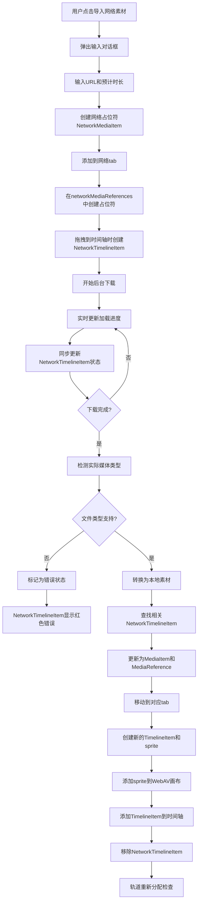

# 网络素材支持设计方案

## 概述

本文档描述了为视频编辑器添加网络素材支持的完整设计方案。网络素材允许用户通过URL导入远程媒体文件，支持占位符机制和自动类型转换。

## 功能需求

### 核心功能
- 通过URL导入网络素材
- 支持预计时长设置（默认5秒）
- 网络素材加载进度显示
- 加载完成后自动转换为对应的本地媒体类型
- 时间轴占位符支持，加载期间限制编辑功能
- 项目持久化时保存网络素材状态

### 用户交互流程
1. 点击导入文件按钮 → 显示右键菜单
2. 选择"导入网络素材" → 弹出输入对话框
3. 输入URL和预计时长 → 确认导入
4. 网络tab显示加载进度 → 可拖拽到时间轴占位
5. 加载完成 → 自动转换为对应类型并移动到相应tab
6. 时间轴clip自动重建为正确类型

## 技术设计

### 1. 数据结构扩展

#### 1.1 类型定义扩展
```typescript
// types/index.ts
export type MediaType = 'video' | 'image' | 'audio' | 'text' | 'network'
export type NetworkMediaStatus = 'loading' | 'loaded' | 'error' | 'timeout' | 'unsupported'
```

#### 1.2 网络素材专用接口
```typescript
/**
 * 网络素材项目接口 - 专门用于网络素材加载期间
 */
export interface NetworkMediaItem {
  id: string
  name: string // 从URL提取或用户输入的名称
  networkUrl: string // 网络素材的原始URL
  networkStatus: NetworkMediaStatus // 网络加载状态
  loadingProgress: number // 加载进度 0-100
  expectedDuration: number // 用户输入的预计时长（帧数）
  mediaType: 'network' // 固定为network类型

  // 加载过程中的临时数据
  downloadedFile?: File // 下载完成的文件对象
  detectedMediaType?: MediaType // 检测到的实际媒体类型
  errorMessage?: string // 错误信息（当状态为error或unsupported时）

  // UI显示相关
  thumbnailUrl?: string // 默认的网络素材图标

  // 时间戳
  createdAt: string
  startedAt?: string // 开始下载时间
  completedAt?: string // 完成下载时间
}

/**
 * 网络素材引用 - 用于项目持久化
 */
export interface NetworkMediaReference {
  originalFileName: string
  networkUrl: string
  expectedDuration: number // 预计时长（帧数）
  isNetworkPlaceholder: true // 标识为网络占位符
  type: 'network'

  // 加载状态（不持久化，重新加载时重置）
  fileSize: 0
  checksum: ''
}
```

#### 1.3 类型联合和工具函数
```typescript
/**
 * 媒体项目联合类型
 */
export type AnyMediaItem = MediaItem | NetworkMediaItem

/**
 * 媒体引用联合类型
 */
export type AnyMediaReference = MediaReference | NetworkMediaReference

/**
 * 类型守卫函数
 */
export function isNetworkMediaItem(item: AnyMediaItem): item is NetworkMediaItem {
  return item.mediaType === 'network'
}

export function isNetworkMediaReference(ref: AnyMediaReference): ref is NetworkMediaReference {
  return ref.type === 'network' && 'isNetworkPlaceholder' in ref
}

/**
 * 网络素材转换结果
 */
export interface NetworkToLocalConversionResult {
  localMediaItem: MediaItem
  localMediaReference: MediaReference
  timelineItemsToRebuild: string[] // 需要重建的时间轴项目ID列表
}

/**
 * 网络时间轴项目接口 - 专门用于网络素材占位符
 */
export interface NetworkTimelineItem {
  id: string
  mediaItemId: string // 指向 NetworkMediaItem.id
  trackId: string
  mediaType: 'network' // 固定为network类型

  // 时间范围（基于预计时长）
  timeRange: {
    timelineStartTime: number // 帧数
    timelineEndTime: number // 帧数
  }

  // 网络状态相关
  networkStatus: NetworkMediaStatus
  loadingProgress: number // 0-100
  errorMessage?: string

  // 占位符配置
  config: {
    name: string // 显示名称
    expectedDuration: number // 预计时长（帧数）
  }

  // 标识字段
  isNetworkPlaceholder: true
  sprite: null // 网络占位符不创建sprite
}

/**
 * 时间轴项目联合类型
 */
export type AnyTimelineItem = TimelineItem | NetworkTimelineItem

/**
 * 类型守卫函数
 */
export function isNetworkTimelineItem(item: AnyTimelineItem): item is NetworkTimelineItem {
  return item.mediaType === 'network' && 'isNetworkPlaceholder' in item
}

/**
 * 查找需要重建的时间轴项目工具函数
 */
export function findTimelineItemsToRebuild(
  networkMediaItemId: string,
  timelineItems: AnyTimelineItem[]
): string[] {
  return timelineItems
    .filter(item => item.mediaItemId === networkMediaItemId)
    .map(item => item.id)
}
```

### 2. UI 层改造

#### 2.1 Tab 系统扩展
在 `MediaLibrary.vue` 中添加网络tab：

```typescript
const tabs = [
  // ... 现有tabs
  {
    type: 'network' as TabType,
    label: '网络',
    icon: 'M12,2A10,10 0 0,0 2,12A10,10 0 0,0 12,22A10,10 0 0,0 22,12A10,10 0 0,0 12,2M11,19.93C7.05,19.44 4,16.08 4,12C4,11.38 4.08,10.78 4.21,10.21L9,15V16A1,1 0 0,0 10,17H11V19.93M17.9,17.39C17.64,16.58 16.9,16 16,16H15V13A1,1 0 0,0 14,12H8V10H10A1,1 0 0,0 11,9V7H13A2,2 0 0,0 15,5V4.59C17.93,5.77 20,8.64 20,12C20,14.08 19.2,15.97 17.9,17.39Z'
  }
]

type TabType = 'all' | 'video' | 'audio' | 'network'
```

#### 2.2 导入菜单扩展
扩展右键菜单支持两种导入方式：

```typescript
const currentMenuItems = computed((): MenuItem[] => {
  if (contextMenuType.value === 'empty') {
    return [
      {
        label: '导入本地文件',
        icon: 'M19,13H13V19H11V13H5V11H11V5H13V11H19V13Z',
        onClick: () => handleImportLocalFiles(),
      },
      {
        label: '导入网络素材',
        icon: 'M12,2A10,10 0 0,0 2,12A10,10 0 0,0 12,22A10,10 0 0,0 22,12A10,10 0 0,0 12,2M11,19.93C7.05,19.44 4,16.08 4,12C4,11.38 4.08,10.78 4.21,10.21L9,15V16A1,1 0 0,0 10,17H11V19.93M17.9,17.39C17.64,16.58 16.9,16 16,16H15V13A1,1 0 0,0 14,12H8V10H10A1,1 0 0,0 11,9V7H13A2,2 0 0,0 15,5V4.59C17.93,5.77 20,8.64 20,12C20,14.08 19.2,15.97 17.9,17.39Z',
        onClick: () => handleImportNetworkMedia(),
      }
    ]
  }
  // ... 其他菜单逻辑
})
```

#### 2.3 网络素材输入对话框
创建新组件 `NetworkMediaDialog.vue`：
- URL 输入框（必填，支持常见媒体URL格式验证）
- 预计时长输入框（默认5秒，自动转换为帧数）
- 素材名称输入框（可选，默认从URL提取文件名）
- 支持格式提示（显示当前支持的媒体格式列表）
- 确认/取消按钮
- URL 格式验证和实时反馈

#### 2.4 时间轴网络clip组件
创建新组件 `TimelineNetworkClip.vue`：
- 专门用于渲染 NetworkTimelineItem
- 根据 networkStatus 显示不同的视觉状态
- 支持基本操作：选中、删除、拖拽移动
- 禁用编辑功能：裁剪、复制、分割、动画等
- 实时显示加载进度和错误状态

### 3. TimelineNetworkClip 组件设计

#### 3.1 组件结构
```vue
<template>
  <div
    class="timeline-network-clip"
    :class="[
      `status-${networkStatus}`,
      { selected: isSelected }
    ]"
    @click="handleSelect"
    @contextmenu="handleContextMenu"
  >
    <!-- 背景层 -->
    <div class="clip-background" :style="backgroundStyle">

      <!-- 加载状态 -->
      <div v-if="networkStatus === 'loading'" class="loading-content">
        <div class="loading-spinner"></div>
        <div class="progress-bar">
          <div class="progress-fill" :style="{ width: `${loadingProgress}%` }"></div>
        </div>
        <span class="progress-text">{{ loadingProgress }}%</span>
      </div>

      <!-- 错误状态 -->
      <div v-else-if="isErrorStatus" class="error-content">
        <div class="error-icon">⚠</div>
        <span class="error-text">错误</span>
        <div v-if="errorMessage" class="error-details">{{ errorMessage }}</div>
      </div>

      <!-- 素材信息 -->
      <div class="clip-info">
        <span class="clip-name">{{ clipName }}</span>
        <span class="clip-duration">{{ formattedDuration }}</span>
      </div>
    </div>

    <!-- 选中边框 -->
    <div v-if="isSelected" class="selection-border"></div>
  </div>
</template>
```

#### 3.2 样式设计
```scss
.timeline-network-clip {
  position: relative;
  height: 50px;
  border-radius: 4px;
  cursor: pointer;
  user-select: none;

  // 状态样式
  &.status-loading {
    .clip-background {
      background: linear-gradient(135deg, #3498db, #2980b9);
      border: 2px solid #2980b9;
    }
  }

  &.status-unsupported,
  &.status-error {
    .clip-background {
      background: linear-gradient(135deg, #e74c3c, #c0392b);
      border: 2px solid #c0392b;
    }
  }

  // 加载内容
  .loading-content {
    display: flex;
    flex-direction: column;
    align-items: center;
    justify-content: center;
    height: 100%;
    color: white;

    .loading-spinner {
      width: 16px;
      height: 16px;
      border: 2px solid rgba(255, 255, 255, 0.3);
      border-top: 2px solid white;
      border-radius: 50%;
      animation: spin 1s linear infinite;
    }

    .progress-bar {
      width: 80%;
      height: 4px;
      background: rgba(255, 255, 255, 0.3);
      border-radius: 2px;
      margin: 4px 0;

      .progress-fill {
        height: 100%;
        background: white;
        border-radius: 2px;
        transition: width 0.3s ease;
      }
    }

    .progress-text {
      font-size: 10px;
      font-weight: bold;
    }
  }

  // 错误内容
  .error-content {
    display: flex;
    flex-direction: column;
    align-items: center;
    justify-content: center;
    height: 100%;
    color: white;

    .error-icon {
      font-size: 18px;
      margin-bottom: 2px;
    }

    .error-text {
      font-size: 12px;
      font-weight: bold;
    }

    .error-details {
      font-size: 8px;
      opacity: 0.8;
      text-align: center;
      margin-top: 2px;
    }
  }

  // 素材信息
  .clip-info {
    position: absolute;
    bottom: 2px;
    left: 4px;
    right: 4px;
    display: flex;
    justify-content: space-between;
    font-size: 10px;
    color: rgba(255, 255, 255, 0.9);

    .clip-name {
      flex: 1;
      overflow: hidden;
      text-overflow: ellipsis;
      white-space: nowrap;
    }

    .clip-duration {
      margin-left: 4px;
    }
  }

  // 选中边框
  .selection-border {
    position: absolute;
    top: -2px;
    left: -2px;
    right: -2px;
    bottom: -2px;
    border: 2px solid #f39c12;
    border-radius: 6px;
    pointer-events: none;
  }
}

@keyframes spin {
  0% { transform: rotate(0deg); }
  100% { transform: rotate(360deg); }
}
```

#### 3.3 组件逻辑
```typescript
// TimelineNetworkClip.vue <script setup>
interface Props {
  networkTimelineItem: NetworkTimelineItem
  isSelected: boolean
  timelineScale: number // 时间轴缩放比例
}

const props = defineProps<Props>()
const emit = defineEmits<{
  select: [id: string]
  delete: [id: string]
  contextMenu: [event: MouseEvent, item: NetworkTimelineItem]
}>()

// 计算属性
const networkStatus = computed(() => props.networkTimelineItem.networkStatus)
const loadingProgress = computed(() => props.networkTimelineItem.loadingProgress)
const errorMessage = computed(() => props.networkTimelineItem.errorMessage)
const isErrorStatus = computed(() =>
  networkStatus.value === 'unsupported' || networkStatus.value === 'error'
)

const clipName = computed(() => props.networkTimelineItem.config.name)
const formattedDuration = computed(() => {
  const frames = props.networkTimelineItem.config.expectedDuration
  return framesToTimecode(frames)
})

const backgroundStyle = computed(() => {
  const duration = props.networkTimelineItem.timeRange.timelineEndTime -
                   props.networkTimelineItem.timeRange.timelineStartTime
  const width = duration * props.timelineScale
  return {
    width: `${width}px`
  }
})

// 事件处理
const handleSelect = () => {
  emit('select', props.networkTimelineItem.id)
}

const handleContextMenu = (event: MouseEvent) => {
  event.preventDefault()
  emit('contextMenu', event, props.networkTimelineItem)
}

// 监听状态变化
watch(() => props.networkTimelineItem.networkStatus, (newStatus) => {
  // 状态变化时的动画效果
  if (newStatus === 'unsupported' || newStatus === 'error') {
    // 添加错误状态动画
    nextTick(() => {
      // 可以添加震动或闪烁效果
    })
  }
})
```

#### 3.4 Timeline.vue 集成
```typescript
// Timeline.vue 中的集成逻辑
<template>
  <div class="timeline">
    <!-- 轨道渲染 -->
    <div v-for="track in tracks" :key="track.id" class="track">
      <!-- 时间轴项目渲染 -->
      <template v-for="item in getTrackItems(track.id)" :key="item.id">
        <!-- 网络clip -->
        <TimelineNetworkClip
          v-if="isNetworkTimelineItem(item)"
          :network-timeline-item="item"
          :is-selected="selectedItemId === item.id"
          :timeline-scale="timelineScale"
          @select="handleSelectItem"
          @delete="handleDeleteNetworkItem"
          @context-menu="handleNetworkItemContextMenu"
        />

        <!-- 普通clip -->
        <TimelineClip
          v-else
          :timeline-item="item"
          :is-selected="selectedItemId === item.id"
          :timeline-scale="timelineScale"
          @select="handleSelectItem"
          @delete="handleDeleteItem"
          @context-menu="handleItemContextMenu"
        />
      </template>
    </div>
  </div>
</template>

<script setup lang="ts">
// 网络clip特殊处理
const handleDeleteNetworkItem = async (itemId: string) => {
  const networkItem = timelineItems.value.find(item =>
    item.id === itemId && isNetworkTimelineItem(item)
  ) as NetworkTimelineItem

  if (networkItem) {
    console.log(`🗑️ 删除NetworkTimelineItem: ${itemId}`)

    // 取消下载任务
    networkMediaManager.cancelDownload(networkItem.mediaItemId)

    // 从时间轴移除NetworkTimelineItem
    const index = timelineItems.value.findIndex(item => item.id === itemId)
    if (index !== -1) {
      timelineItems.value.splice(index, 1)
      console.log(`✅ NetworkTimelineItem已从时间轴移除`)
    }

    // 如果没有其他时间轴项目引用，也从媒体库移除
    const hasOtherReferences = timelineItems.value.some(item =>
      item.mediaItemId === networkItem.mediaItemId
    )
    if (!hasOtherReferences) {
      networkMediaManager.removeNetworkMediaItem(networkItem.mediaItemId)
      console.log(`🧹 NetworkMediaItem已从媒体库移除`)
    }
  }
}

// 网络素材转换完成的处理函数
const handleNetworkMediaConversion = async (
  networkMediaItem: NetworkMediaItem,
  localMediaItem: MediaItem
) => {
  console.log(`🔄 开始转换网络素材: ${networkMediaItem.id} → ${localMediaItem.id}`)

  // 查找所有相关的NetworkTimelineItem
  const networkTimelineItems = timelineItems.value.filter(item =>
    isNetworkTimelineItem(item) && item.mediaItemId === networkMediaItem.id
  ) as NetworkTimelineItem[]

  for (const networkItem of networkTimelineItems) {
    // 1. 创建新的TimelineItem（详细逻辑见转换流程）
    // 注意：这里会根据实际文件时长调整clip范围
    const newTimelineItem = await createTimelineItemFromLocalMedia(
      localMediaItem,
      networkItem.timeRange,
      networkItem.trackId
    )

    // 2. 添加新的TimelineItem
    timelineItems.value.push(newTimelineItem)
    console.log(`✅ 添加新TimelineItem: ${newTimelineItem.id}`)

    // 3. 移除NetworkTimelineItem
    const index = timelineItems.value.findIndex(item => item.id === networkItem.id)
    if (index !== -1) {
      timelineItems.value.splice(index, 1)
      console.log(`🗑️ 移除NetworkTimelineItem: ${networkItem.id}`)
    }
  }

  console.log(`🎉 网络素材转换完成，共转换 ${networkTimelineItems.length} 个clip`)
}

const handleNetworkItemContextMenu = (event: MouseEvent, item: NetworkTimelineItem) => {
  const menuItems = []

  if (item.networkStatus === 'error') {
    menuItems.push({
      label: '重试下载',
      onClick: () => networkMediaManager.retryDownload(item.mediaItemId)
    })
  }

  if (item.networkStatus === 'unsupported') {
    menuItems.push({
      label: '重新选择文件',
      onClick: () => showNetworkMediaDialog(item.mediaItemId)
    })
  }

  menuItems.push({
    label: '删除',
    onClick: () => handleDeleteNetworkItem(item.id)
  })

  showContextMenu(event, menuItems)
}
</script>
```

### 4. 网络素材管理器

#### 4.1 NetworkMediaManager 核心类
```typescript
export class NetworkMediaManager {
  private static instance: NetworkMediaManager
  private loadingTasks = new Map<string, AbortController>()
  private networkMediaItems = new Map<string, NetworkMediaItem>()

  /**
   * 创建网络素材项目
   * @param url 网络URL
   * @param expectedDuration 预计时长（帧数）
   * @param name 素材名称（可选，默认从URL提取）
   * @returns 网络素材项目
   */
  createNetworkMediaItem(
    url: string,
    expectedDuration: number,
    name?: string
  ): NetworkMediaItem

  /**
   * 开始网络素材下载
   * @param networkMediaItem 网络素材项目
   * @returns Promise<void>
   */
  async startDownload(networkMediaItem: NetworkMediaItem): Promise<void>

  /**
   * 取消网络素材下载
   * @param mediaItemId 媒体项目ID
   */
  cancelDownload(mediaItemId: string): void

  /**
   * 获取网络素材加载进度
   * @param mediaItemId 媒体项目ID
   * @returns 进度百分比 0-100
   */
  getLoadingProgress(mediaItemId: string): number

  /**
   * 检测下载文件的实际媒体类型
   * @param file 下载的文件
   * @returns 检测到的媒体类型，如果不支持则抛出错误
   */
  private async detectMediaType(file: File): Promise<MediaType>

  /**
   * 检查文件类型是否支持
   * @param file 下载的文件
   * @returns 是否为支持的媒体类型
   */
  private isSupportedMediaType(file: File): boolean

  /**
   * 转换网络素材为本地素材
   * @param networkMediaItem 网络素材项目
   * @param timelineItems 时间轴项目数组（用于查找需要重建的clip）
   * @returns 转换结果
   */
  async convertToLocal(
    networkMediaItem: NetworkMediaItem,
    timelineItems: TimelineItem[]
  ): Promise<NetworkToLocalConversionResult>

  /**
   * 清理网络素材数据
   * @param mediaItemId 媒体项目ID
   */
  removeNetworkMediaItem(mediaItemId: string): void

  /**
   * 获取所有网络素材项目
   * @returns 网络素材项目列表
   */
  getAllNetworkMediaItems(): NetworkMediaItem[]

  /**
   * 重新尝试下载失败的网络素材
   * @param mediaItemId 媒体项目ID
   */
  retryDownload(mediaItemId: string): Promise<void>

  /**
   * 更新网络素材的URL（用于错误修复）
   * @param mediaItemId 媒体项目ID
   * @param newUrl 新的URL
   */
  updateNetworkUrl(mediaItemId: string, newUrl: string): Promise<void>
}
```

### 4. 工作流程设计

#### 4.1 网络素材导入流程


#### 4.2 网络素材转换流程
1. **下载完成检测**：NetworkMediaItem 的 downloadedFile 字段不为空
2. **类型检测**：根据下载的文件头信息检测实际媒体类型
3. **类型支持检查**：
   ```typescript
   if (!isSupportedMediaType(downloadedFile)) {
     // 标记为不支持的文件类型
     networkMediaItem.networkStatus = 'unsupported'
     networkMediaItem.errorMessage = `不支持的文件类型: ${downloadedFile.type}`
     // 保持占位符状态，不进行转换
     return
   }
   ```
4. **创建本地素材**（仅当文件类型支持时）：
   - 将下载的文件保存到项目的media目录
   - 创建标准的 MediaItem 对象（与直接导入的本地素材完全相同）
   - 创建对应类型的 WebAV Clip（MP4Clip/ImgClip/AudioClip）
   - 生成缩略图
5. **查找相关时间轴clip**（仅当文件类型支持时）：
   ```typescript
   const timelineItemsToRebuild = timelineItems.filter(
     item => item.mediaItemId === networkMediaItem.id
   ).map(item => item.id)
   ```
6. **数据替换**（仅当文件类型支持时）：
   - **完全替换**：用新的 MediaItem 替换 NetworkMediaItem
   - **完全替换**：用新的 MediaReference 替换 NetworkMediaReference
   - 从网络tab移动到对应的tab（视频/音频）
7. **时间轴clip重建**（仅当文件类型支持时）：
   - 查找相关的 NetworkTimelineItem
   - **时长调整**：比较实际文件时长与预估时长，使用实际时长重新设置clip范围
   - **创建新clip**：基于本地素材创建新的 sprite 和 TimelineItem
   - **画布更新**：将新的 sprite 添加到 WebAV 画布
   - **添加新clip**：将新的 TimelineItem 添加到时间轴数组
   - **移除NetworkClip**：从时间轴数组中移除 NetworkTimelineItem
   - 保持原有的起始位置和轨道位置（必要时重新分配轨道）
8. **错误状态处理**（当文件类型不支持时）：
   - NetworkMediaItem 保持在网络tab中
   - 时间轴占位符显示红色错误状态
   - 属性面板显示错误信息和重新选择文件选项
9. **清理网络数据**：删除 NetworkMediaItem 和相关的网络加载任务（仅当成功转换时）

**重要说明**：转换过程是**先添加新clip，再移除旧clip**的过程，而不是就地修改。这确保了：
- **无缝切换**：避免时间轴出现空白期，用户体验更流畅
- **类型安全**：NetworkTimelineItem 和 TimelineItem 是不同的类型
- **状态清晰**：避免中间状态的混乱
- **渲染正确**：Vue能正确识别组件类型变化并重新渲染
- **时长准确**：根据实际文件时长调整clip范围，而不是使用预估时长

#### 4.3 网络时间轴clip处理
**NetworkTimelineItem 特性**：
- 专门的网络clip类型，不创建 WebAV sprite
- 根据 networkStatus 显示不同的视觉效果：
  - `loading`：蓝色背景，显示加载进度条和百分比
  - `unsupported`：红色背景，中央显示"错误"文字
  - `error`：红色背景，显示具体错误信息
- 禁用所有编辑功能（裁剪、复制、分割、动画等）
- 支持基本操作：选中、删除、拖拽移动
- 属性面板显示网络加载信息（URL、进度、预计时长、错误信息）

**NetworkTimelineItem 转换流程**：
```typescript
// 1. 查找需要转换的网络时间轴项目
const networkTimelineItems = timelineItems.value.filter(
  item => isNetworkTimelineItem(item) && item.mediaItemId === networkMediaItem.id
) as NetworkTimelineItem[]

// 2. 根据网络素材状态处理
if (networkMediaItem.networkStatus === 'unsupported') {
  // 文件类型不支持，更新NetworkTimelineItem显示错误状态
  for (const networkItem of networkTimelineItems) {
    networkItem.networkStatus = 'unsupported'
    networkItem.errorMessage = networkMediaItem.errorMessage
    // 保持NetworkTimelineItem状态，不转换
  }
} else if (networkMediaItem.networkStatus === 'loaded') {
  // 文件类型支持，转换为标准TimelineItem
  for (const networkItem of networkTimelineItems) {
    // 保存原有配置
    const originalTimeRange = networkItem.timeRange
    const originalTrackId = networkItem.trackId
    const originalId = networkItem.id

    // 1. 创建新的sprite（基于转换后的本地素材）
    const newSprite = await createSpriteFromMediaItem(localMediaItem)

    // 2. 处理时长不匹配的情况
    const originalDuration = originalTimeRange.timelineEndTime - originalTimeRange.timelineStartTime
    const actualDuration = localMediaItem.duration // 实际文件时长（帧数）

    let newTimelineEndTime: number
    if (actualDuration !== originalDuration) {
      // 实际时长与预估时长不符，使用实际时长
      newTimelineEndTime = originalTimeRange.timelineStartTime + actualDuration
      console.log(`⏱️ 时长调整: 预估${originalDuration}帧 → 实际${actualDuration}帧`)
    } else {
      // 时长匹配，保持原有范围
      newTimelineEndTime = originalTimeRange.timelineEndTime
    }

    newSprite.setTimeRange({
      timelineStartTime: originalTimeRange.timelineStartTime,
      timelineEndTime: newTimelineEndTime,
      clipStartTime: 0,
      clipEndTime: actualDuration
    })

    // 2. 检查轨道兼容性，必要时重新分配
    let targetTrackId = originalTrackId
    if (needsTrackReassignment(originalTrackId, localMediaItem.mediaType)) {
      targetTrackId = findCompatibleTrack(localMediaItem.mediaType)
      console.log(`🔄 轨道重新分配: ${originalTrackId} → ${targetTrackId}`)
    }

    // 3. 创建新的标准TimelineItem
    const newTimelineItem: TimelineItem = {
      id: generateNewTimelineItemId(), // 生成新的ID
      mediaItemId: localMediaItem.id,
      trackId: targetTrackId,
      mediaType: localMediaItem.mediaType,
      timeRange: newSprite.getTimeRange(),
      sprite: markRaw(newSprite),
      config: {
        // 基于原有配置创建新配置
        opacity: 1,
        // ... 其他默认配置
      },
      mediaName: localMediaItem.name
    }

    // 4. 添加sprite到WebAV画布
    avCanvas.addSprite(newSprite)
    console.log(`🎨 添加sprite到画布: ${newTimelineItem.id}`)

    // 5. 添加新的TimelineItem到时间轴
    timelineItems.value.push(newTimelineItem)
    console.log(`✅ 添加新TimelineItem: ${newTimelineItem.id}`)

    // 6. 从时间轴移除NetworkTimelineItem
    const networkItemIndex = timelineItems.value.findIndex(item => item.id === originalId)
    if (networkItemIndex !== -1) {
      timelineItems.value.splice(networkItemIndex, 1)
      console.log(`🗑️ 移除NetworkTimelineItem: ${originalId}`)
    }

    // 7. 触发UI更新（如果当前选中的是被替换的项目）
    if (selectedTimelineItemId.value === originalId) {
      selectedTimelineItemId.value = newTimelineItem.id
    }
  }
}
```

**轨道重新分配逻辑**：
- 网络→视频：移动到最近的视频轨道
- 网络→音频：移动到最近的音频轨道
- 网络→图片：移动到最近的视频轨道（图片使用视频轨道）
- 如果目标轨道不存在，自动创建新轨道

**NetworkTimelineItem 拖拽规则**：
- 可以拖拽到任何轨道（因为实际类型未知）
- 转换时根据实际类型重新分配到合适轨道
- 错误状态的NetworkTimelineItem可以删除但不能转换

### 5. 持久化设计

#### 5.1 项目保存结构
```json
{
  "mediaReferences": {
    // 已完成转换的网络素材 - 完全等同于本地素材
    "converted_item_123": {
      "originalFileName": "network_video.mp4",
      "storedPath": "media/videos/network_video.mp4",
      "type": "video",
      "fileSize": 1024000,
      "checksum": "abc123"
      // 注意：转换后不保留任何网络相关信息
    },

    // 普通本地素材
    "local_item_789": {
      "originalFileName": "local_video.mp4",
      "storedPath": "media/videos/local_video.mp4",
      "type": "video",
      "fileSize": 2048000,
      "checksum": "def456"
    }
  },

  // 网络素材占位符单独存储
  "networkMediaReferences": {
    "network_item_456": {
      "originalFileName": "loading_audio.mp3",
      "networkUrl": "https://example.com/audio.mp3",
      "expectedDuration": 150,
      "isNetworkPlaceholder": true,
      "type": "network",
      "fileSize": 0,
      "checksum": ""
    },
    "network_item_789": {
      "originalFileName": "error_video.mp4",
      "networkUrl": "https://example.com/unsupported.xyz",
      "expectedDuration": 300,
      "isNetworkPlaceholder": true,
      "type": "network",
      "networkStatus": "unsupported",
      "errorMessage": "不支持的文件类型: application/octet-stream",
      "fileSize": 0,
      "checksum": ""
    }
  }
}
```

#### 5.2 项目加载恢复机制
1. **分离加载**：
   - **mediaReferences**：按普通本地素材加载，包括已转换完成的网络素材
   - **networkMediaReferences**：重新创建 NetworkMediaItem，重新启动下载流程
2. **网络素材恢复**：
   - 从 networkMediaReferences 创建 NetworkMediaItem 对象
   - 重新启动网络下载任务
   - 恢复到网络tab中显示
3. **状态重置**：
   - 加载进度重置为0
   - 网络状态重置为 'loading'
   - 重新开始下载流程
4. **错误处理**：
   - 网络不可用：显示错误状态，提供重试选项
   - URL失效：标记为错误状态，允许用户修改URL
   - 超时：提供重新加载选项

### 6. Tab 切换逻辑扩展

#### 6.1 自动切换规则
```typescript
function determineTargetTab(draggedMediaTypes: MediaType[]): TabType {
  const hasNetwork = draggedMediaTypes.includes('network')
  const hasVideo = draggedMediaTypes.some(type => ['video', 'image'].includes(type))
  const hasAudio = draggedMediaTypes.includes('audio')
  
  // 纯网络素材
  if (hasNetwork && draggedMediaTypes.length === 1) {
    return 'network'
  }
  
  // 混合类型显示全部
  if (draggedMediaTypes.length > 1) {
    return 'all'
  }
  
  // 单一类型
  if (hasVideo) return 'video'
  if (hasAudio) return 'audio'
  
  return 'all'
}
```

### 7. 时长调整机制

#### 7.1 时长不匹配处理
当网络素材下载完成后，实际文件时长往往与用户预估的时长不符：

```typescript
// 时长调整逻辑
function adjustTimelineItemDuration(
  originalTimeRange: TimeRange,
  actualDuration: number,
  expectedDuration: number
): TimeRange {
  const startTime = originalTimeRange.timelineStartTime

  if (actualDuration !== expectedDuration) {
    console.log(`⏱️ 时长调整: 预估${expectedDuration}帧 → 实际${actualDuration}帧`)

    return {
      timelineStartTime: startTime,
      timelineEndTime: startTime + actualDuration,
      clipStartTime: 0,
      clipEndTime: actualDuration
    }
  }

  // 时长匹配，保持原有范围
  return originalTimeRange
}
```

#### 7.2 用户体验考虑
- **保持起始位置**：clip的开始时间保持不变，只调整结束时间
- **自动适应**：无需用户手动调整，系统自动使用实际时长
- **视觉反馈**：在控制台显示时长调整信息，便于调试
- **冲突处理**：如果调整后的clip与其他clip重叠，需要处理冲突

### 8. 错误处理和用户体验

#### 8.1 加载状态显示
- **网络tab**：
  - `loading`：显示蓝色加载进度条和百分比
  - `unsupported`：显示红色错误图标和"不支持的格式"文字
  - `error`：显示红色错误图标和具体错误信息
- **NetworkTimelineItem**：
  - `loading`：蓝色背景，显示加载动画和进度百分比
  - `unsupported`：红色背景，中央显示"错误"文字
  - `error`：红色背景，中央显示"错误"文字
- **属性面板**：
  - `loading`：显示URL、进度、预计时长、取消按钮
  - `unsupported`：显示错误信息、支持格式列表、重新选择/删除按钮
  - `error`：显示错误信息、重试/删除按钮

#### 7.2 错误处理策略
- **网络超时**：显示重试按钮，支持手动重新加载
- **URL无效**：显示错误提示，允许修改URL
- **文件格式不支持**：
  - 网络tab中显示红色错误状态
  - 时间轴占位符显示红色"错误"标识
  - 属性面板显示"不支持的文件类型"和支持格式列表
  - 提供"重新选择文件"或"删除"选项
- **下载失败**：显示具体错误信息，提供重试选项

#### 7.3 断线恢复机制
- **项目重新打开**：自动检查未完成的网络加载任务
- **网络恢复**：自动重试失败的下载任务
- **清理机制**：定期清理长时间失败的网络占位符

## 实现计划

### Phase 1: 基础结构（1-2天）
- [ ] 扩展类型定义（MediaType, NetworkMediaStatus等）
- [ ] 创建网络tab UI
- [ ] 实现网络素材输入对话框
- [ ] 扩展导入菜单

### Phase 2: 核心功能（3-4天）
- [ ] 实现 NetworkMediaManager 类
- [ ] 实现 NetworkMediaItem 和 NetworkMediaReference 接口
- [ ] 实现 NetworkTimelineItem 接口和类型守卫
- [ ] 创建 TimelineNetworkClip.vue 组件
- [ ] 网络素材占位符创建和管理
- [ ] 基础下载和进度更新流程
- [ ] NetworkTimelineItem UI实现（包括错误状态显示）
- [ ] Timeline.vue 集成网络clip渲染逻辑

### Phase 3: 转换和重建（2-3天）
- [ ] 媒体类型检测逻辑
- [ ] 文件类型支持检查（`isSupportedMediaType`）
- [ ] NetworkMediaItem 到 MediaItem 的完整转换
- [ ] NetworkMediaReference 到 MediaReference 的替换
- [ ] 实现 `findTimelineItemsToRebuild` 查找逻辑
- [ ] NetworkTimelineItem 到 TimelineItem 的转换机制（移除+添加）
- [ ] 轨道兼容性检查和重新分配逻辑
- [ ] 不支持文件类型的错误状态处理
- [ ] NetworkTimelineItem 的拖拽和基本操作支持
- [ ] TimelineNetworkClip 组件的交互逻辑完善
- [ ] 时长调整机制实现（实际时长vs预估时长）

### Phase 4: 持久化和恢复（2-3天）
- [ ] 项目保存/加载适配（支持 networkMediaReferences）
- [ ] 断线恢复机制实现
- [ ] NetworkMediaItem 和 MediaItem 的数据流管理
- [ ] 错误状态的持久化和恢复
- [ ] 重试和URL更新功能实现
- [ ] 错误处理和用户反馈完善
- [ ] 测试和优化

### Phase 5: 测试和优化（1-2天）
- [ ] 端到端测试
- [ ] 用户体验优化
- [ ] 文档更新

## 支持的文件格式

### 8.1 基本格式支持
- **视频格式**：MP4, WebM（基于现有WebAV支持）
- **音频格式**：MP3, WAV（基于现有WebAV支持）
- **图片格式**：JPG, PNG（基于现有WebAV支持）
- **URL协议**：HTTP, HTTPS

### 8.2 格式检测
```typescript
function isSupportedMediaType(file: File): boolean {
  // 复用现有的媒体类型检测逻辑
  return isVideoFile(file) || isAudioFile(file) || isImageFile(file)
}
```

## 技术风险和注意事项

1. **CORS 限制**：某些网络资源可能存在跨域限制
2. **文件大小**：大文件下载可能影响用户体验
3. **网络稳定性**：需要处理网络中断和重连
4. **文件类型检测**：需要准确检测文件类型，避免误判
5. **错误状态管理**：确保不支持的文件类型能正确显示错误状态
6. **存储空间**：网络素材下载后占用本地存储空间

## 总结

本方案通过扩展现有的媒体管理架构，为视频编辑器添加了完整的网络素材支持。设计保持了与现有系统的一致性，利用了现有的媒体管理、项目持久化和时间轴重建机制，同时为网络素材提供了完整的生命周期管理。

方案的核心优势：
- **渐进式加载**：支持占位符机制，不阻塞用户操作
- **自动转换**：加载完成后自动转换为对应的本地媒体类型
- **完全本地化**：转换完成后与直接导入的本地素材完全一致，无网络依赖
- **专用组件**：TimelineNetworkClip 提供专门的网络素材渲染和交互
- **智能错误处理**：不支持的文件类型保持占位符状态，显示清晰的错误反馈
- **持久化支持**：完整的项目保存和恢复机制，包括错误状态
- **错误恢复**：完善的错误处理、重试机制和断线恢复
- **用户体验**：直观的进度显示、状态反馈和错误提示
- **数据一致性**：确保网络素材转换后的数据结构与本地素材完全相同
- **操作灵活性**：支持重新选择文件、修改URL、重试下载等恢复操作
- **视觉一致性**：网络clip与普通clip在时间轴上有统一的视觉风格
