# 网络素材支持设计方案

## 概述

本文档描述了为视频编辑器添加网络素材支持的完整设计方案。网络素材允许用户通过URL导入远程媒体文件，支持占位符机制和自动类型转换。

## 功能需求

### 核心功能
- 通过URL导入网络素材
- 支持预计时长设置（默认5秒）
- 网络素材加载进度显示
- 加载完成后自动转换为对应的本地媒体类型
- 时间轴占位符支持，加载期间限制编辑功能
- 项目持久化时保存网络素材状态

### 用户交互流程
1. 点击导入文件按钮 → 显示右键菜单
2. 选择"导入网络素材" → 弹出输入对话框
3. 输入URL和预计时长 → 确认导入
4. 网络tab显示加载进度 → 可拖拽到时间轴占位
5. 加载完成 → 自动转换为对应类型并移动到相应tab
6. 时间轴clip自动重建为正确类型

## 技术设计

### 1. 数据结构扩展

#### 1.1 类型定义扩展
```typescript
// types/index.ts

// 扩展现有的MediaType类型，添加network类型
// 现有定义：export type MediaType = 'video' | 'image' | 'audio' | 'text'
// 扩展为：
export type MediaType = 'video' | 'image' | 'audio' | 'text' | 'network'

// 网络素材状态枚举
export type NetworkMediaStatus = 'loading' | 'loaded' | 'error' | 'timeout' | 'unsupported'

// 网络时间轴项目专用时间范围接口（复用现有的时间范围概念）
export interface NetworkTimeRange {
  /** 时间轴开始时间（帧数） - 网络占位符在整个项目时间轴上的开始位置 */
  timelineStartTime: number
  /** 时间轴结束时间（帧数） - 网络占位符在整个项目时间轴上的结束位置 */
  timelineEndTime: number
}

// 注意：VideoTimeRange 和 ImageTimeRange 已在现有代码中定义，直接复用
```

#### 1.2 继承关系设计

```typescript
/**
 * 基础媒体项目接口 - 所有媒体项目的共同基础
 */
export interface BaseMediaItem {
  id: string
  name: string
  createdAt: string
}

/**
 * 本地媒体项目接口 - 继承基础接口，添加本地文件相关属性
 */
export interface LocalMediaItem extends BaseMediaItem {
  mediaType: 'video' | 'image' | 'audio' | 'text'
  file: File
  url: string
  duration: number // 素材时长（帧数）
  type: string
  mp4Clip: Raw<MP4Clip> | null
  imgClip: Raw<ImgClip> | null
  audioClip: Raw<AudioClip> | null
  isReady: boolean
  status: MediaStatus
  thumbnailUrl?: string
}

/**
 * 网络媒体项目接口 - 继承基础接口，添加网络相关属性
 */
export interface NetworkMediaItem extends BaseMediaItem {
  mediaType: 'network' // 固定为network类型
  networkUrl: string // 网络素材的原始URL
  networkStatus: NetworkMediaStatus // 网络加载状态
  loadingProgress: number // 加载进度 0-100
  expectedDuration: number // 用户输入的预计时长（帧数）

  // 加载过程中的临时数据
  downloadedFile?: File // 下载完成的文件对象
  detectedMediaType?: MediaType // 检测到的实际媒体类型
  errorMessage?: string // 错误信息（当状态为error或unsupported时）

  // UI显示相关
  thumbnailUrl?: string // 默认的网络素材图标

  // 时间戳
  startedAt?: string // 开始下载时间
  completedAt?: string // 完成下载时间

  // 转换状态标记（转换完成后设置为true）
  isConverted?: boolean
}

/**
 * 基础媒体引用接口 - 所有媒体引用的共同基础
 */
export interface BaseMediaReference {
  originalFileName: string
  fileSize: number
  checksum: string
}

/**
 * 本地媒体引用接口 - 继承基础接口，添加本地存储相关属性
 */
export interface LocalMediaReference extends BaseMediaReference {
  type: 'video' | 'image' | 'audio' | 'text'
  storedPath: string // 相对于项目目录的路径
}

/**
 * 网络媒体引用接口 - 继承基础接口，添加网络相关属性
 */
export interface NetworkMediaReference extends BaseMediaReference {
  type: 'network'
  networkUrl: string
  expectedDuration: number // 预计时长（帧数）
  isNetworkPlaceholder: true // 标识为网络占位符

  // 网络素材的文件大小和校验和在下载前为0和空字符串
  fileSize: 0
  checksum: ''

  // 错误状态持久化（可选）
  networkStatus?: NetworkMediaStatus
  errorMessage?: string
}
```

#### 1.3 类型联合和工具函数
```typescript
/**
 * 媒体项目联合类型
 */
export type AnyMediaItem = LocalMediaItem | NetworkMediaItem

/**
 * 媒体引用联合类型
 */
export type AnyMediaReference = LocalMediaReference | NetworkMediaReference

/**
 * 类型守卫函数
 */
export function isLocalMediaItem(item: AnyMediaItem): item is LocalMediaItem {
  return item.mediaType !== 'network'
}

export function isNetworkMediaItem(item: AnyMediaItem): item is NetworkMediaItem {
  return item.mediaType === 'network'
}

export function isLocalMediaReference(ref: AnyMediaReference): ref is LocalMediaReference {
  return ref.type !== 'network'
}

export function isNetworkMediaReference(ref: AnyMediaReference): ref is NetworkMediaReference {
  return ref.type === 'network' && 'isNetworkPlaceholder' in ref
}

/**
 * 网络素材转换结果
 */
export interface NetworkToLocalConversionResult {
  localMediaItem: LocalMediaItem
  localMediaReference: LocalMediaReference
  timelineItemsToRebuild: string[] // 需要重建的时间轴项目ID列表
}

/**
 * 基础时间轴项目接口 - 所有时间轴项目的共同基础
 */
export interface BaseTimelineItem {
  id: string
  mediaItemId: string
  trackId: string
  mediaType: MediaType
}

/**
 * 本地时间轴项目接口 - 继承基础接口，添加本地媒体相关属性
 */
export interface LocalTimelineItem extends BaseTimelineItem {
  mediaType: 'video' | 'image' | 'audio' | 'text'
  mediaItemId: string // 指向 LocalMediaItem.id

  // 时间范围 - 使用现有的时间范围接口
  timeRange: VideoTimeRange | ImageTimeRange // 根据媒体类型使用对应的时间范围

  // sprite和配置
  sprite: Raw<CustomSprite>
  config: GetMediaConfig<MediaType> // 根据媒体类型的配置

  // 其他现有属性
  thumbnailUrl?: string
  mediaName?: string
}

/**
 * 网络时间轴项目接口 - 继承基础接口，添加网络相关属性
 */
export interface NetworkTimelineItem extends BaseTimelineItem {
  mediaType: 'network' // 固定为network类型
  mediaItemId: string // 指向 NetworkMediaItem.id

  // 时间范围 - 使用专用的简化时间范围
  timeRange: NetworkTimeRange

  // 网络状态相关
  networkStatus: NetworkMediaStatus
  loadingProgress: number // 0-100
  errorMessage?: string

  // 占位符配置
  config: {
    name: string // 显示名称
    expectedDuration: number // 预计时长（帧数）
  }

  // 标识字段
  isNetworkPlaceholder: true
  sprite: null // 网络占位符不创建sprite
}

/**
 * 时间轴项目联合类型
 */
export type AnyTimelineItem = LocalTimelineItem | NetworkTimelineItem

/**
 * 类型守卫函数
 */
export function isLocalTimelineItem(item: AnyTimelineItem): item is LocalTimelineItem {
  return item.mediaType !== 'network'
}

export function isNetworkTimelineItem(item: AnyTimelineItem): item is NetworkTimelineItem {
  return item.mediaType === 'network' && 'isNetworkPlaceholder' in item
}

/**
 * 查找需要重建的时间轴项目工具函数
 */
export function findTimelineItemsToRebuild(
  networkMediaItemId: string,
  timelineItems: AnyTimelineItem[]
): string[] {
  return timelineItems
    .filter(item => item.mediaItemId === networkMediaItemId)
    .map(item => item.id)
}
```

### 2. UI 层改造

#### 2.1 Tab 系统扩展
在 `MediaLibrary.vue` 中添加网络tab：

```typescript
const tabs = [
  // ... 现有tabs
  {
    type: 'network' as TabType,
    label: '网络',
    icon: 'M12,2A10,10 0 0,0 2,12A10,10 0 0,0 12,22A10,10 0 0,0 22,12A10,10 0 0,0 12,2M11,19.93C7.05,19.44 4,16.08 4,12C4,11.38 4.08,10.78 4.21,10.21L9,15V16A1,1 0 0,0 10,17H11V19.93M17.9,17.39C17.64,16.58 16.9,16 16,16H15V13A1,1 0 0,0 14,12H8V10H10A1,1 0 0,0 11,9V7H13A2,2 0 0,0 15,5V4.59C17.93,5.77 20,8.64 20,12C20,14.08 19.2,15.97 17.9,17.39Z'
  }
]

type TabType = 'all' | 'video' | 'audio' | 'network'
```

#### 2.2 导入菜单扩展
扩展右键菜单支持两种导入方式：

```typescript
const currentMenuItems = computed((): MenuItem[] => {
  if (contextMenuType.value === 'empty') {
    return [
      {
        label: '导入本地文件',
        icon: 'M19,13H13V19H11V13H5V11H11V5H13V11H19V13Z',
        onClick: () => handleImportLocalFiles(),
      },
      {
        label: '导入网络素材',
        icon: 'M12,2A10,10 0 0,0 2,12A10,10 0 0,0 12,22A10,10 0 0,0 22,12A10,10 0 0,0 12,2M11,19.93C7.05,19.44 4,16.08 4,12C4,11.38 4.08,10.78 4.21,10.21L9,15V16A1,1 0 0,0 10,17H11V19.93M17.9,17.39C17.64,16.58 16.9,16 16,16H15V13A1,1 0 0,0 14,12H8V10H10A1,1 0 0,0 11,9V7H13A2,2 0 0,0 15,5V4.59C17.93,5.77 20,8.64 20,12C20,14.08 19.2,15.97 17.9,17.39Z',
        onClick: () => handleImportNetworkMedia(),
      }
    ]
  }
  // ... 其他菜单逻辑
})
```

#### 2.3 网络素材输入对话框
创建新组件 `NetworkMediaDialog.vue`：
- URL 输入框（必填，支持常见媒体URL格式验证）
- 预计时长输入框（默认5秒，自动转换为帧数）
- 素材名称输入框（可选，默认从URL提取文件名）
- 支持格式提示（显示当前支持的媒体格式列表）
- 确认/取消按钮
- URL 格式验证和实时反馈

#### 2.4 时间轴网络clip组件
创建新组件 `TimelineNetworkClip.vue`：
- 专门用于渲染 NetworkTimelineItem
- 根据 networkStatus 显示不同的视觉状态
- 支持基本操作：选中、删除、拖拽移动
- 禁用编辑功能：裁剪、复制、分割、动画等
- 实时显示加载进度和错误状态

### 3. TimelineNetworkClip 组件设计

#### 3.1 组件结构
```vue
<template>
  <div
    class="timeline-network-clip"
    :class="[
      `status-${networkStatus}`,
      { selected: isSelected }
    ]"
    @click="handleSelect"
    @contextmenu="handleContextMenu"
  >
    <!-- 背景层 -->
    <div class="clip-background" :style="backgroundStyle">

      <!-- 加载状态 -->
      <div v-if="networkStatus === 'loading'" class="loading-content">
        <div class="loading-spinner"></div>
        <div class="progress-bar">
          <div class="progress-fill" :style="{ width: `${loadingProgress}%` }"></div>
        </div>
        <span class="progress-text">{{ loadingProgress }}%</span>
      </div>

      <!-- 错误状态 -->
      <div v-else-if="isErrorStatus" class="error-content">
        <div class="error-icon">⚠</div>
        <span class="error-text">错误</span>
        <div v-if="errorMessage" class="error-details">{{ errorMessage }}</div>
      </div>

      <!-- 素材信息 -->
      <div class="clip-info">
        <span class="clip-name">{{ clipName }}</span>
        <span class="clip-duration">{{ formattedDuration }}</span>
      </div>
    </div>

    <!-- 选中边框 -->
    <div v-if="isSelected" class="selection-border"></div>
  </div>
</template>
```

#### 3.2 样式设计
```scss
.timeline-network-clip {
  position: relative;
  height: 50px;
  border-radius: 4px;
  cursor: pointer;
  user-select: none;

  // 状态样式
  &.status-loading {
    .clip-background {
      background: linear-gradient(135deg, #3498db, #2980b9);
      border: 2px solid #2980b9;
    }
  }

  &.status-unsupported,
  &.status-error {
    .clip-background {
      background: linear-gradient(135deg, #e74c3c, #c0392b);
      border: 2px solid #c0392b;
    }
  }

  // 加载内容
  .loading-content {
    display: flex;
    flex-direction: column;
    align-items: center;
    justify-content: center;
    height: 100%;
    color: white;

    .loading-spinner {
      width: 16px;
      height: 16px;
      border: 2px solid rgba(255, 255, 255, 0.3);
      border-top: 2px solid white;
      border-radius: 50%;
      animation: spin 1s linear infinite;
    }

    .progress-bar {
      width: 80%;
      height: 4px;
      background: rgba(255, 255, 255, 0.3);
      border-radius: 2px;
      margin: 4px 0;

      .progress-fill {
        height: 100%;
        background: white;
        border-radius: 2px;
        transition: width 0.3s ease;
      }
    }

    .progress-text {
      font-size: 10px;
      font-weight: bold;
    }
  }

  // 错误内容
  .error-content {
    display: flex;
    flex-direction: column;
    align-items: center;
    justify-content: center;
    height: 100%;
    color: white;

    .error-icon {
      font-size: 18px;
      margin-bottom: 2px;
    }

    .error-text {
      font-size: 12px;
      font-weight: bold;
    }

    .error-details {
      font-size: 8px;
      opacity: 0.8;
      text-align: center;
      margin-top: 2px;
    }
  }

  // 素材信息
  .clip-info {
    position: absolute;
    bottom: 2px;
    left: 4px;
    right: 4px;
    display: flex;
    justify-content: space-between;
    font-size: 10px;
    color: rgba(255, 255, 255, 0.9);

    .clip-name {
      flex: 1;
      overflow: hidden;
      text-overflow: ellipsis;
      white-space: nowrap;
    }

    .clip-duration {
      margin-left: 4px;
    }
  }

  // 选中边框
  .selection-border {
    position: absolute;
    top: -2px;
    left: -2px;
    right: -2px;
    bottom: -2px;
    border: 2px solid #f39c12;
    border-radius: 6px;
    pointer-events: none;
  }
}

@keyframes spin {
  0% { transform: rotate(0deg); }
  100% { transform: rotate(360deg); }
}
```

#### 3.3 组件逻辑
```typescript
// TimelineNetworkClip.vue <script setup>
interface Props {
  networkTimelineItem: NetworkTimelineItem
  isSelected: boolean
  timelineScale: number // 时间轴缩放比例
}

const props = defineProps<Props>()
const emit = defineEmits<{
  select: [id: string]
  delete: [id: string]
  contextMenu: [event: MouseEvent, item: NetworkTimelineItem]
}>()

// 计算属性
const networkStatus = computed(() => props.networkTimelineItem.networkStatus)
const loadingProgress = computed(() => props.networkTimelineItem.loadingProgress)
const errorMessage = computed(() => props.networkTimelineItem.errorMessage)
const isErrorStatus = computed(() =>
  networkStatus.value === 'unsupported' || networkStatus.value === 'error'
)

const clipName = computed(() => props.networkTimelineItem.config.name)
const formattedDuration = computed(() => {
  const frames = props.networkTimelineItem.config.expectedDuration
  return framesToTimecode(frames)
})

const backgroundStyle = computed(() => {
  const duration = props.networkTimelineItem.timeRange.timelineEndTime -
                   props.networkTimelineItem.timeRange.timelineStartTime
  const width = duration * props.timelineScale
  return {
    width: `${width}px`
  }
})

// 事件处理
const handleSelect = () => {
  emit('select', props.networkTimelineItem.id)
}

const handleContextMenu = (event: MouseEvent) => {
  event.preventDefault()
  emit('contextMenu', event, props.networkTimelineItem)
}

// 监听状态变化
watch(() => props.networkTimelineItem.networkStatus, (newStatus) => {
  // 状态变化时的动画效果
  if (newStatus === 'unsupported' || newStatus === 'error') {
    // 添加错误状态动画
    nextTick(() => {
      // 可以添加震动或闪烁效果
    })
  }
})
```

#### 3.4 Timeline.vue 集成
```typescript
// Timeline.vue 中的集成逻辑
<template>
  <div class="timeline">
    <!-- 轨道渲染 -->
    <div v-for="track in tracks" :key="track.id" class="track">
      <!-- 时间轴项目渲染 -->
      <template v-for="item in getTrackItems(track.id)" :key="item.id">
        <!-- 网络clip -->
        <TimelineNetworkClip
          v-if="isNetworkTimelineItem(item)"
          :network-timeline-item="item"
          :is-selected="selectedItemId === item.id"
          :timeline-scale="timelineScale"
          @select="handleSelectItem"
          @delete="handleDeleteNetworkItem"
          @context-menu="handleNetworkItemContextMenu"
        />

        <!-- 普通clip -->
        <TimelineClip
          v-else
          :timeline-item="item"
          :is-selected="selectedItemId === item.id"
          :timeline-scale="timelineScale"
          @select="handleSelectItem"
          @delete="handleDeleteItem"
          @context-menu="handleItemContextMenu"
        />
      </template>
    </div>
  </div>
</template>

<script setup lang="ts">
// 网络clip特殊处理
const handleDeleteNetworkItem = async (itemId: string) => {
  const networkItem = timelineItems.value.find(item =>
    item.id === itemId && isNetworkTimelineItem(item)
  ) as NetworkTimelineItem

  if (networkItem) {
    console.log(`🗑️ 删除NetworkTimelineItem: ${itemId}`)

    // 取消下载任务
    networkMediaManager.cancelDownload(networkItem.mediaItemId)

    // 从时间轴移除NetworkTimelineItem
    const index = timelineItems.value.findIndex(item => item.id === itemId)
    if (index !== -1) {
      timelineItems.value.splice(index, 1)
      console.log(`✅ NetworkTimelineItem已从时间轴移除`)
    }

    // 如果没有其他时间轴项目引用，也从媒体库移除
    const hasOtherReferences = timelineItems.value.some(item =>
      item.mediaItemId === networkItem.mediaItemId
    )
    if (!hasOtherReferences) {
      networkMediaManager.removeNetworkMediaItem(networkItem.mediaItemId)
      console.log(`🧹 NetworkMediaItem已从媒体库移除`)
    }
  }
}

// 网络素材转换完成的处理函数
const handleNetworkMediaConversion = async (
  networkMediaItem: NetworkMediaItem,
  localMediaItem: LocalMediaItem
) => {
  console.log(`🔄 开始转换网络素材: ${networkMediaItem.id} → ${localMediaItem.id}`)

  // 标记转换完成
  networkMediaItem.isConverted = true
  networkMediaItem.networkStatus = 'loaded'

  // 查找所有相关的NetworkTimelineItem
  const networkTimelineItems = timelineItems.value.filter(item =>
    isNetworkTimelineItem(item) && item.mediaItemId === networkMediaItem.id
  ) as NetworkTimelineItem[]

  for (const networkItem of networkTimelineItems) {
    // 1. 创建新的LocalTimelineItem（详细逻辑见转换流程）
    // 注意：这里会根据实际文件时长调整clip范围
    const newTimelineItem = await createLocalTimelineItemFromNetworkItem(
      localMediaItem,
      networkItem
    )

    // 2. 添加新的LocalTimelineItem
    timelineItems.value.push(newTimelineItem)
    console.log(`✅ 添加新LocalTimelineItem: ${newTimelineItem.id}`)

    // 3. 移除NetworkTimelineItem
    const index = timelineItems.value.findIndex(item => item.id === networkItem.id)
    if (index !== -1) {
      timelineItems.value.splice(index, 1)
      console.log(`🗑️ 移除NetworkTimelineItem: ${networkItem.id}`)
    }
  }

  // 4. 将LocalMediaItem添加到媒体库
  mediaStore.addMediaItem(localMediaItem)
  console.log(`📚 LocalMediaItem已添加到媒体库`)

  // 5. 清理NetworkMediaItem（不保留历史）
  networkMediaManager.removeNetworkMediaItem(networkMediaItem.id)
  console.log(`🧹 NetworkMediaItem已清理`)

  console.log(`🎉 网络素材转换完成，共转换 ${networkTimelineItems.length} 个clip`)
}

const handleNetworkItemContextMenu = (event: MouseEvent, item: NetworkTimelineItem) => {
  const menuItems = []

  if (item.networkStatus === 'error') {
    menuItems.push({
      label: '重试下载',
      onClick: () => networkMediaManager.retryDownload(item.mediaItemId)
    })
  }

  if (item.networkStatus === 'unsupported') {
    menuItems.push({
      label: '重新选择文件',
      onClick: () => showNetworkMediaDialog(item.mediaItemId)
    })
  }

  menuItems.push({
    label: '删除',
    onClick: () => handleDeleteNetworkItem(item.id)
  })

  showContextMenu(event, menuItems)
}
</script>
```

### 4. 网络素材管理器

#### 4.1 NetworkMediaManager 核心类
```typescript
export class NetworkMediaManager {
  private static instance: NetworkMediaManager
  private loadingTasks = new Map<string, AbortController>()
  private networkMediaItems = new Map<string, NetworkMediaItem>()

  /**
   * 创建网络素材项目
   * @param url 网络URL
   * @param expectedDuration 预计时长（帧数）
   * @param name 素材名称（可选，默认从URL提取）
   * @returns 网络素材项目
   */
  createNetworkMediaItem(
    url: string,
    expectedDuration: number,
    name?: string
  ): NetworkMediaItem

  /**
   * 开始网络素材下载
   * @param networkMediaItem 网络素材项目
   * @returns Promise<void>
   */
  async startDownload(networkMediaItem: NetworkMediaItem): Promise<void>

  /**
   * 取消网络素材下载
   * @param mediaItemId 媒体项目ID
   */
  cancelDownload(mediaItemId: string): void

  /**
   * 获取网络素材加载进度
   * @param mediaItemId 媒体项目ID
   * @returns 进度百分比 0-100
   */
  getLoadingProgress(mediaItemId: string): number

  /**
   * 检测下载文件的实际媒体类型
   * @param file 下载的文件
   * @returns 检测到的媒体类型，如果不支持则抛出错误
   */
  private async detectMediaType(file: File): Promise<MediaType>

  /**
   * 检查文件类型是否支持
   * @param file 下载的文件
   * @returns 是否为支持的媒体类型
   */
  private isSupportedMediaType(file: File): boolean

  /**
   * 转换网络素材为本地素材（转换完成后自动清理网络素材）
   * @param networkMediaItem 网络素材项目
   * @param timelineItems 时间轴项目数组（用于查找需要重建的clip）
   * @returns 转换结果
   */
  async convertToLocal(
    networkMediaItem: NetworkMediaItem,
    timelineItems: AnyTimelineItem[]
  ): Promise<NetworkToLocalConversionResult>

  /**
   * 清理网络素材数据
   * @param mediaItemId 媒体项目ID
   */
  removeNetworkMediaItem(mediaItemId: string): void

  /**
   * 获取所有网络素材项目（仅包括加载中和错误状态的素材）
   * @returns 网络素材项目列表
   */
  getAllNetworkMediaItems(): NetworkMediaItem[]

  /**
   * 重新尝试下载失败的网络素材
   * @param mediaItemId 媒体项目ID
   */
  retryDownload(mediaItemId: string): Promise<void>

  /**
   * 更新网络素材的URL（用于错误修复）
   * @param mediaItemId 媒体项目ID
   * @param newUrl 新的URL
   */
  updateNetworkUrl(mediaItemId: string, newUrl: string): Promise<void>
}
```

### 4. 工作流程设计

#### 4.1 网络素材导入流程

```mermaid
graph TD
    A[用户点击导入网络素材] --> B[弹出输入对话框]
    B --> C[输入URL和预计时长]
    C --> D[创建网络占位符NetworkMediaItem]
    D --> E[添加到网络tab]
    E --> F[在NetworkMediaReferences中创建占位符]
    F --> G[拖拽到时间轴时创建NetworkTimelineItem]
    G --> H[开始后台下载]
    H --> I[实时更新加载进度]
    I --> J[同步更新NetworkTimelineItem状态]
    J --> K{下载完成?}
    K -->|是| L[检测实际媒体类型]
    K -->|否| I
    L --> M{文件类型支持?}
    M -->|是| N[转换为本地素材]
    M -->|否| O[标记为错误状态]
    O --> P[NetworkTimelineItem显示红色错误]
    N --> Q[查找相关NetworkTimelineItem]
    Q --> R[创建LocalMediaItem和LocalMediaReference]
    R --> R1[移除NetworkMediaItem和NetworkMediaReference]
    R1 --> S[移动到对应tab]
    S --> T[创建新的TimelineItem和sprite]
    T --> U[添加sprite到WebAV画布]
    U --> V[添加TimelineItem到时间轴]
    V --> W[移除NetworkTimelineItem]
    W --> X[轨道重新分配检查]
```


#### 4.2 网络素材转换流程（基于继承关系）
1. **下载完成检测**：NetworkMediaItem 的 downloadedFile 字段不为空
2. **类型检测**：根据下载的文件头信息检测实际媒体类型
3. **类型支持检查**：
   ```typescript
   if (!isSupportedMediaType(downloadedFile)) {
     // 标记为不支持的文件类型
     networkMediaItem.networkStatus = 'unsupported'
     networkMediaItem.errorMessage = `不支持的文件类型: ${downloadedFile.type}`
     // 保持占位符状态，不进行转换
     return
   }
   ```
4. **创建本地素材**（仅当文件类型支持时）：
   - 将下载的文件保存到项目的media目录
   - 创建 LocalMediaItem 对象（与直接导入的本地素材完全相同）
   - 创建对应类型的 WebAV Clip（MP4Clip/ImgClip/AudioClip）
   - 生成缩略图
5. **标记转换完成**（仅当文件类型支持时）：
   ```typescript
   // 标记NetworkMediaItem转换完成
   networkMediaItem.isConverted = true
   networkMediaItem.networkStatus = 'loaded'
   ```
6. **查找相关时间轴clip**（仅当文件类型支持时）：
   ```typescript
   const networkTimelineItems = timelineItems.filter(
     item => isNetworkTimelineItem(item) && item.mediaItemId === networkMediaItem.id
   ) as NetworkTimelineItem[]
   ```
7. **时间轴clip转换**（仅当文件类型支持时）：
   - 为每个 NetworkTimelineItem 创建对应的 LocalTimelineItem
   - **时长调整**：比较实际文件时长与预估时长，使用实际时长重新设置clip范围
   - **创建新clip**：基于本地素材创建新的 sprite 和 LocalTimelineItem
   - **画布更新**：将新的 sprite 添加到 WebAV 画布
   - **添加新clip**：将新的 LocalTimelineItem 添加到时间轴数组
   - **移除NetworkClip**：从时间轴数组中移除 NetworkTimelineItem
   - 保持原有的起始位置和轨道位置（必要时重新分配轨道）
8. **媒体库更新**（仅当文件类型支持时）：
   - 将 LocalMediaItem 添加到媒体库
   - 从网络tab移动到对应的tab（视频/音频/图片）
   - 清理 NetworkMediaItem（不保留历史）
9. **错误状态处理**（当文件类型不支持时）：
   - NetworkMediaItem 保持在网络tab中，显示错误状态
   - 时间轴占位符显示红色错误状态
   - 属性面板显示错误信息和重新选择文件选项
10. **引用关系更新**：
    - 创建 LocalMediaReference 并添加到 mediaReferences
    - 清理 NetworkMediaReference（不保留历史）

**重要说明**：转换过程是**先添加新clip，再移除旧clip**的过程，而不是就地修改。这确保了：
- **无缝切换**：避免时间轴出现空白期，用户体验更流畅
- **类型安全**：NetworkTimelineItem 和 TimelineItem 是不同的类型
- **状态清晰**：避免中间状态的混乱
- **渲染正确**：Vue能正确识别组件类型变化并重新渲染
- **时长准确**：根据实际文件时长调整clip范围，而不是使用预估时长

#### 4.3 网络时间轴clip处理
**NetworkTimelineItem 特性**：
- 专门的网络clip类型，不创建 WebAV sprite
- 根据 networkStatus 显示不同的视觉效果：
  - `loading`：蓝色背景，显示加载进度条和百分比
  - `unsupported`：红色背景，中央显示"错误"文字
  - `error`：红色背景，显示具体错误信息
- 禁用所有编辑功能（裁剪、复制、分割、动画等）
- 支持基本操作：选中、删除、拖拽移动
- 属性面板显示网络加载信息（URL、进度、预计时长、错误信息）

**NetworkTimelineItem 转换流程**：
```typescript
// 1. 查找需要转换的网络时间轴项目
const networkTimelineItems = timelineItems.value.filter(
  item => isNetworkTimelineItem(item) && item.mediaItemId === networkMediaItem.id
) as NetworkTimelineItem[]

// 2. 根据网络素材状态处理
if (networkMediaItem.networkStatus === 'unsupported') {
  // 文件类型不支持，更新NetworkTimelineItem显示错误状态
  for (const networkItem of networkTimelineItems) {
    networkItem.networkStatus = 'unsupported'
    networkItem.errorMessage = networkMediaItem.errorMessage
    // 保持NetworkTimelineItem状态，不转换
  }
} else if (networkMediaItem.networkStatus === 'loaded') {
  // 文件类型支持，转换为LocalTimelineItem
  for (const networkItem of networkTimelineItems) {
    // 保存原有配置
    const originalTimeRange = networkItem.timeRange
    const originalTrackId = networkItem.trackId
    const originalId = networkItem.id

    // 1. 创建新的sprite（基于转换后的本地素材）
    const newSprite = await createSpriteFromLocalMediaItem(localMediaItem)

    // 2. 处理时长不匹配的情况
    const originalDuration = originalTimeRange.timelineEndTime - originalTimeRange.timelineStartTime
    const actualDuration = localMediaItem.duration // 实际文件时长（帧数）

    let newTimeRange: VideoTimeRange | ImageTimeRange
    if (actualDuration !== originalDuration) {
      // 实际时长与预估时长不符，使用实际时长
      console.log(`⏱️ 时长调整: 预估${originalDuration}帧 → 实际${actualDuration}帧`)
    }

    // 根据实际媒体类型创建对应的时间范围
    if (localMediaItem.mediaType === 'video' || localMediaItem.mediaType === 'audio') {
      newTimeRange = {
        clipStartTime: 0,
        clipEndTime: actualDuration,
        timelineStartTime: originalTimeRange.timelineStartTime,
        timelineEndTime: originalTimeRange.timelineStartTime + actualDuration,
        effectiveDuration: actualDuration,
        playbackRate: 1.0
      } as VideoTimeRange
    } else {
      // 图片类型
      newTimeRange = {
        timelineStartTime: originalTimeRange.timelineStartTime,
        timelineEndTime: originalTimeRange.timelineStartTime + actualDuration,
        displayDuration: actualDuration
      } as ImageTimeRange
    }

    newSprite.setTimeRange(newTimeRange)

    // 3. 检查轨道兼容性，必要时重新分配
    let targetTrackId = originalTrackId
    if (needsTrackReassignment(originalTrackId, localMediaItem.mediaType)) {
      targetTrackId = findCompatibleTrack(localMediaItem.mediaType)
      console.log(`🔄 轨道重新分配: ${originalTrackId} → ${targetTrackId}`)
    }

    // 4. 创建新的LocalTimelineItem
    const newTimelineItem: LocalTimelineItem = {
      id: generateNewTimelineItemId(), // 生成新的ID
      mediaItemId: localMediaItem.id,
      trackId: targetTrackId,
      mediaType: localMediaItem.mediaType,
      timeRange: newSprite.getTimeRange(), // 使用sprite返回的正确时间范围类型
      sprite: markRaw(newSprite),
      config: createDefaultConfigForMediaType(localMediaItem.mediaType),
      mediaName: localMediaItem.name
    }

    // 5. 添加sprite到WebAV画布
    avCanvas.addSprite(newSprite)
    console.log(`🎨 添加sprite到画布: ${newTimelineItem.id}`)

    // 6. 添加新的LocalTimelineItem到时间轴
    timelineItems.value.push(newTimelineItem)
    console.log(`✅ 添加新LocalTimelineItem: ${newTimelineItem.id}`)

    // 7. 从时间轴移除NetworkTimelineItem
    const networkItemIndex = timelineItems.value.findIndex(item => item.id === originalId)
    if (networkItemIndex !== -1) {
      timelineItems.value.splice(networkItemIndex, 1)
      console.log(`🗑️ 移除NetworkTimelineItem: ${originalId}`)
    }

    // 8. 触发UI更新（如果当前选中的是被替换的项目）
    if (selectedTimelineItemId.value === originalId) {
      selectedTimelineItemId.value = newTimelineItem.id
    }
  }
}
```

**轨道重新分配逻辑**：
- 网络→视频：移动到最近的视频轨道
- 网络→音频：移动到最近的音频轨道
- 网络→图片：移动到最近的视频轨道（图片使用视频轨道）
- 如果目标轨道不存在，自动创建新轨道

**NetworkTimelineItem 拖拽规则**：
- 可以拖拽到任何轨道（因为实际类型未知）
- 转换时根据实际类型重新分配到合适轨道
- 错误状态的NetworkTimelineItem可以删除但不能转换

### 5. 持久化设计

#### 5.1 完整的项目保存结构（project.json）

基于现有的ProjectConfig接口和新的继承关系设计：

```json
{
  "id": "project_1234567890",
  "name": "我的视频项目",
  "description": "包含网络素材的视频项目",
  "createdAt": "2024-01-01T00:00:00.000Z",
  "updatedAt": "2024-01-01T12:00:00.000Z",
  "version": "1.0.0",
  "thumbnail": "thumbnails/project_thumb.jpg",
  "duration": "00:02:30",

  // 项目设置
  "settings": {
    "videoResolution": {
      "name": "1080p",
      "width": 1920,
      "height": 1080,
      "aspectRatio": "16:9"
    },
    "frameRate": 30,
    "timelineDurationFrames": 1800
  },

  // 时间轴数据（不包含运行时状态）
  "timeline": {
    "tracks": [
      {
        "id": "track_video_1",
        "name": "视频轨道 1",
        "type": "video",
        "isVisible": true,
        "isMuted": false,
        "height": 60
      },
      {
        "id": "track_audio_1",
        "name": "音频轨道 1",
        "type": "audio",
        "isVisible": true,
        "isMuted": false,
        "height": 40
      }
    ],

    // 时间轴项目数据（包含本地和网络项目）
    "timelineItems": [
      // 本地时间轴项目（持久化数据，不包含sprite等运行时状态）
      {
        "id": "timeline_local_001",
        "mediaItemId": "local_item_123",
        "trackId": "track_video_1",
        "mediaType": "video",
        "timeRange": {
          "clipStartTime": 0,
          "clipEndTime": 300,
          "timelineStartTime": 0,
          "timelineEndTime": 300,
          "effectiveDuration": 300,
          "playbackRate": 1.0
        },
        "config": {
          "x": 0,
          "y": 0,
          "width": 1920,
          "height": 1080,
          "rotation": 0,
          "opacity": 1,
          "volume": 1,
          "isMuted": false
        },
        "mediaName": "本地视频.mp4"
      },

      // 网络时间轴项目（持久化数据）
      {
        "id": "timeline_network_001",
        "mediaItemId": "network_item_456",
        "trackId": "track_audio_1",
        "mediaType": "network",
        "timeRange": {
          "timelineStartTime": 300,
          "timelineEndTime": 450
        },
        "config": {
          "name": "网络音频",
          "expectedDuration": 150
        },
        "isNetworkPlaceholder": true,
        "networkStatus": "loading",
        "loadingProgress": 65
      }
    ],

    // 媒体项目数据（包含本地和网络项目，不包含运行时状态）
    "mediaItems": [
      // 本地媒体项目数据
      {
        "id": "local_item_123",
        "name": "本地视频.mp4",
        "mediaType": "video",
        "duration": 300,
        "type": "video/mp4",
        "createdAt": "2024-01-01T10:00:00.000Z"
      },

      // 网络媒体项目数据
      {
        "id": "network_item_456",
        "name": "网络音频.mp3",
        "mediaType": "network",
        "networkUrl": "https://example.com/audio.mp3",
        "networkStatus": "loading",
        "loadingProgress": 65,
        "expectedDuration": 150,
        "createdAt": "2024-01-01T11:00:00.000Z",
        "startedAt": "2024-01-01T11:05:00.000Z"
      },

      // 转换后的本地媒体项目（网络素材转换完成后只保留本地项目）
      {
        "id": "local_item_789",
        "name": "已转换视频.mp4",
        "mediaType": "video",
        "duration": 600,
        "type": "video/mp4",
        "createdAt": "2024-01-01T09:05:00.000Z"
      }
    ]
  },

  // 本地媒体文件引用（包括已转换的网络素材）
  "mediaReferences": {
    "local_item_123": {
      "originalFileName": "local_video.mp4",
      "storedPath": "media/videos/local_video.mp4",
      "type": "video",
      "fileSize": 2048000,
      "checksum": "def456"
    },
    "local_item_789": {
      "originalFileName": "converted_video.mp4",
      "storedPath": "media/videos/converted_video.mp4",
      "type": "video",
      "fileSize": 1024000,
      "checksum": "abc123"
    }
  },

  // 网络媒体引用（仅包括加载中和错误状态的素材，转换完成后会被清理）
  "networkMediaReferences": {
    // 加载中的网络素材
    "network_item_456": {
      "originalFileName": "loading_audio.mp3",
      "networkUrl": "https://example.com/audio.mp3",
      "expectedDuration": 150,
      "isNetworkPlaceholder": true,
      "type": "network",
      "fileSize": 0,
      "checksum": ""
    }
  },

  // 导出记录
  "exports": []
}
```

#### 5.2 项目加载恢复机制（基于继承关系）

**加载流程概述**：
```typescript
async function loadProjectContent(projectId: string): Promise<void> {
  // 1. 加载项目配置
  const projectConfig = await loadProjectConfig(projectId)

  // 2. 分别处理本地和网络媒体项目
  const { localMediaItems, networkMediaItems } = separateMediaItems(projectConfig.timeline.mediaItems)

  // 3. 恢复本地媒体项目
  await restoreLocalMediaItems(localMediaItems, projectConfig.mediaReferences)

  // 4. 恢复网络媒体项目
  await restoreNetworkMediaItems(networkMediaItems, projectConfig.networkMediaReferences)

  // 5. 重建时间轴项目
  await rebuildTimelineItems(projectConfig.timeline.timelineItems)
}
```

**详细恢复步骤**：

1. **本地媒体项目恢复**：
   ```typescript
   async function restoreLocalMediaItems(
     localMediaItems: LocalMediaItemData[],
     mediaReferences: Record<string, LocalMediaReference>
   ): Promise<LocalMediaItem[]> {
     const restoredItems: LocalMediaItem[] = []

     for (const itemData of localMediaItems) {
       const reference = mediaReferences[itemData.id]
       if (!reference) {
         console.warn(`本地媒体引用缺失: ${itemData.id}`)
         continue
       }

       // 从本地文件重新创建WebAV Clip
       const file = await loadFileFromPath(reference.storedPath)
       const clip = await createWebAVClip(file, itemData.mediaType)

       // 重建LocalMediaItem
       const localMediaItem: LocalMediaItem = {
         ...itemData,
         file,
         url: URL.createObjectURL(file),
         mp4Clip: itemData.mediaType === 'video' ? clip : null,
         imgClip: itemData.mediaType === 'image' ? clip : null,
         audioClip: itemData.mediaType === 'audio' ? clip : null,
         isReady: false, // 重新解析
         status: 'parsing'
       }

       restoredItems.push(localMediaItem)
     }

     return restoredItems
   }
   ```

2. **网络媒体项目恢复**：
   ```typescript
   async function restoreNetworkMediaItems(
     networkMediaItems: NetworkMediaItemData[],
     networkReferences: Record<string, NetworkMediaReference>
   ): Promise<NetworkMediaItem[]> {
     const restoredItems: NetworkMediaItem[] = []

     for (const itemData of networkMediaItems) {
       const reference = networkReferences[itemData.id]
       if (!reference) {
         console.warn(`网络媒体引用缺失: ${itemData.id}`)
         continue
       }

       // 重建NetworkMediaItem
       const networkMediaItem: NetworkMediaItem = {
         ...itemData,
         // 重置运行时状态
         loadingProgress: 0,
         networkStatus: 'loading',
         downloadedFile: undefined,
         detectedMediaType: undefined,
         errorMessage: undefined,
         thumbnailUrl: undefined,
         startedAt: undefined,
         completedAt: undefined,
         convertedTo: undefined
       }

       // 如果之前已经转换成功，该网络素材应该已被清理，不应该出现在这里
       if (reference.networkStatus === 'loaded') {
         console.warn(`发现已转换的网络素材引用，应该已被清理: ${itemData.id}`)
         continue
       }

       // 如果之前有错误状态，恢复错误信息
       if (reference.networkStatus && reference.errorMessage) {
         networkMediaItem.networkStatus = reference.networkStatus
         networkMediaItem.errorMessage = reference.errorMessage
       }

       restoredItems.push(networkMediaItem)

       // 重新启动下载任务（除非已经转换成功或有错误）
       if (networkMediaItem.networkStatus === 'loading') {
         networkMediaManager.startDownload(networkMediaItem)
       }
     }

     return restoredItems
   }
   ```

3. **时间轴项目重建**：
   ```typescript
   async function rebuildTimelineItems(
     timelineItemsData: (LocalTimelineItemData | NetworkTimelineItemData)[]
   ): Promise<AnyTimelineItem[]> {
     const rebuiltItems: AnyTimelineItem[] = []

     for (const itemData of timelineItemsData) {
       if (isNetworkTimelineItemData(itemData)) {
         // 重建NetworkTimelineItem
         const networkMediaItem = findNetworkMediaItem(itemData.mediaItemId)
         if (networkMediaItem) {
           const networkTimelineItem: NetworkTimelineItem = {
             ...itemData,
             networkStatus: networkMediaItem.networkStatus,
             loadingProgress: networkMediaItem.loadingProgress,
             errorMessage: networkMediaItem.errorMessage,
             sprite: null
           }
           rebuiltItems.push(networkTimelineItem)
         }
       } else {
         // 重建LocalTimelineItem
         const localMediaItem = findLocalMediaItem(itemData.mediaItemId)
         if (localMediaItem) {
           const sprite = await createSpriteFromLocalMediaItem(localMediaItem)
           sprite.setTimeRange(itemData.timeRange)

           const localTimelineItem: LocalTimelineItem = {
             ...itemData,
             sprite: markRaw(sprite)
           }
           rebuiltItems.push(localTimelineItem)
         }
       }
     }

     return rebuiltItems
   }
   ```

4. **状态同步和错误处理**：
   - **网络状态恢复**：根据保存的状态决定是否重新下载
   - **错误状态保持**：保留之前的错误信息，提供重试选项
   - **断线重连**：自动检测网络状态，支持断线重连

#### 5.3 持久化设计的关键考虑

**为什么要分离存储 mediaReferences 和 networkMediaReferences？**

1. **数据一致性**：
   - `mediaReferences` 只存储已经下载到本地的文件引用
   - `networkMediaReferences` 存储网络素材的元信息和状态
   - 避免了同一个素材在不同状态下的数据混乱

2. **加载性能**：
   - 本地素材可以立即加载和使用
   - 网络素材需要重新下载，分离存储便于区别处理
   - 避免了加载时的类型判断复杂性

3. **状态管理**：
   - 网络素材的状态（loading/error/loaded）需要特殊处理
   - 转换完成后立即清理网络素材，简化状态管理

4. **向后兼容**：
   - 现有的 `mediaReferences` 结构保持不变
   - 新增的 `networkMediaReferences` 不影响现有功能
   - 渐进式迁移，降低风险

**为什么在 timeline.mediaItems 中同时保存本地和网络项目？**

1. **统一管理**：
   - 媒体库需要统一显示所有媒体项目
   - 便于搜索、排序和过滤操作
   - 保持现有的媒体管理逻辑

2. **关系维护**：
   - 时间轴项目通过 `mediaItemId` 引用媒体项目
   - 统一存储便于维护引用关系
   - 支持网络素材转换后的无缝切换

3. **状态同步**：
   - 网络素材的状态变化需要同步到时间轴
   - 统一存储便于状态广播和更新
   - 减少数据同步的复杂性

**简化的转换设计原理**：

```typescript
// 网络素材转换：直接替换，不保留关联
NetworkMediaItem {
  id: "network_123",
  isConverted: true // 简单的转换标记
}

// 转换完成后：
// 1. 创建 LocalMediaItem (新ID: "local_456")
// 2. 创建 LocalMediaReference
// 3. 清理 NetworkMediaItem 和 NetworkMediaReference
```

这种设计的优势：
- **简洁明了**：避免复杂的关联关系
- **内存高效**：转换完成后立即清理，减少内存占用
- **状态清晰**：只有加载中和错误状态的网络素材会保留
- **易于维护**：减少数据一致性问题

### 6. Tab 切换逻辑扩展

#### 6.1 自动切换规则
```typescript
function determineTargetTab(draggedMediaTypes: MediaType[]): TabType {
  const hasNetwork = draggedMediaTypes.includes('network')
  const hasVideo = draggedMediaTypes.some(type => ['video', 'image'].includes(type))
  const hasAudio = draggedMediaTypes.includes('audio')
  
  // 纯网络素材
  if (hasNetwork && draggedMediaTypes.length === 1) {
    return 'network'
  }
  
  // 混合类型显示全部
  if (draggedMediaTypes.length > 1) {
    return 'all'
  }
  
  // 单一类型
  if (hasVideo) return 'video'
  if (hasAudio) return 'audio'
  
  return 'all'
}
```

### 7. 时长调整机制

#### 7.1 时长不匹配处理
当网络素材下载完成后，实际文件时长往往与用户预估的时长不符：

```typescript
// 时长调整逻辑 - 根据实际媒体类型创建正确的时间范围
function adjustTimelineItemDuration(
  originalTimeRange: NetworkTimeRange,
  actualDuration: number,
  expectedDuration: number,
  actualMediaType: 'video' | 'image' | 'audio'
): VideoTimeRange | ImageTimeRange {
  const startTime = originalTimeRange.timelineStartTime

  if (actualDuration !== expectedDuration) {
    console.log(`⏱️ 时长调整: 预估${expectedDuration}帧 → 实际${actualDuration}帧`)
  }

  // 根据实际媒体类型创建对应的时间范围
  if (actualMediaType === 'video' || actualMediaType === 'audio') {
    return {
      clipStartTime: 0,
      clipEndTime: actualDuration,
      timelineStartTime: startTime,
      timelineEndTime: startTime + actualDuration,
      effectiveDuration: actualDuration,
      playbackRate: 1.0
    } as VideoTimeRange
  } else {
    // 图片类型
    return {
      timelineStartTime: startTime,
      timelineEndTime: startTime + actualDuration,
      displayDuration: actualDuration
    } as ImageTimeRange
  }
}
```

#### 7.2 用户体验考虑
- **保持起始位置**：clip的开始时间保持不变，只调整结束时间
- **自动适应**：无需用户手动调整，系统自动使用实际时长
- **视觉反馈**：在控制台显示时长调整信息，便于调试
- **冲突处理**：如果调整后的clip与其他clip重叠，需要处理冲突

### 8. 错误处理和用户体验

#### 8.1 加载状态显示
- **网络tab**：
  - `loading`：显示蓝色加载进度条和百分比
  - `unsupported`：显示红色错误图标和"不支持的格式"文字
  - `error`：显示红色错误图标和具体错误信息
- **NetworkTimelineItem**：
  - `loading`：蓝色背景，显示加载动画和进度百分比
  - `unsupported`：红色背景，中央显示"错误"文字
  - `error`：红色背景，中央显示"错误"文字
- **属性面板**：
  - `loading`：显示URL、进度、预计时长、取消按钮
  - `unsupported`：显示错误信息、支持格式列表、重新选择/删除按钮
  - `error`：显示错误信息、重试/删除按钮

#### 7.2 错误处理策略
- **网络超时**：显示重试按钮，支持手动重新加载
- **URL无效**：显示错误提示，允许修改URL
- **文件格式不支持**：
  - 网络tab中显示红色错误状态
  - 时间轴占位符显示红色"错误"标识
  - 属性面板显示"不支持的文件类型"和支持格式列表
  - 提供"重新选择文件"或"删除"选项
- **下载失败**：显示具体错误信息，提供重试选项

#### 7.3 断线恢复机制
- **项目重新打开**：自动检查未完成的网络加载任务
- **网络恢复**：自动重试失败的下载任务
- **清理机制**：定期清理长时间失败的网络占位符

## 实现计划

### Phase 1: 基础结构（1-2天）
- [ ] 扩展类型定义（MediaType, NetworkMediaStatus等）
- [ ] 创建网络tab UI
- [ ] 实现网络素材输入对话框
- [ ] 扩展导入菜单

### Phase 2: 核心功能（3-4天）
- [ ] 实现 NetworkMediaManager 类
- [ ] 实现 NetworkMediaItem 和 NetworkMediaReference 接口
- [ ] 实现 NetworkTimelineItem 接口和类型守卫
- [ ] 创建 TimelineNetworkClip.vue 组件
- [ ] 网络素材占位符创建和管理
- [ ] 基础下载和进度更新流程
- [ ] NetworkTimelineItem UI实现（包括错误状态显示）
- [ ] Timeline.vue 集成网络clip渲染逻辑

### Phase 3: 转换和重建（2-3天）
- [ ] 媒体类型检测逻辑
- [ ] 文件类型支持检查（`isSupportedMediaType`）
- [ ] NetworkMediaItem 到 LocalMediaItem 的完整转换
- [ ] NetworkMediaReference 到 LocalMediaReference 的替换
- [ ] 实现 `findTimelineItemsToRebuild` 查找逻辑
- [ ] NetworkTimelineItem 到 TimelineItem 的转换机制（移除+添加）
- [ ] 轨道兼容性检查和重新分配逻辑
- [ ] 不支持文件类型的错误状态处理
- [ ] NetworkTimelineItem 的拖拽和基本操作支持
- [ ] TimelineNetworkClip 组件的交互逻辑完善
- [ ] 时长调整机制实现（实际时长vs预估时长）

### Phase 4: 持久化和恢复（2-3天）
- [ ] 项目保存/加载适配（支持 NetworkMediaReferences）
- [ ] 断线恢复机制实现
- [ ] NetworkMediaItem 和 LocalMediaItem 的数据流管理
- [ ] 错误状态的持久化和恢复
- [ ] 重试和URL更新功能实现
- [ ] 错误处理和用户反馈完善
- [ ] 测试和优化

### Phase 5: 测试和优化（1-2天）
- [ ] 端到端测试
- [ ] 用户体验优化
- [ ] 文档更新

## 支持的文件格式

### 8.1 基本格式支持
- **视频格式**：MP4, WebM（基于现有WebAV支持）
- **音频格式**：MP3, WAV（基于现有WebAV支持）
- **图片格式**：JPG, PNG（基于现有WebAV支持）
- **URL协议**：HTTP, HTTPS

### 8.2 格式检测
```typescript
function isSupportedMediaType(file: File): boolean {
  // 复用现有的媒体类型检测逻辑
  return isVideoFile(file) || isAudioFile(file) || isImageFile(file)
}
```

## 技术风险和注意事项

1. **CORS 限制**：某些网络资源可能存在跨域限制
2. **文件大小**：大文件下载可能影响用户体验
3. **网络稳定性**：需要处理网络中断和重连
4. **文件类型检测**：需要准确检测文件类型，避免误判
5. **错误状态管理**：确保不支持的文件类型能正确显示错误状态
6. **存储空间**：网络素材下载后占用本地存储空间

## 总结

本方案通过继承关系重新设计了网络素材支持架构，解决了原设计中的存储混乱、类型复杂性和转换流程问题。新设计保持了与现有系统的一致性，同时提供了更清晰的类型层次和数据流。

## 新设计的核心优势：

### 1. **清晰的继承关系**
- **BaseMediaItem/BaseMediaReference**：提供共同的基础属性
- **LocalMediaItem/LocalMediaReference**：专门处理本地文件
- **NetworkMediaItem/NetworkMediaReference**：专门处理网络素材
- **类型安全**：通过继承关系确保类型一致性，减少类型判断的复杂度

### 2. **简化的存储策略**
- **单一数据源**：所有媒体项目都存储在同一个数组中，通过类型区分
- **引用分离**：本地引用和网络引用分别存储，避免数据混乱
- **即时清理**：转换完成后立即清理网络素材，保持数据简洁

### 3. **简化的转换流程**
- **直接替换**：网络素材转换时创建新的本地素材，然后清理网络素材
- **一次性转换**：转换过程是一次性的，不保留中间状态
- **内存优化**：转换完成后立即释放网络素材占用的内存

### 4. **向后兼容性**
- **类型别名**：`MediaItem = LocalMediaItem` 保持现有代码兼容
- **渐进迁移**：可以逐步迁移现有代码到新的类型系统
- **最小改动**：现有的媒体处理逻辑基本不需要修改

### 5. **功能完整性**
- **渐进式加载**：支持占位符机制，不阻塞用户操作
- **自动转换**：加载完成后自动转换为对应的本地媒体类型
- **完全本地化**：转换完成后与直接导入的本地素材完全一致，无网络依赖
- **专用组件**：TimelineNetworkClip 提供专门的网络素材渲染和交互
- **智能错误处理**：不支持的文件类型保持占位符状态，显示清晰的错误反馈
- **持久化支持**：完整的项目保存和恢复机制，包括错误状态
- **错误恢复**：完善的错误处理、重试机制和断线恢复
- **用户体验**：直观的进度显示、状态反馈和错误提示
- **数据一致性**：确保网络素材转换后的数据结构与本地素材完全相同
- **操作灵活性**：支持重新选择文件、修改URL、重试下载等恢复操作
- **视觉一致性**：网络clip与普通clip在时间轴上有统一的视觉风格

### 6. **架构优势**
- **可扩展性**：继承关系便于未来添加新的媒体类型
- **可维护性**：清晰的类型层次和简化的状态管理降低了代码复杂度
- **可测试性**：类型分离使得单元测试更容易编写
- **高性能**：及时清理减少内存占用，提升应用性能
