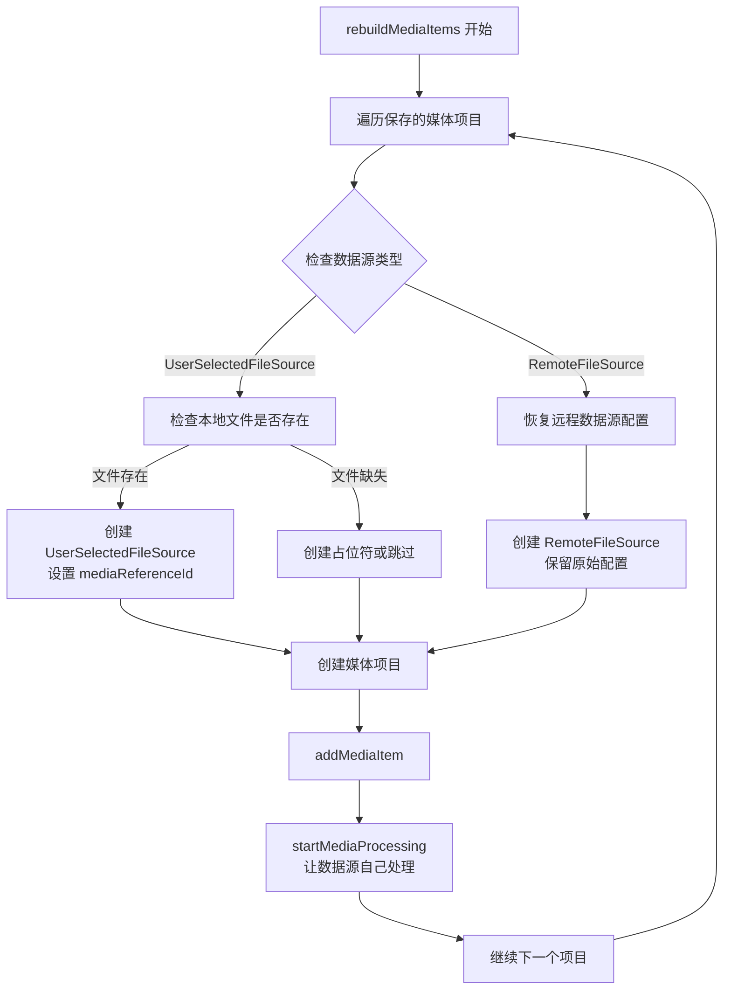

# rebuildMediaItems 重构方案

## 问题背景

当前 `UnifiedProjectModule.ts` 中的 `rebuildMediaItems` 方法存在设计问题，它没有充分利用数据源的抽象机制，导致不同数据源（用户选择文件 vs 远程下载文件）的重建和恢复机制不一致。

## 当前问题分析

### 1. 数据源类型混淆

```typescript
// 当前 rebuildMediaItems 的问题代码（已修正）
// 现在应该根据原始数据源类型进行正确的重建：

// 用户选择文件：直接传入 mediaReferenceId
const source = DataSourceFactory.createUserSelectedSource(mediaRef.id)

// 远程文件：也应该优先使用 mediaReferenceId 重建
const source = DataSourceFactory.createRemoteSource(mediaRef.id)
```

**问题**：之前无论原始数据源是什么类型（用户选择文件 vs 远程下载），重建时都强制创建 `UserSelectedFileSource`，这破坏了数据源的语义完整性。现在已通过统一的 `mediaReferenceId` 重建机制解决。

### 2. 缺乏数据源恢复机制

当前代码没有根据保存的数据源信息来恢复正确的数据源类型，而是简单地从磁盘文件重新创建用户选择文件源。

### 3. 与新增流程不一致

对比 `UnifiedMediaLibrary.vue` 中的处理：

**用户选择文件**（`addMediaItem`）：
```typescript
const userSelectedSource = DataSourceFactory.createUserSelectedSource(file)
const mediaItem = unifiedStore.createUnifiedMediaItemData(id, name, userSelectedSource, options)
unifiedStore.addMediaItem(mediaItem)
unifiedStore.startMediaProcessing(mediaItem)
```

**远程下载文件**（`handleRemoteDownloadSubmit`）：
```typescript
const remoteConfig: RemoteFileConfig = {
  url: config.url,
  ...config  // 包含 headers, timeout, retryCount 等其他配置
}
const remoteSource = DataSourceFactory.createRemoteSource(remoteConfig)
const mediaItem = unifiedStore.createUnifiedMediaItemData(id, name, remoteSource, options)
unifiedStore.addMediaItem(mediaItem)
unifiedStore.startMediaProcessing(mediaItem)
```

## 解决方案设计

### 核心思路

1. **保存数据源类型信息**：在项目配置中保存原始数据源的类型和配置
2. **智能数据源恢复**：根据保存的信息恢复正确的数据源类型
3. **统一处理流程**：让数据源自己处理获取逻辑，`rebuildMediaItems` 只负责协调

### 重构方案流程图



## 具体实现建议

### 1. 重构 rebuildMediaItems 方法

`UnifiedMediaItemData` 的 `source` 字段已经包含了数据源的所有信息，包括类型在内，无需额外扩展项目配置类型。我们可以直接利用现有的数据源信息进行重构：

```typescript
async function rebuildMediaItems(
  mediaReferences: UnifiedMediaReference[],
  timelineMediaItems: UnifiedMediaItemData[]
): Promise<void> {
  // ... 前置检查代码

  for (const savedMediaItem of timelineMediaItems) {
    try {
      let source: UnifiedDataSourceData
      
      // 根据保存的数据源类型恢复数据源
      if (DataSourceQueries.isUserSelectedSource(savedMediaItem.source)) {
        // 用户选择文件：直接传入 mediaReferenceId，让数据源内部处理文件加载
        const mediaReferenceId = savedMediaItem.source.mediaReferenceId
        if (mediaReferenceId) {
          const mediaRef = mediaRefMap.get(mediaReferenceId)
          if (mediaRef) {
            // 直接传入 mediaReferenceId，让数据源内部在 executeAcquisition 中加载文件
            source = DataSourceFactory.createUserSelectedSource(mediaRef.id)
          } else {
            console.warn(`本地文件缺失，跳过: ${savedMediaItem.name}`)
            continue
          }
        }
      } else if (DataSourceQueries.isRemoteSource(savedMediaItem.source)) {
        // 远程文件：优先使用 mediaReferenceId 重建，失败时才使用原始配置
        const mediaReferenceId = savedMediaItem.source.mediaReferenceId
        if (mediaReferenceId) {
          const mediaRef = mediaRefMap.get(mediaReferenceId)
          if (mediaRef) {
            // 直接传入 mediaReferenceId，让数据源内部优先从本地文件重建
            source = DataSourceFactory.createRemoteSource(mediaRef.id)
          } else {
            // 本地文件缺失，使用原始配置重新下载
            console.warn(`本地文件缺失，将重新下载: ${savedMediaItem.name}`)
            const remoteConfig: RemoteFileConfig = {
              url: savedMediaItem.source.remoteUrl,
              ...savedMediaItem.source.config
            }
            source = DataSourceFactory.createRemoteSource(remoteConfig)
          }
        } else {
          // 旧项目没有 mediaReferenceId，使用原始配置下载
          const remoteConfig: RemoteFileConfig = {
            url: savedMediaItem.source.remoteUrl,
            ...savedMediaItem.source.config
          }
          source = DataSourceFactory.createRemoteSource(remoteConfig)
        }
      } else {
        console.warn(`未知数据源类型: ${savedMediaItem.source.type}`)
        continue
      }

      // 创建媒体项目（使用统一流程）
      const mediaItem = mediaModule.createUnifiedMediaItemData(
        savedMediaItem.id,
        savedMediaItem.name,
        source,
        {
          mediaType: savedMediaItem.mediaType,
          duration: savedMediaItem.duration,
        }
      )

      // 添加并启动处理（与新增流程完全一致）
      mediaModule.addMediaItem(mediaItem)
      mediaModule.startMediaProcessing(mediaItem)
      
    } catch (error) {
      console.error(`恢复媒体项目失败: ${savedMediaItem.name}`, error)
    }
  }
}
```

## 优势分析

### 1. 语义一致性
- 用户选择的文件恢复为 `UserSelectedFileSource`
- 远程下载的文件恢复为 `RemoteFileSource`
- 保持数据源的原始语义

### 2. 处理流程统一
- 重建流程与新增流程完全一致
- 都是：创建数据源 → 创建媒体项目 → 添加 → 启动处理
- 减少代码重复和维护成本

### 3. 扩展性好
- 新增数据源类型时，只需在工厂函数中添加对应分支
- 不需要修改核心重建逻辑

### 4. 错误处理更清晰
- 不同数据源类型的错误处理可以分别优化
- 远程文件可以重新下载，本地文件缺失可以提示用户

## 实施步骤

### 阶段一：重构 rebuildMediaItems
1. 实现数据源类型判断逻辑（使用 `DataSourceQueries` 进行类型检查）
2. 实现不同类型数据源的恢复机制
3. 统一处理流程

### 阶段二：测试验证
1. 测试用户选择文件的重建
2. 测试远程下载文件的重建
3. 测试混合数据源项目的重建
4. 测试文件缺失等异常情况

## 风险评估

### 技术风险
- 数据源恢复逻辑复杂，可能引入新的错误

### 缓解措施
- 充分的单元测试和集成测试
- 保留原有逻辑作为回退方案

## 总结

这种重构方案将使 `rebuildMediaItems` 更加符合面向对象的设计原则，同时与现有的新增流程保持一致性。通过正确地恢复数据源类型，让数据源自己处理获取逻辑，可以提高代码的可维护性和扩展性。