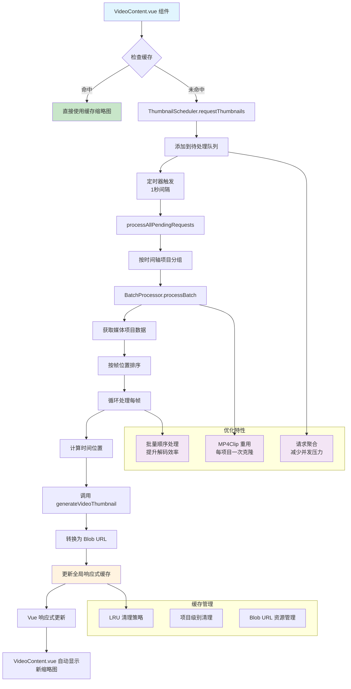

# 精简版缩略图优化方案

## 当前问题分析

基于对 [`VideoContent.vue`](frontend/src/unified/components/renderers/VideoContent.vue) 和 [`RealtimeThumbnailManager.ts`](frontend/src/unified/managers/RealtimeThumbnailManager.ts) 的分析，当前实现存在以下核心问题：

1. **缺乏缓存机制**：每次缩略图都是实时生成，没有利用已生成的结果
2. **并发管理不足**：每个缩略图请求都是独立处理，没有任务聚合
3. **解码效率低下**：没有利用WebAV的批量处理能力，每帧都需要单独的MP4Clip克隆

## 优化目标与核心策略

1. **减少资源消耗**：将MP4Clip克隆次数从每帧一次优化为每个时间轴项目一次
2. **提高处理效率**：通过批量顺序处理提升解码效率
3. **避免重复计算**：通过内存缓存机制减少重复生成
4. **优化响应速度**：提供稳定的缩略图加载体验

## 接口定义

### 1. 缓存相关接口

```typescript
interface CachedThumbnail {
  blobUrl: string;
  timestamp: number;
  timelineItemId: string;
  framePosition: number;
  clipStartTime: number;
  clipEndTime: number;
}
```

### 2. 请求相关接口

```typescript
interface ThumbnailBatchRequest {
  /** 时间轴项目数据 */
  timelineItem: UnifiedTimelineItemData;
  
  /** 缩略图布局数组，包含需要生成的帧索引信息 */
  thumbnailLayout: ThumbnailLayoutItem[];
  
  /** 请求时间戳 */
  timestamp: number;
}
```

## 类定义

### 1. BatchProcessor 类

```typescript
/**
 * 批量处理器类
 * 负责批量生成缩略图，优化MP4Clip重用和缓存管理
 */
class BatchProcessor {
  /**
   * 批量处理缩略图生成
   */
  async processBatch(
    timelineItem: UnifiedTimelineItemData,
    thumbnailLayout: ThumbnailLayoutItem[]
  ): Promise<Map<number, string>> {
    // 1. 获取媒体项目数据
    // 2. 按帧位置排序缩略图布局
    // 3. 循环处理每个帧：
    //    - 计算时间位置
    //    - 使用 generateVideoThumbnail 生成缩略图
    //    - 转换为 Blob URL
    //    - 更新全局响应式缓存
    // 4. 返回结果映射
  }
  
  private calculateTimePosition(
    mediaItem: UnifiedMediaItemData,
    frame: number
  ): number {
    // 根据帧率计算时间位置（微秒）
  }
}
```

### 2. ThumbnailScheduler 类

```typescript
/**
 * 优化的缩略图调度器类
 * 使用定时触发机制管理缩略图生成任务的调度
 */
class ThumbnailScheduler {
  private pendingRequests = new Map(); // 待处理请求映射
  private batchProcessor: BatchProcessor;
  private throttledProcessor; // 节流处理器（1秒间隔）（使用lodash的throttle函数）

  /**
   * 添加缩略图请求（由VideoContent.vue调用）
   */
  requestThumbnails(request: ThumbnailBatchRequest): void {
    // 1. 将请求按时间轴项目存储
    // 2. 将缩略图布局转换为内部请求格式
    // 3. 触发节流处理器
  }

  private async processAllPendingRequests(): Promise<void> {
    // 1. 创建当前请求快照并清空队列
    // 2. 按时间轴项目逐个处理
  }

  private async processTimelineItemRequests(
    timelineItemId: string,
    requests: Array<{framePosition: number, timestamp: number}>
  ): Promise<void> {
    // 1. 获取时间轴项目数据
    // 2. 构建缩略图布局数组
    // 3. 调用批量处理器
  }

  cancelTasks(timelineItemId: string): void {
    // 取消指定项目的待处理任务
  }
}
```

## 方法定义

### 1. 缓存键生成方法

```typescript
// 缓存键生成函数
function generateCacheKey(
  timelineItemId: string,
  framePosition: number,
  clipStartTime: number,
  clipEndTime: number
): string {
  // 格式: ${timelineItemId}-${framePosition}-${clipStartTime}-${clipEndTime}
}
```

### 2. Vue Store 方法

```typescript
// Vue Store 方法（伪代码）
export const useUnifiedStore = defineStore('unified', () => {
  const thumbnailCache = reactive(new Map<string, CachedThumbnail>()); // 全局缩略图缓存

  function clearThumbnailCacheByTimelineItem(timelineItemId: string): void {
    // 清理指定时间轴项目的缓存和Blob URL资源
  }
  
  function cleanupThumbnailCache(maxSize: number = 1000): void {
    // LRU策略清理缓存
  }

  return { thumbnailCache, clearThumbnailCacheByTimelineItem, cleanupThumbnailCache };
});

// 获取缓存的缩略图URL
function getThumbnailUrl(
  timelineItemId: string,
  framePosition: number,
  clipStartTime: number,
  clipEndTime: number
): string | null {
  // 生成缓存键并从全局缓存获取URL
}
```

### 3. 组件方法（VideoContent.vue）

```typescript
// 组件方法（VideoContent.vue）
// timeRange变化时thumbnailLayout也会响应式变化
watch(thumbnailLayout, (newLayout) => {
  // 1. 取消旧任务
  // 2. 过滤未缓存的项目
  // 3. 提交新请求到定时处理队列
});

onUnmounted(() => {
  // 组件卸载清理
});
```

## 架构设计方案

### 1. 响应式缓存系统

使用Vue响应式Map作为全局缓存，集成到unifiedStore中，实现自动依赖追踪和组件更新。

### 2. 任务调度系统

采用节流机制，使用lodash的throttle函数（1秒间隔）处理待处理的缩略图任务，实现批量处理和MP4Clip重用。

### 3. 批量处理优化

通过BatchProcessor类利用现有的generateVideoThumbnail函数进行批量处理，大幅简化实现复杂度并减少资源消耗。

### 4. 节流机制优化

**优势**：
1. **实现简单，易于维护**: 使用成熟的lodash throttle函数，无需复杂的防抖、优先级逻辑
2. **避免性能开销**: 避免频繁触发带来的性能开销
3. **批量处理效果好**: 1秒间隔内的所有请求合并处理，批量效果最大化
4. **用户体验稳定**: 不会因为快速操作导致卡顿，1秒延迟对用户几乎无感知
5. **资源利用高效**: MP4Clip重用效果更明显，减少资源浪费
6. **逻辑简洁**: 每次thumbnailLayout变化时直接取消旧任务，无需复杂判断
7. **响应及时**: 总是处理最新的布局需求，避免过时任务浪费资源
8. **性能稳定**: 节流控制处理频率，避免频繁操作造成的性能波动

## 实施路线图

### 阶段一：基础架构搭建（第1-2周）

1. **创建核心类文件**
   - 在 [`frontend/src/unified/managers/`](frontend/src/unified/managers/) 目录下创建：
     - `BatchProcessor.ts` - 批量处理器类
     - `ThumbnailScheduler.ts` - 缩略图调度器类
   - 在 [`frontend/src/unified/utils/`](frontend/src/unified/utils/) 目录下创建：
     - `thumbnailCacheUtils.ts` - 缓存相关工具函数

2. **扩展 unifiedStore**
   - 在 [`frontend/src/unified/unifiedStore.ts`](frontend/src/unified/unifiedStore.ts) 中添加：
     - 全局响应式缩略图缓存 `thumbnailCache`
     - 缓存管理方法 `clearThumbnailCacheByTimelineItem`、`cleanupThumbnailCache`

3. **更新类型定义**
   - 在 [`frontend/src/unified/types/thumbnail.ts`](frontend/src/unified/types/thumbnail.ts) 中添加新接口：
     - `CachedThumbnail`
     - `ThumbnailBatchRequest`
   
   注：[`ThumbnailLayoutItem`](frontend/src/unified/types/thumbnail.ts:11) 和 [`UnifiedMediaItemData`](frontend/src/unified/mediaitem/types.ts:51) 接口已存在

### 阶段二：批量处理器实现（第3周）

1. **实现 BatchProcessor 类**
   - 集成现有的 [`generateVideoThumbnail`](frontend/src/unified/managers/RealtimeThumbnailManager.ts:45) 函数
   - 实现批量顺序处理逻辑
   - 优化 MP4Clip 重用机制

2. **缓存系统集成**
   - 实现缓存键生成函数
   - 集成 Blob URL 管理
   - 实现 LRU 缓存清理策略

### 阶段三：调度器实现（第4周）

1. **实现 ThumbnailScheduler 类**
   - 集成 lodash 的 throttle 函数（1秒间隔）
   - 实现请求队列管理
   - 实现任务取消机制

2. **集成到现有系统**
   - 替换 [`RealtimeThumbnailManager.ts`](frontend/src/unified/managers/RealtimeThumbnailManager.ts) 中的相关逻辑
   - 更新 [`VideoContent.vue`](frontend/src/unified/components/renderers/VideoContent.vue) 的缩略图请求逻辑

### 阶段四：测试与优化（第5-6周）

1. **功能测试**
   - 验证缓存命中率
   - 测试批量处理性能
   - 验证内存使用优化效果

2. **性能调优**
   - 调整缓存大小限制
   - 优化批量处理参数
   - 验证响应速度提升

3. **边界情况处理**
   - 大文件处理测试
   - 快速操作场景测试
   - 内存泄漏检查


### 架构变更要点

#### 1. 数据流变更

**原架构**：
```
VideoContent.vue → RealtimeThumbnailManager → generateVideoThumbnail (每帧独立)
```

**新架构**：
```
VideoContent.vue → ThumbnailScheduler → BatchProcessor → generateVideoThumbnail (批量处理)
                                    ↓
                              Global Cache (unifiedStore)
```

#### 2. 缓存层级结构

- **L1缓存**：Vue响应式 Map (内存缓存，支持自动依赖追踪)
- **缓存键策略**：`${timelineItemId}-${framePosition}-${clipStartTime}-${clipEndTime}`
- **缓存清理**：LRU策略 + 项目级别清理

#### 3. 并发控制优化

**原实现问题**：
- 每个缩略图请求独立处理
- MP4Clip 为每帧单独克隆
- 无请求聚合机制

**新实现优势**：
- 基于时间轴项目的批量处理
- MP4Clip 每个项目只克隆一次
- 1秒间隔的节流批量处理

#### 4. 组件集成变更

**VideoContent.vue 变更**：
- 移除直接调用 `RealtimeThumbnailManager`
- 添加 `ThumbnailScheduler.requestThumbnails()` 调用
- 通过响应式缓存自动更新缩略图显示

**Store 扩展**：
- 添加全局缩略图缓存状态
- 提供缓存管理和清理方法
- 支持跨组件的缓存共享

#### 5. 性能优化要点

- **MP4Clip 重用**：从每帧克隆优化为每项目克隆
- **批量解码**：利用 WebAV 的批量处理能力
- **智能缓存**：避免重复计算，提高响应速度
- **内存管理**：自动 Blob URL 清理和 LRU 缓存策略


## 缩略图优化方案流程图



### 流程说明

#### 主流程
1. **请求阶段**：`VideoContent.vue` 检查缓存，未命中时发起请求
2. **调度阶段**：`ThumbnailScheduler` 收集请求，定时批量处理
3. **处理阶段**：`BatchProcessor` 按项目分组，批量生成缩略图
4. **缓存阶段**：结果存入响应式缓存，触发组件自动更新

#### 关键优化点
- **智能缓存**：避免重复计算，提升响应速度
- **批量处理**：MP4Clip 重用，减少资源消耗
- **节流聚合**：1秒间隔处理，优化用户体验
- **响应式更新**：利用 Vue 特性，自动更新界面

#### 资源管理
- **内存缓存**：LRU 策略控制缓存大小
- **Blob URL 管理**：自动清理，防止内存泄漏
- **项目级清理**：时间轴项目变更时清理相关缓存


## 总结

本激进重构方案通过彻底重建缩略图系统架构，实现以上核心优化目标。