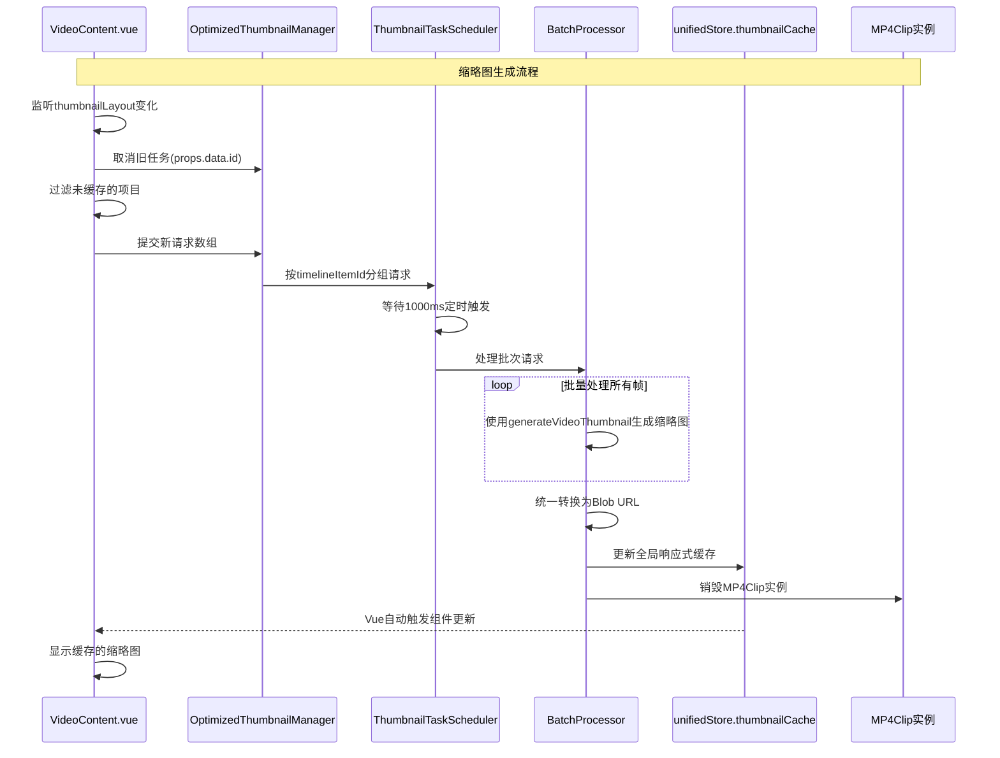

# 精简版缩略图优化方案

## 当前问题分析

基于对 [`VideoContent.vue`](frontend/src/unified/components/renderers/VideoContent.vue) 和 [`RealtimeThumbnailManager.ts`](frontend/src/unified/managers/RealtimeThumbnailManager.ts) 的分析，当前实现存在以下核心问题：

1. **缺乏缓存机制**：每次缩略图都是实时生成，没有利用已生成的结果
2. **并发管理不足**：每个缩略图请求都是独立处理，没有任务聚合
3. **解码效率低下**：没有利用WebAV的批量处理能力，每帧都需要单独的MP4Clip克隆

## 优化目标与核心策略

1. **减少资源消耗**：将MP4Clip克隆次数从每帧一次优化为每个时间轴项目一次
2. **提高处理效率**：通过批量顺序处理提升解码效率
3. **避免重复计算**：通过内存缓存机制减少重复生成
4. **优化响应速度**：提供稳定的缩略图加载体验

## 接口定义

### 1. 缓存相关接口

```typescript
interface CachedThumbnail {
  blobUrl: string;
  timestamp: number;
  timelineItemId: string;
  framePosition: number;
  clipStartTime: number;
  clipEndTime: number;
}
```

### 2. 任务调度相关接口

```typescript
interface ThumbnailTaskScheduler {
  /** 按时间轴项目分组的任务集合 */
  taskGroups: Map<string, ThumbnailTaskGroup>;
  
  /** 批量处理器实例，负责实际的缩略图生成 */
  batchProcessor: BatchProcessor;
  
  /** 待处理的任务队列 */
  processingQueue: Array<ThumbnailTaskGroup>;
}

interface ThumbnailTaskGroup {
  /** 时间轴项目ID */
  timelineItemId: string;
  
  /** 媒体项目数据 */
  mediaItem: UnifiedMediaItemData;
  
  /** 待处理的帧索引集合 */
  pendingFrames: Set<number>;
  
  /** 是否正在处理中 */
  processing: boolean;
}

interface ThumbnailBatchRequest {
  /** 时间轴项目ID */
  timelineItemId: string;
  
  /** 帧位置 */
  framePosition: number;
  
  /** 请求时间戳 */
  timestamp: number;
}

interface ThumbnailRequest {
  /** 时间轴项目ID */
  timelineItemId: string;
  
  /** 帧位置 */
  framePosition: number;
  
  /** 请求时间戳 */
  timestamp: number;
}

interface OptimizedThumbnailManager {
  /**
   * 批量请求缩略图生成（替换单个生成）
   * @param requests 缩略图批量请求数组
   * @returns Promise<void>
   */
  requestThumbnails(requests: ThumbnailBatchRequest[]): Promise<void>
  
  /**
   * 取消指定时间轴项目的待处理任务（视口变化时调用）
   * @param timelineItemId 时间轴项目ID
   */
  cancelTasks(timelineItemId: string): void
  
  /**
   * 获取缓存状态信息
   * @returns 缓存状态对象
   */
  getCacheStatus(): ThumbnailCacheStatus
}
```

## 类定义

### 1. BatchProcessor 类

```typescript
/**
 * 批量处理器类
 * 负责批量生成缩略图，优化MP4Clip重用和缓存管理
 */
class BatchProcessor {
  /** 使用全局响应式缓存，无需私有缓存 */
  // 通过 unifiedStore.thumbnailCache 访问全局缓存
  
  // 导入现有的缩略图生成工具
  import { generateVideoThumbnail, canvasToBlob } from '@/unified/utils/thumbnailGenerator';
  
  /**
   * 批量处理缩略图生成
   * @param timelineItemId 时间轴项目ID
   * @param mediaItem 媒体项目数据
   * @param frames 需要生成缩略图的帧索引数组
   * @returns 包含帧索引和对应Blob URL的映射
   */
  async processBatch(
    timelineItemId: string,
    mediaItem: UnifiedMediaItemData,
    frames: number[]
  ): Promise<Map<number, string>> {
    
    // 1. 帧索引排序（按时间顺序）
    const sortedFrames = frames.sort((a, b) => a - b);
    
    const blobResults = new Map<number, string>();
    
    try {
      // 2. 使用 generateVideoThumbnail 批量处理所有帧
      // generateVideoThumbnail 内部已经包含了 MP4Clip 准备和帧解码
      for (const frame of sortedFrames) {
        const timePosition = this.calculateTimePosition(mediaItem, frame);
        
        // 使用现有的 generateVideoThumbnail 生成缩略图
        const canvas = await generateVideoThumbnail(
          mediaItem.webav.mp4Clip,
          timePosition
        );
        
        // 转换为 Blob URL
        const blobUrl = await canvasToBlob(canvas);
        blobResults.set(frame, blobUrl);
        
        // 3. 更新全局响应式缓存（使用统一的缓存键格式）
        const cacheKey = this.generateCacheKey(timelineItemId, frame, mediaItem);
        // 使用全局响应式缓存，Vue会自动处理组件更新
        unifiedStore.thumbnailCache.set(cacheKey, {
          blobUrl,
          timestamp: Date.now(),
          timelineItemId: timelineItemId,
          framePosition: frame,
          clipStartTime: mediaItem.timeRange?.clipStartTime || 0,
          clipEndTime: mediaItem.timeRange?.clipEndTime || 0
        });
      }
      
      return blobResults;
      
    } catch (error) {
      console.error('批量处理缩略图失败:', error);
      throw error;
    }
  }
  
  /**
   * 生成缓存键
   * @param timelineItemId 时间轴项目ID
   * @param framePosition 帧位置
   * @param mediaItem 媒体项目数据
   * @returns 缓存键字符串
   */
  private generateCacheKey(
    timelineItemId: string,
    framePosition: number,
    mediaItem: UnifiedMediaItemData
  ): string {
    const clipStartTime = mediaItem.timeRange?.clipStartTime || 0;
    const clipEndTime = mediaItem.timeRange?.clipEndTime || 0;
    return `${timelineItemId}-${framePosition}-${clipStartTime}-${clipEndTime}`;
  }
  
  /**
   * 计算帧对应的时间位置
   * @param mediaItem 媒体项目数据
   * @param frame 帧索引
   * @returns 时间位置（微秒）
   */
  private calculateTimePosition(mediaItem: UnifiedMediaItemData, frame: number): number {
    // 实现细节...
    return 0;
  }
}
```

### 2. OptimizedThumbnailScheduler 类

```typescript
import { throttle } from 'lodash';

/**
 * 优化的缩略图调度器类
 * 使用定时触发机制管理缩略图生成任务的调度
 */
class OptimizedThumbnailScheduler {
  /** 处理间隔时间（毫秒） */
  private readonly PROCESSING_INTERVAL = 1000; // 1秒间隔
  
  /** 待处理的请求映射，按时间轴项目分组 */
  private pendingRequests = new Map<string, Set<ThumbnailRequest>>();
  
  /** 批量处理器实例 */
  private batchProcessor: BatchProcessor;
  
  /** 使用lodash的throttle创建节流处理函数 */
  private throttledProcessor = throttle(() => {
    this.processAllPendingRequests();
  }, this.PROCESSING_INTERVAL, {
    leading: false,  // 不在开始时执行
    trailing: true   // 在结束时执行
  });

  /**
   * 添加缩略图请求（由VideoContent.vue调用）
   * @param requests 缩略图批量请求数组
   */
  requestThumbnails(requests: ThumbnailBatchRequest[]): void {
    // 将请求按时间轴项目分组存储
    requests.forEach(request => {
      if (!this.pendingRequests.has(request.timelineItemId)) {
        this.pendingRequests.set(request.timelineItemId, new Set());
      }
      this.pendingRequests.get(request.timelineItemId)!.add(request);
    });
    
    // 直接触发节流处理器（lodash会自动控制1秒执行频率）
    this.throttledProcessor();
  }

  /**
   * 定时处理所有待处理请求
   */
  private async processAllPendingRequests(): void {
    if (this.pendingRequests.size === 0) return;

    console.log(`🔄 定时处理开始，待处理项目数: ${this.pendingRequests.size}`);

    // 创建当前待处理请求的快照，然后立即清空队列
    // 这样可以避免处理过程中新的请求干扰当前批次
    const currentRequests = new Map(this.pendingRequests);
    this.pendingRequests.clear(); // 立即清空，为下一轮做准备

    // 按时间轴项目逐个处理
    for (const [timelineItemId, requests] of currentRequests.entries()) {
      if (requests.size === 0) continue;

      try {
        await this.processTimelineItemRequests(timelineItemId, Array.from(requests));
        console.log(`✅ 完成处理项目 ${timelineItemId}，帧数: ${requests.size}`);
        
      } catch (error) {
        console.error(`❌ 处理时间轴项目 ${timelineItemId} 失败:`, error);
      }
    }
  }

  /**
   * 处理单个时间轴项目的所有缩略图请求
   * @param timelineItemId 时间轴项目ID
   * @param requests 缩略图请求数组
   */
  private async processTimelineItemRequests(
    timelineItemId: string,
    requests: ThumbnailRequest[]
  ): Promise<void> {
    if (requests.length === 0) return;

    const timelineItemId = requests[0].timelineItemId;
    // 通过时间轴项目ID获取时间轴项目数据
    const timelineItem = unifiedStore.getTimelineItem(timelineItemId);
    if (!timelineItem) {
      console.error(`❌ 找不到时间轴项目: ${timelineItemId}`);
      return;
    }
    // 通过时间轴项目获取媒体项目
    const mediaItem = unifiedStore.getMediaItem(timelineItem.mediaItemId);
    if (!mediaItem) {
      console.error(`❌ 找不到媒体项目: ${timelineItem.mediaItemId}`);
      return;
    }
    const frames = requests.map(req => req.framePosition);

    console.log(`📸 处理项目 ${timelineItemId}，帧数: ${frames.length}`);

    // 调用批量处理器
    const results = await this.batchProcessor.processBatch(
      timelineItemId,
      mediaItem,
      frames
    );

    // 结果已经通过全局响应式缓存更新，Vue会自动处理组件更新
    // 无需额外的通知逻辑
  }

  /**
   * 取消指定时间轴项目的待处理请求
   * @param timelineItemId 时间轴项目ID
   */
  cancelTasks(timelineItemId: string): void {
    this.pendingRequests.delete(timelineItemId);
    console.log(`❌ 取消项目 ${timelineItemId} 的待处理任务`);
  }

  /**
   * 清理资源
   */
  destroy(): void {
    // 取消lodash throttle的待执行任务
    this.throttledProcessor.cancel();
    this.pendingRequests.clear();
  }
  
  /**
   * 更新全局响应式缓存（替代notifyConsumers）
   * Vue会自动处理组件更新，无需手动通知
   * @param timelineItemId 时间轴项目ID
   * @param results 生成结果映射
   */
  private updateGlobalCache(timelineItemId: string, results: Map<number, string>): void {
    // 结果已经通过全局响应式缓存更新，Vue会自动触发组件重新渲染
    // 无需额外的通知逻辑
  }
}
```

## 方法定义

### 1. 缓存键生成方法

```typescript
// 缓存键设计: timelineItemId-framePosition-clipStartTime-clipEndTime
const cacheKey = `${timelineItemId}-${framePosition}-${clipStartTime}-${clipEndTime}`;

// 使用Vue响应式Map作为全局缓存，集成到unifiedStore中
// 在 unifiedStore.ts 中添加：
// thumbnailCache: reactive(new Map<string, CachedThumbnail>()),
const maxCacheSize = 1000; // 最大缓存数量
```

### 2. Vue Store 方法

```typescript
// 在unifiedStore.ts中添加全局响应式缓存（使用Composition API风格）
export const useUnifiedStore = defineStore('unified', () => {
  // ...其他状态和模块初始化
  
  // 全局缩略图缓存
  const thumbnailCache = reactive(new Map<string, CachedThumbnail>());
  const maxCacheSize = 1000; // 最大缓存数量

  /**
   * 清理指定时间轴项目的缓存
   */
  function clearThumbnailCacheByTimelineItem(timelineItemId: string): void {
    for (const [key, cached] of thumbnailCache.entries()) {
      if (cached.timelineItemId === timelineItemId) {
        // 清理Blob URL资源
        URL.revokeObjectURL(cached.blobUrl);
        thumbnailCache.delete(key);
      }
    }
  }
  
  /**
   * 清理缓存条目（LRU策略）
   */
  function cleanupThumbnailCache(maxSize: number = 1000): void {
    if (thumbnailCache.size > maxSize) {
      const entries = Array.from(thumbnailCache.entries());
      entries.sort((a, b) => a[1].timestamp - b[1].timestamp);
      
      const toRemove = entries.slice(0, thumbnailCache.size - maxSize);
      for (const [key] of toRemove) {
        const cached = thumbnailCache.get(key);
        if (cached) {
          URL.revokeObjectURL(cached.blobUrl);
          thumbnailCache.delete(key);
        }
      }
    }
  }

  // 导出缓存相关状态和方法
  return {
    // ...其他导出的状态和方法
    thumbnailCache,
    clearThumbnailCacheByTimelineItem,
    cleanupThumbnailCache
  };
});

// 组件中使用响应式缓存
const unifiedStore = useUnifiedStore()

// 获取缩略图URL（自动响应式）
function getThumbnailUrl(timelineItemId: string, framePosition: number): string | null {
  const cacheKey = generateCacheKey(timelineItemId, framePosition);
  return unifiedStore.thumbnailCache.get(cacheKey)?.blobUrl || null;
}

// 监听缓存变化（可选，Vue会自动处理）
watch(() => unifiedStore.thumbnailCache, () => {
  // 缓存更新时自动触发组件重新渲染
}, { deep: true });
```

### 3. 组件方法（VideoContent.vue）

```typescript
// 极简的触发逻辑 - 每次都取消旧任务，专注处理新任务
watch(thumbnailLayout, (newLayout) => {
  // 1. 直接取消所有旧的待处理任务
  // 因为newLayout是最新的布局，旧任务已无意义
  optimizedThumbnailManager.cancelTasks(props.data.id);

  // 2. 收集未缓存的缩略图请求
  const uncachedItems = newLayout.filter(item => {
    const cacheKey = generateCacheKey(props.data.id, item);
    return !unifiedStore.thumbnailCache.has(cacheKey);
  });

  if (uncachedItems.length === 0) return;

  // 3. 提交新的请求到定时处理队列
  const requests = uncachedItems.map(item => ({
    timelineItemId: props.data.id,
    framePosition: item.framePosition,
    mediaItem: getMediaItem(),
    timestamp: Date.now()
  }));
  
  // 提交到队列，1秒后会被自动处理
  optimizedThumbnailManager.requestThumbnails(requests);
  
}, { deep: true, immediate: true });

// 监听时间轴变化
watch(() => props.data.timeRange, () => {
  // timeRange变化时，清除缓存和待处理任务
  clearThumbnailCacheByTimelineItem(props.data.id);
  optimizedThumbnailManager.cancelTasks(props.data.id);
  // watch会自动重新触发
}, { deep: true });

// 组件卸载时清理
onUnmounted(() => {
  optimizedThumbnailManager.cancelTasks(props.data.id);
});
```

## 架构设计方案

### 1. 响应式缓存系统

使用Vue响应式Map作为全局缓存，集成到unifiedStore中，实现自动依赖追踪和组件更新。

### 2. 任务调度系统

采用定时触发机制，每1000ms检查一次是否有待处理的缩略图任务，实现批量处理和MP4Clip重用。

### 3. 批量处理优化

通过BatchProcessor类利用现有的generateVideoThumbnail函数进行批量处理，大幅简化实现复杂度并减少资源消耗。

### 4. 简化的定时触发机制

**优势**：
1. **实现简单，易于维护**: 无需复杂的防抖、优先级逻辑，代码更易维护
2. **避免性能开销**: 避免频繁触发带来的性能开销
3. **批量处理效果好**: 1秒间隔内的所有请求合并处理，批量效果最大化
4. **用户体验稳定**: 不会因为快速操作导致卡顿，1秒延迟对用户几乎无感知
5. **资源利用高效**: MP4Clip重用效果更明显，减少资源浪费
6. **逻辑简洁**: 每次thumbnailLayout变化时直接取消旧任务，无需复杂判断
7. **响应及时**: 总是处理最新的布局需求，避免过时任务浪费资源
8. **性能稳定**: 固定间隔处理，避免频繁操作造成的性能波动

### 5. Vue响应式缓存与资源管理

#### Vue响应式方案的优势

**综合优势**
1. **自动依赖追踪**: Vue自动处理组件更新，无需手动通知机制，移除复杂的 `notifyConsumers` 逻辑
2. **开发体验优秀**: 与Vue DevTools完美集成，支持Time Travel调试，完整的TypeScript支持
3. **性能优化**: 减少内存占用，避免重复的事件监听器注册，自动批量处理状态更新
4. **实施便利**: 与现有 `unifiedStore` 架构完全兼容，支持渐进式迁移，代码更简洁易维护

## 实施路线图（响应式优化版）

### 阶段一：核心架构重建 (2天)
1. **完全替换现有管理器**：
   - 删除`RealtimeThumbnailManager.ts`
   - 创建全新的`OptimizedThumbnailManager.ts`，实现方案中的所有优化功能
   - 重写`thumbnailCache.ts`和`thumbnailBatchProcessor.ts`

2. **重构缓存系统**：
   - 集成内存缓存和LRU策略，资源清理与缓存管理一体化
   - 移除所有旧的缓存逻辑

3. **批量处理与响应式集成**：
   - 实现任务调度系统和批量处理器
   - 按时间轴项目分组处理
  - 利用现有的generateVideoThumbnail函数进行批量处理，统一更新全局响应式缓存

### 阶段二：组件层激进重构 (2天)
1. **完全重写VideoContent.vue**：
   - 移除现有的`thumbnailStates`逐个生成逻辑
   - 实现新的批量请求机制
   - 集成智能预加载和优先级管理

2. **响应式组件重构**：
   - 移除现有的`thumbnailStates`逐个生成逻辑
   - 集成全局响应式缓存，直接消费 `unifiedStore.thumbnailCache`
   - 实现智能预加载和基于响应式的优先级管理

3. **类型系统与响应式集成**：
   - 扩展`types/thumbnail.ts`支持响应式缓存接口
   - 添加全局缓存状态类型定义
   - 优化组件与响应式缓存的类型集成

## 激进重构策略

### 架构变更要点

#### 1. 管理器层重构
管理器层将实现之前定义的 `OptimizedThumbnailManager` 接口，提供批量缩略图生成和管理功能。

#### 2. 组件层重构（极简定时触发）
```typescript
```
- **彻底移除**现有的Map-based缓存
- **直接实现**LRU策略，资源清理与缓存管理一体化
- **统一管理**所有Blob URL的生命周期，确保同步清理

## 缩略图优化方案流程图



## 监控指标

建议监控以下关键指标：
- 缓存命中率
- 平均处理时间
- 内存使用情况
- 任务队列长度
- 错误率

## 总结

本激进重构方案通过彻底重建缩略图系统架构，实现以上核心优化目标。