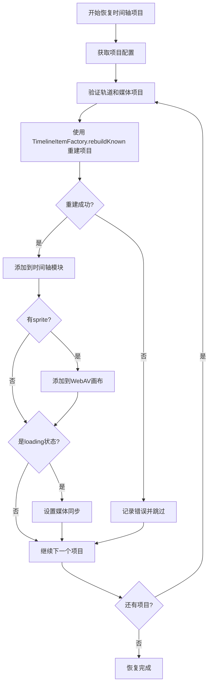

# 时间轴项目恢复逻辑修正方案

## 问题概述

本文档分析了 `AddTimelineItemCommand.ts` 和 `UnifiedProjectModule.ts` 中时间轴项目的添加逻辑差异，并提出了相应的修正方案，确保项目恢复时的时间轴项目具有与新建项目相同的完整功能。

## 问题分析

### AddTimelineItemCommand.ts 的添加逻辑

在 `AddTimelineItemCommand.execute()` 方法中，添加时间轴项目的流程是：

1. **重建时间轴项目**：使用 `TimelineItemFactory.rebuildKnown()` 从原始素材重新创建 TimelineItem 和 sprite
2. **添加到时间轴**：调用 `this.timelineModule.addTimelineItem(newTimelineItem)`
3. **添加到 WebAV 画布**：如果有 sprite，调用 `this.webavModule.addSprite()`
4. **设置媒体同步**：如果是 loading 状态，设置状态同步

### UnifiedProjectModule.ts 的恢复逻辑

在 `restoreTimelineItems()` 方法中，恢复时间轴项目的流程是：

1. **克隆时间轴项目**：使用 `TimelineItemFactory.clone()` 克隆保存的时间轴项目数据
2. **清理运行时数据**：主动将 `clonedItem.runtime` 设为空对象
3. **添加到时间轴**：调用 `timelineModule.addTimelineItem(clonedItem)`

## 关键差异

| 方面 | AddTimelineItemCommand | restoreTimelineItems |
|------|----------------------|---------------------|
| **重建方式** | 使用 `rebuildKnown` 重新创建完整对象 | 使用 `clone` 仅克隆数据 |
| **Sprite 处理** | 重新创建并添加到 WebAV 画布 | 主动清理运行时数据，不创建 sprite |
| **运行时数据** | 重建完整的运行时数据 | 清空运行时数据 |
| **媒体同步** | 为 loading 状态项目设置同步 | 没有设置媒体同步 |

## 问题根源

`restoreTimelineItems()` 方法只是简单地克隆了保存的时间轴项目数据，并清理了运行时数据，但没有像 `AddTimelineItemCommand.execute()` 那样重建必要的运行时组件（如 sprite），也没有设置媒体同步。

这会导致恢复的时间轴项目缺少可视化组件，无法正常显示和交互。

## 修正方案

### 方案概述

将 `restoreTimelineItems()` 方法的逻辑调整为与 `AddTimelineItemCommand.execute()` 一致，使用相同的重建流程。

### 具体修改步骤

1. **修改重建逻辑**：
   - 将 `TimelineItemFactory.clone()` 替换为 `TimelineItemFactory.rebuildKnown()`
   - 确保从原始素材重新创建时间轴项目和 sprite

2. **添加 WebAV 集成**：
   - 在 UnifiedProjectModule 中添加对 webavModule 的依赖
   - 重建成功后，将 sprite 添加到 WebAV 画布

3. **设置媒体同步**：
   - 为 loading 状态的时间轴项目设置媒体同步
   - 导入并使用 `setupCommandMediaSync` 工具

4. **错误处理优化**：
   - 添加更详细的错误处理和日志记录
   - 确保单个项目失败不会影响整个恢复过程

### 修改后的代码流程



### 需要修改的具体内容

1. **修改 UnifiedProjectModule.ts**：
   - 在 `createUnifiedProjectModule` 函数参数中添加 `webavModule` 依赖
   - 重写 `restoreTimelineItems` 方法的核心逻辑
   - 导入必要的工具函数和类型

2. **保持与 AddTimelineItemCommand 的一致性**：
   - 使用相同的重建逻辑
   - 相同的错误处理模式
   - 相同的日志记录格式

### 代码修改示例

#### 1. 添加依赖导入

```typescript
// 在 UnifiedProjectModule.ts 顶部添加
import {
  setupCommandMediaSync,
  cleanupCommandMediaSync,
} from '@/unified/composables/useCommandMediaSync'

import { generateCommandId } from '@/utils/idGenerator'
```

#### 2. 修改 createUnifiedProjectModule 函数签名

```typescript
export function createUnifiedProjectModule(
  configModule: {
    // ... 现有配置
  },
  timelineModule?: {
    // ... 现有配置
  },
  trackModule?: {
    // ... 现有配置
  },
  mediaModule?: {
    // ... 现有配置
  },
  webavModule?: {
    addSprite: (sprite: VisibleSprite) => Promise<boolean>
    removeSprite: (sprite: VisibleSprite) => boolean
  }, // 添加 webavModule 依赖
)
```

#### 3. 修改 restoreTimelineItems 方法

```typescript
async function restoreTimelineItems(): Promise<void> {
  try {
    console.log('🎬 开始恢复时间轴项目状态...')
    
    // 获取项目配置
    const projectConfig = await projectFileOperations.loadProjectConfig(configModule.projectId.value)
    if (!projectConfig) {
      throw new Error('项目配置不存在，无法恢复时间轴项目')
    }

    // 检查必要模块是否可用
    if (!timelineModule) {
      console.warn('⚠️ 时间轴模块未初始化，跳过时间轴项目恢复')
      return
    }
    
    if (!mediaModule) {
      console.warn('⚠️ 媒体模块未初始化，跳过时间轴项目恢复')
      return
    }

    // 清空现有时间轴项目
    timelineModule.timelineItems.value = []

    // 恢复时间轴项目数据
    const savedTimelineItems = projectConfig.timeline.timelineItems
    if (savedTimelineItems && savedTimelineItems.length > 0) {
      for (const itemData of savedTimelineItems) {
        try {
          // 基本验证：必须有ID
          if (!itemData.id) {
            console.warn('⚠️ 跳过无效的时间轴项目数据（缺少ID）:', itemData)
            continue
          }

          // 验证轨道是否存在
          if (itemData.trackId && !trackModule?.tracks.value.some(t => t.id === itemData.trackId)) {
            console.warn(`⚠️ 跳过时间轴项目，对应的轨道不存在: ${itemData.trackId}`)
            continue
          }

          // 文本类型特殊处理（文本类型没有对应的媒体项目，mediaItemId可以为空）
          if (itemData.mediaType !== 'text' && !itemData.mediaItemId) {
            console.warn('⚠️ 跳过无效的时间轴项目数据（缺少mediaItemId）:', itemData)
            continue
          }

          // 非文本类型：验证对应的媒体项目是否存在
          if (itemData.mediaType !== 'text' && itemData.mediaItemId) {
            const mediaItem = mediaModule.mediaItems.value.find(m => m.id === itemData.mediaItemId)
            if (!mediaItem) {
              console.warn(`⚠️ 跳过时间轴项目，对应的媒体项目不存在: ${itemData.mediaItemId}`)
              continue
            }
          }

          console.log(`🔄 恢复时间轴项目：从源头重建 ${itemData.id}...`)

          // 使用 TimelineItemFactory.rebuildKnown 重建时间轴项目
          const rebuildResult = await TimelineItemFactory.rebuildKnown({
            originalTimelineItemData: itemData,
            getMediaItem: (id: string) => mediaModule.mediaItems.value.find(m => m.id === id),
            logIdentifier: 'restoreTimelineItems',
          })

          if (!rebuildResult.success) {
            console.error(`❌ 重建时间轴项目失败: ${itemData.id} - ${rebuildResult.error}`)
            continue
          }

          const newTimelineItem = rebuildResult.timelineItem

          // 1. 添加到时间轴
          timelineModule.addTimelineItem(newTimelineItem)

          // 2. 添加sprite到WebAV画布
          if (newTimelineItem.runtime.sprite && webavModule) {
            await webavModule.addSprite(newTimelineItem.runtime.sprite)
          }

          // 3. 针对loading状态的项目设置状态同步
          if (newTimelineItem.timelineStatus === 'loading') {
            const commandId = generateCommandId()
            setupCommandMediaSync(
              commandId,
              newTimelineItem.mediaItemId,
              newTimelineItem.id,
              `restoreTimelineItems ${newTimelineItem.id}`,
            )
          }

          console.log(`✅ 已恢复时间轴项目: ${itemData.id} (${itemData.mediaType})`)
        } catch (error) {
          console.error(`❌ 恢复时间轴项目失败: ${itemData.id}`, error)
          // 即使单个时间轴项目恢复失败，也要继续处理其他项目
        }
      }
    }

    console.log(`✅ 时间轴项目恢复完成: ${timelineModule.timelineItems.value.length}个项目`)
  } catch (error) {
    console.error('❌ 恢复时间轴项目失败:', error)
    throw error
  }
}
```

## 预期效果

实施此修正方案后，项目恢复时的时间轴项目将具有以下特点：

1. **完整的运行时数据**：包括 sprite 和其他必要的运行时组件
2. **正确的可视化显示**：时间轴项目能够在 WebAV 画布上正确显示
3. **一致的媒体处理**：loading 状态的项目能够正确设置媒体同步
4. **更好的错误处理**：单个项目失败不会影响整个恢复过程

## 注意事项

1. **依赖管理**：确保 `webavModule` 在调用 `restoreTimelineItems` 时已经正确初始化
2. **性能考虑**：重建过程可能比简单的克隆操作耗时更长，需要考虑用户体验
3. **测试覆盖**：需要针对各种媒体类型和状态进行全面测试
4. **向后兼容**：确保修改不会影响现有的项目加载功能

## 实施建议

1. 先在开发环境进行测试，确保修改不会引入新的问题
2. 逐步实施，可以先实现核心的重建逻辑，再添加媒体同步等功能
3. 添加详细的日志记录，便于问题排查
4. 考虑添加进度指示器，提升用户体验