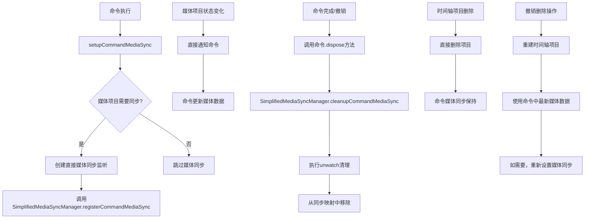

# 删除命令媒体同步问题解决方案

## 问题背景

在当前的实现中，当删除一个处于loading状态的时间轴项目时，如果该项目的媒体项目后续状态发生变化（如从loading变为ready），由于时间轴项目已被删除，无法接收到状态更新，导致命令中保存的原始数据无法同步更新。这在撤销删除操作时会导致重建的项目数据不一致。

## 关键洞察

通过分析，我们发现了一个重要的特性：**loading时间轴项目是一个很干净的状态**。这意味着：

1. **loading时间轴项目没有复杂的特有属性** - 它们只是媒体项目在时间轴上的一个占位符
2. **loading时间轴项目的主要不确定信息** - 只有媒体的基本属性（宽高、时长）需要等待媒体加载完成
3. **其他属性都是初始化值** - 位置、时间等基本信息在创建时就已经确定

基于这个关键洞察，我们可以大幅简化同步关系：**命令的原始数据更新只需要从媒体项目获取，而不需要从时间轴项目获取，同步也只是同步命令与媒体项目即可**。

## 简化方案：直接命令-媒体同步

### 1. 创建简化的媒体同步管理器

```typescript
// frontend/src/unified/timelineitem/SimplifiedMediaSyncManager.ts
import type { SimpleCommand } from '../modules/commands/types'

/**
 * 简化的媒体同步管理器
 * 只维护命令与媒体项目之间的同步关系，不涉及时间轴项目
 */
export class SimplifiedMediaSyncManager {
  private static instance: SimplifiedMediaSyncManager
  private commandMediaSyncMap = new Map<string, {
    commandId: string
    mediaItemId: string
    unwatch: () => void
  }>()

  static getInstance(): SimplifiedMediaSyncManager {
    if (!SimplifiedMediaSyncManager.instance) {
      SimplifiedMediaSyncManager.instance = new SimplifiedMediaSyncManager()
    }
    return SimplifiedMediaSyncManager.instance
  }

  /**
   * 注册命令媒体同步监听器
   * @param commandId 命令ID
   * @param mediaItemId 媒体项目ID
   * @param unwatch 清理函数
   */
  /**
   * 注册命令媒体同步监听器
   * @param commandId 命令ID
   * @param mediaItemId 媒体项目ID
   * @param unwatch 清理函数
   */
  registerCommandMediaSync(
    commandId: string,
    mediaItemId: string,
    unwatch: () => void
  ): void {
    const key = `${commandId}:${mediaItemId}`
    this.commandMediaSyncMap.set(key, {
      commandId,
      mediaItemId,
      unwatch
    })
    
    console.log(`🔗 [SimplifiedMediaSyncManager] 已注册命令媒体同步: ${commandId} <-> ${mediaItemId}`)
  }

  /**
   * 清理指定命令的所有媒体同步监听
   * @param commandId 命令ID
   */
  cleanupCommandMediaSync(commandId: string): void {
    for (const [key, sync] of this.commandMediaSyncMap) {
      if (sync.commandId === commandId) {
        try {
          sync.unwatch()
          this.commandMediaSyncMap.delete(key)
          console.log(`🗑️ [SimplifiedMediaSyncManager] 已清理命令媒体同步: ${commandId}`)
        } catch (error) {
          console.error(`❌ [SimplifiedMediaSyncManager] 清理命令媒体同步失败: ${commandId}`, error)
        }
      }
    }
  }

  /**
   * 清理指定媒体项目的所有同步监听
   * @param mediaItemId 媒体项目ID
   */
  cleanupMediaItemSync(mediaItemId: string): void {
    for (const [key, sync] of this.commandMediaSyncMap) {
      if (sync.mediaItemId === mediaItemId) {
        try {
          sync.unwatch()
          this.commandMediaSyncMap.delete(key)
          console.log(`🗑️ [SimplifiedMediaSyncManager] 已清理媒体项目同步: ${mediaItemId}`)
        } catch (error) {
          console.error(`❌ [SimplifiedMediaSyncManager] 清理媒体项目同步失败: ${mediaItemId}`, error)
        }
      }
    }
  }

  /**
   * 清理所有同步监听
   */
  cleanup(): void {
    for (const [key, sync] of this.commandMediaSyncMap) {
      try {
        sync.unwatch()
      } catch (error) {
        console.error(`❌ [SimplifiedMediaSyncManager] 清理命令媒体同步失败: ${key}`, error)
      }
    }
    this.commandMediaSyncMap.clear()
  }
}
```

### 3. 修改 useTimelineMediaSync

```typescript
// frontend/src/unified/composables/useTimelineMediaSync.ts
import { SimplifiedMediaSyncManager } from '../timelineitem/SimplifiedMediaSyncManager'
import type { SimpleCommand } from '../modules/commands/types'

/**
 * 设置命令与媒体项目的直接同步
 * @param commandId 命令ID
 * @param mediaItem 媒体项目
 */
function setupCommandMediaSync(
  commandId: string,
  mediaItem: UnifiedMediaItemData
): boolean {
  try {
    // 检查媒体项目状态，只有非ready状态才需要设置同步
    const isReady = UnifiedMediaItemQueries.isReady(mediaItem)
    const hasError = UnifiedMediaItemQueries.hasError(mediaItem)

    if (isReady) {
      console.log(`⏭️ [TimelineMediaSync] 跳过命令同步设置，媒体项目已经ready: ${mediaItem.name}`, {
        commandId,
        mediaItemId: mediaItem.id,
      })
      return false
    }

    if (hasError) {
      console.log(`⏭️ [TimelineMediaSync] 跳过命令同步设置，媒体项目有错误: ${mediaItem.name}`, {
        commandId,
        mediaItemId: mediaItem.id,
        mediaStatus: mediaItem.mediaStatus,
      })
      return false
    }

    // 设置媒体状态同步
    const unwatch = setupDirectMediaSync(commandId, mediaItem.id)

    if (unwatch) {
      console.log(`🔗 [TimelineMediaSync] 已为命令设置直接状态同步: ${commandId} <-> ${mediaItem.id}`, {
        mediaName: mediaItem.name,
        mediaStatus: mediaItem.mediaStatus,
      })

      // 注册到SimplifiedMediaSyncManager中
      const syncManager = SimplifiedMediaSyncManager.getInstance()
      syncManager.registerCommandMediaSync(commandId, mediaItem.id, unwatch)
      
      console.log(`💾 [TimelineMediaSync] 已注册监听器到简化媒体同步管理器: ${commandId}`)
      
      return true
    } else {
      console.warn(`⚠️ [TimelineMediaSync] 无法为命令设置直接状态同步: ${commandId} <-> ${mediaItem.id}`, {
        mediaName: mediaItem.name,
        mediaStatus: mediaItem.mediaStatus,
      })
      return false
    }
  } catch (error) {
    console.error(`❌ [TimelineMediaSync] 为命令设置直接状态同步失败:`, {
      commandId,
      mediaItemId: mediaItem.id,
      error: error instanceof Error ? error.message : String(error),
    })
    return false
  }
}

/**
 * 设置直接的媒体状态同步
 * 不依赖时间轴项目，直接在命令和媒体项目之间建立同步
 */
function setupDirectMediaSync(
  commandId: string,
  mediaItemId: string
): (() => void) | null {
  // 实现直接的媒体状态同步逻辑
  // 这里需要根据实际的媒体状态监听机制来实现
  
  // 伪代码示例：
  const mediaModule = useMediaModule()
  const commandModule = useCommandModule()
  
  const unwatch = mediaModule.watchMediaItem(mediaItemId, (updatedMedia) => {
    // 直接更新命令中保存的媒体数据
    const command = commandModule.getCommand(commandId)
    if (command && !command.isDisposed) {
      command.updateMediaData(updatedMedia)
      console.log(`🔄 [TimelineMediaSync] 已更新命令媒体数据: ${commandId} <- ${mediaItemId}`, {
        mediaName: updatedMedia.name,
        mediaStatus: updatedMedia.mediaStatus,
      })
    }
  })
  
  return unwatch
}

/**
 * 清理命令的所有媒体同步
 * @param commandId 命令ID
 */
function cleanupCommandMediaSync(commandId: string): void {
  try {
    const syncManager = SimplifiedMediaSyncManager.getInstance()
    syncManager.cleanupCommandMediaSync(commandId)
    
    console.log(`🗑️ [TimelineMediaSync] 已清理命令所有媒体同步: ${commandId}`)
  } catch (error) {
    console.error(`❌ [TimelineMediaSync] 清理命令媒体同步失败:`, {
      commandId,
      error: error instanceof Error ? error.message : String(error),
    })
  }
}
```

### 4. 修改 RemoveTimelineItemCommand

```typescript
// frontend/src/unified/modules/commands/RemoveTimelineItemCommand.ts
import { setupCommandMediaSync, cleanupCommandMediaSync } from '../../composables/useTimelineMediaSync'
import { SimplifiedMediaSyncManager } from '../../timelineitem/SimplifiedMediaSyncManager'

export class RemoveTimelineItemCommand implements SimpleCommand {
  // ... 原有代码 ...
  
  private _isDisposed = false
  
  /**
   * 执行命令：删除时间轴项目
   */
  async execute(): Promise<void> {
    try {
      // 检查项目是否存在
      const existingItem = this.timelineModule.getTimelineItem(this.timelineItemId)
      if (!existingItem) {
        console.warn(`⚠️ 时间轴项目不存在，无法删除: ${this.timelineItemId}`)
        return
      }
      
      // 设置媒体同步（只针对loading状态的项目）
      if (existingItem.timelineStatus === 'loading') {
        const mediaItem = this.mediaModule.getMediaItem(existingItem.mediaItemId)
        if (mediaItem) {
          setupCommandMediaSync(this.id, mediaItem)
        }
      }
      
      // 删除时间轴项目
      this.timelineModule.removeTimelineItem(this.timelineItemId)

      if (this.originalTimelineItemData && isKnownTimelineItem(this.originalTimelineItemData)) {
        const mediaItem = this.mediaModule.getMediaItem(this.originalTimelineItemData.mediaItemId)
        console.log(`🗑️ 已删除已知时间轴项目: ${mediaItem?.name || '未知素材'}`)
      }
    } catch (error) {
      const itemName = this.originalTimelineItemData?.mediaItemId || '未知项目'
      console.error(`❌ 删除时间轴项目失败: ${itemName}`, error)
      throw error
    }
  }
  
  /**
   * 撤销命令：重新创建时间轴项目
   */
  async undo(): Promise<void> {
    try {
      if (this.originalTimelineItemData && isKnownTimelineItem(this.originalTimelineItemData)) {
        // 检查是否为文本项目
        if (this.originalTimelineItemData.mediaType === 'text') {
          // 文本项目特殊处理 - 不需要媒体项目
          console.log(`🔄 撤销删除操作：重建文本时间轴项目...`)

          const newTimelineItem = await this.rebuildTextTimelineItem()
          this.timelineModule.addTimelineItem(newTimelineItem)

          if (newTimelineItem.runtime.sprite) {
            await this.webavModule.addSprite(newTimelineItem.runtime.sprite)
          }

          const textConfig = this.originalTimelineItemData.config as TextMediaConfig
          console.log(`↩️ 已撤销删除文本时间轴项目: ${textConfig.text.substring(0, 20)}...`)
        } else {
          // 常规媒体项目撤销逻辑
          console.log(`🔄 撤销删除操作：重建已知时间轴项目...`)

          // 从原始素材和命令中保存的最新媒体数据重建TimelineItem
          const newTimelineItem = await this.rebuildKnownTimelineItem()
          
          // 1. 添加到时间轴
          this.timelineModule.addTimelineItem(newTimelineItem)

          // 2. 添加sprite到WebAV画布
          if (newTimelineItem.runtime.sprite) {
            await this.webavModule.addSprite(newTimelineItem.runtime.sprite)
          }

          // 3. 如果项目仍然是loading状态，重新设置媒体同步
          if (newTimelineItem.timelineStatus === 'loading') {
            const mediaItem = this.mediaModule.getMediaItem(this.originalTimelineItemData.mediaItemId)
            if (mediaItem) {
              setupCommandMediaSync(this.id, mediaItem)
            }
          }

          const mediaItem = this.mediaModule.getMediaItem(this.originalTimelineItemData.mediaItemId)
          console.log(`↩️ 已撤销删除已知时间轴项目: ${mediaItem?.name || '未知素材'}`)
        }
      } else {
        throw new Error('没有有效的时间轴项目数据')
      }
    } catch (error) {
      const itemName = this.originalTimelineItemData?.mediaItemId || '未知项目'
      console.error(`❌ 撤销删除时间轴项目失败: ${itemName}`, error)
      throw error
    }
  }
  
  /**
   * 更新媒体数据（由媒体同步调用）
   * @param mediaData 最新的媒体数据
   */
  updateMediaData(mediaData: UnifiedMediaItemData): void {
    if (this.originalTimelineItemData && isKnownTimelineItem(this.originalTimelineItemData)) {
      // 更新命令中保存的媒体数据
      // 这里只更新需要同步的媒体属性（宽高、时长等）
      const config = this.originalTimelineItemData.config as MediaConfig
      
      if (mediaData.width !== undefined && mediaData.height !== undefined) {
        config.width = mediaData.width
        config.height = mediaData.height
      }
      
      if (mediaData.duration !== undefined) {
        config.duration = mediaData.duration
      }
      
      console.log(`🔄 [RemoveTimelineItemCommand] 已更新媒体数据: ${this.id}`, {
        width: config.width,
        height: config.height,
        duration: config.duration,
      })
    }
  }
  
  /**
   * 检查命令是否已被清理
   */
  get isDisposed(): boolean {
    return this._isDisposed
  }
  
  /**
   * 清理命令持有的资源
   */
  dispose(): void {
    if (this._isDisposed) {
      return
    }
    
    this._isDisposed = true
    // 清理媒体同步
    cleanupCommandMediaSync(this.id)
    console.log(`🗑️ [RemoveTimelineItemCommand] 命令资源已清理: ${this.id}`)
  }
}
```

### 5. 修改其他需要媒体同步的命令

```typescript
// frontend/src/unified/modules/commands/AddTimelineItemCommand.ts
import { setupCommandMediaSync, cleanupCommandMediaSync } from '../../composables/useTimelineMediaSync'

export class AddTimelineItemCommand implements SimpleCommand {
  // ... 原有代码 ...
  
  private _isDisposed = false
  
  /**
   * 更新媒体数据（由媒体同步调用）
   * @param mediaData 最新的媒体数据
   */
  updateMediaData(mediaData: UnifiedMediaItemData): void {
    if (this.originalTimelineItemData && isKnownTimelineItem(this.originalTimelineItemData)) {
      const config = this.originalTimelineItemData.config as MediaConfig
      
      if (mediaData.width !== undefined && mediaData.height !== undefined) {
        config.width = mediaData.width
        config.height = mediaData.height
      }
      
      if (mediaData.duration !== undefined) {
        config.duration = mediaData.duration
      }
      
      console.log(`🔄 [AddTimelineItemCommand] 已更新媒体数据: ${this.id}`, {
        width: config.width,
        height: config.height,
        duration: config.duration,
      })
    }
  }
  
  /**
   * 检查命令是否已被清理
   */
  get isDisposed(): boolean {
    return this._isDisposed
  }
  
  /**
   * 清理命令持有的资源
   */
  dispose(): void {
    if (this._isDisposed) {
      return
    }
    
    this._isDisposed = true
    // 清理媒体同步
    cleanupCommandMediaSync(this.id)
    console.log(`🗑️ [AddTimelineItemCommand] 命令资源已清理: ${this.id}`)
  }
}
```

## 架构设计图



## 测试方案

### 测试场景1：删除loading项目后媒体变为ready
1. 添加一个loading状态的媒体项目到时间轴
2. 删除该时间轴项目
3. 等待媒体项目加载完成变为ready
4. 撤销删除操作
5. 验证重建的时间轴项目使用了最新的媒体数据

### 测试场景2：删除loading项目后媒体出错
1. 添加一个loading状态的媒体项目到时间轴
2. 删除该时间轴项目
3. 模拟媒体项目加载出错
4. 撤销删除操作
5. 验证错误处理逻辑

### 测试场景3：命令资源清理
1. 添加一个loading状态的媒体项目到时间轴
2. 删除该时间轴项目
3. 手动清理命令资源
4. 验证媒体同步监听器被正确清理

## 总结

这个简化方案基于关键洞察：**loading时间轴项目是一个很干净的状态**，通过直接建立命令与媒体项目之间的同步关系，大幅简化了系统架构。

主要优势：

1. **架构简化** - 只需要维护命令与媒体项目之间的关系，不涉及时间轴项目
2. **数据流清晰** - 命令直接从媒体项目获取最新数据，减少中间环节
3. **资源效率** - 避免维护不必要的时间轴项目引用，减少内存使用
4. **逻辑清晰** - loading时间轴项目作为简单的占位符，只关注媒体基本属性的同步
5. **易于维护** - 减少了组件间的耦合，提高了系统的可维护性
6. **接口驱动** - 通过SimpleCommand接口定义标准方法，避免使用复杂的Mixin模式

这个方案不仅解决了删除命令的媒体同步问题，还为整个系统提供了一个更加简洁和高效的媒体同步机制。通过直接在命令类中实现SimpleCommand接口的方法，避免了引入CommandMixin带来的额外复杂性。