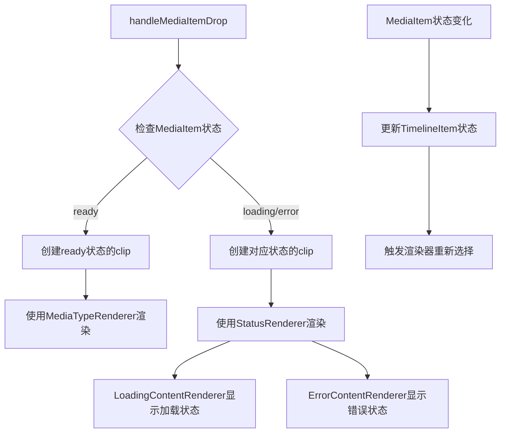
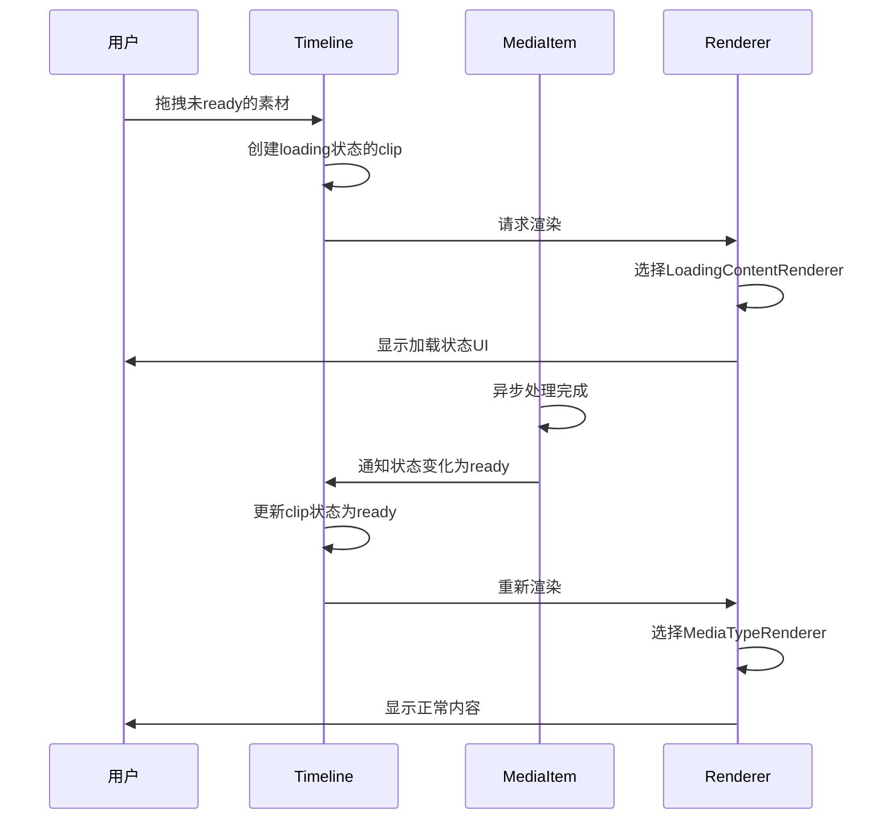

# 支持未ready的clip实现方案

## 概述

本文档详细描述了如何在UnifiedTimeline中支持未ready状态的clip，使用户能够在素材还在解析中时就能拖拽到时间轴上，并通过LoadingContentRenderer显示加载状态。

## 当前架构分析

从代码中可以看到，系统已经有了一个完整的状态管理和渲染系统：

1. **时间轴项目状态**：`TimelineItemStatus` 有三种状态：`ready`、`loading`、`error`
2. **渲染器工厂**：`ContentRendererFactory` 基于状态优先选择渲染器
3. **LoadingContentRenderer**：已经实现了加载状态的渲染器，支持进度显示

## 方案概述



## 具体实现方案

### 1. 修改 handleMediaItemDrop 函数

**位置**：`frontend/src/unified/components/UnifiedTimeline.vue` 第1471行

**当前代码**：
```typescript
if (!UnifiedMediaItemQueries.isReady(storeMediaItem)) {
  throw new Error('素材还在解析中，请稍后再试')
}
```

**修改后**：
```typescript
// 移除这个检查，允许创建未ready的clip
// if (!UnifiedMediaItemQueries.isReady(storeMediaItem)) {
//   throw new Error('素材还在解析中，请稍后再试')
// }
```

### 2. 创建时间轴项目时映射状态

**位置**：`frontend/src/unified/components/UnifiedTimeline.vue` `createMediaClipFromMediaItem` 函数

**修改代码**：
```typescript
// 根据MediaItem状态映射TimelineItem状态
const timelineStatus = mapMediaStatusToTimelineStatus(storeMediaItem.mediaStatus)

const timelineItemData: UnifiedTimelineItemData = {
  id: generateId(),
  mediaItemId: storeMediaItem.id,
  trackId: trackId,
  mediaType: storeMediaItem.mediaType,
  timeRange: {
    timelineStartTime: startTimeFrames,
    timelineEndTime: startTimeFrames + storeMediaItem.duration,
    clipStartTime: 0,
    clipEndTime: storeMediaItem.duration,
  },
  config: config,
  animation: undefined,
  timelineStatus: timelineStatus, // 使用映射后的状态
  runtime: {},
  ...(storeMediaItem.name && { mediaName: storeMediaItem.name }),
}
```

### 3. 状态映射函数

**位置**：`frontend/src/unified/components/UnifiedTimeline.vue` 或创建新的工具函数

**新增代码**：
```typescript
/**
 * 将MediaItem状态映射到TimelineItem状态
 * 利用现有的MEDIA_TO_TIMELINE_STATUS_MAP
 */
function mapMediaStatusToTimelineStatus(mediaStatus: MediaStatus): TimelineItemStatus {
  return MEDIA_TO_TIMELINE_STATUS_MAP[mediaStatus] || 'loading'
}
```

### 4. 状态同步机制

**位置**：在UnifiedStore中添加状态同步方法

**新增代码**：
```typescript
/**
 * 同步MediaItem状态变化到相关的TimelineItem
 * @param mediaItemId 媒体项目ID
 * @param newMediaStatus 新的媒体状态
 */
function syncTimelineItemStatus(mediaItemId: string, newMediaStatus: MediaStatus) {
  const timelineItems = getTimelineItemsByMediaId(mediaItemId)
  const newTimelineStatus = mapMediaStatusToTimelineStatus(newMediaStatus)
  
  timelineItems.forEach(item => {
    item.timelineStatus = newTimelineStatus
  })
}

/**
 * 根据媒体项目ID获取相关的时间轴项目
 * @param mediaItemId 媒体项目ID
 */
function getTimelineItemsByMediaId(mediaItemId: string): UnifiedTimelineItemData[] {
  const result: UnifiedTimelineItemData[] = []
  
  // 遍历所有轨道
  tracks.forEach(track => {
    const trackItems = getTimelineItemsByTrack(track.id)
    trackItems.forEach(item => {
      if (item.mediaItemId === mediaItemId) {
        result.push(item)
      }
    })
  })
  
  return result
}
```

### 5. 配置处理

**位置**：`frontend/src/unified/components/UnifiedTimeline.vue` 或创建新的工具函数

**新增代码**：
```typescript
/**
 * 为未ready的clip创建默认配置
 * @param mediaType 媒体类型
 * @param canvasResolution 画布分辨率
 */
function createDefaultConfigForUnreadyClip(
  mediaType: MediaTypeOrUnknown,
  canvasResolution: { width: number; height: number }
): GetTimelineItemConfig<MediaTypeOrUnknown> {
  if (mediaType === 'unknown') {
    return {
      name: '处理中...',
      expectedDuration: 150, // 默认5秒
      transform: {}
    } as UnknownMediaConfig
  }
  
  // 为已知类型创建基础配置
  return createEnhancedDefaultConfig(mediaType, null, canvasResolution)
}
```

## 渲染器系统的优势

现有的渲染器系统已经完美支持这个方案：

### LoadingContentRenderer 功能

**位置**：`frontend/src/unified/components/renderers/status/LoadingContentRenderer.ts`

**主要功能**：
1. **自动处理loading状态**：根据timelineStatus自动选择渲染器
2. **媒体类型区分**：
   - `unknown`类型：显示异步处理内容，包括处理类型图标、状态文本、进度圆环
   - 已知类型：显示普通加载内容，包括媒体类型图标、加载文本、加载动画
3. **进度显示**：支持进度条和进度圆环两种显示方式
4. **视觉反馈**：提供丰富的加载动画和状态指示

### ErrorContentRenderer 功能

**位置**：`frontend/src/unified/components/renderers/status/ErrorContentRenderer.ts`

**主要功能**：
1. **错误类型识别**：自动识别网络错误、文件错误、格式错误等
2. **错误信息显示**：显示主要错误信息和详细错误信息
3. **用户操作**：提供重试和删除按钮
4. **错误恢复**：支持可恢复错误的处理

### ContentRendererFactory 策略

**位置**：`frontend/src/unified/components/renderers/ContentRendererFactory.ts`

**渲染器选择策略**：
1. **状态优先**：优先基于状态选择渲染器
2. **媒体类型次之**：ready状态下基于媒体类型选择渲染器
3. **兜底机制**：提供默认渲染器确保系统稳定性

## 用户体验流程



## 实现步骤

### 第一步：移除ready检查
1. 修改 `handleMediaItemDrop` 函数
2. 移除 `UnifiedMediaItemQueries.isReady` 检查
3. 测试拖拽功能是否正常工作

### 第二步：添加状态映射
1. 创建 `mapMediaStatusToTimelineStatus` 函数
2. 在 `createMediaClipFromMediaItem` 中使用状态映射
3. 测试不同状态的MediaItem是否能正确创建对应状态的TimelineItem

### 第三步：建立状态同步
1. 在UnifiedStore中添加 `syncTimelineItemStatus` 方法
2. 添加 `getTimelineItemsByMediaId` 辅助方法
3. 在MediaItem状态变化时调用同步方法
4. 测试状态同步是否正常工作

### 第四步：测试渲染器
1. 测试LoadingContentRenderer在不同状态下的显示
2. 测试ErrorContentRenderer的错误处理
3. 测试状态变化时的渲染器切换
4. 验证用户体验是否流畅

## 配置处理细节

### 默认配置策略

对于未ready的clip，需要提供合理的默认配置：

1. **unknown类型**：
   - 名称：显示为"处理中..."
   - 预期时长：默认5秒（150帧）
   - 变换：使用空变换对象

2. **已知类型**：
   - 使用该类型的默认配置
   - 原始分辨率：暂时为null，等待解析完成后更新
   - 其他属性：使用类型默认值

### 配置更新策略

当MediaItem状态变为ready时，需要更新TimelineItem的配置：

1. **视频/图片**：更新原始分辨率信息
2. **音频**：更新音频相关属性
3. **文本**：更新文本内容和样式
4. **通用**：更新名称和其他元数据

## 错误处理策略

### 创建阶段的错误处理

1. **拖拽失败**：显示错误提示，不创建TimelineItem
2. **配置创建失败**：使用默认配置，记录错误日志
3. **状态映射失败**：默认使用loading状态，记录错误日志

### 运行时错误处理

1. **状态同步失败**：重试机制，失败后记录错误
2. **渲染器切换失败**：保持当前渲染器，记录错误
3. **配置更新失败**：保持当前配置，记录错误

## 性能考虑

### 内存管理

1. **渲染器实例**：ContentRendererFactory使用单例模式，避免重复创建
2. **状态同步**：批量更新状态，减少不必要的渲染
3. **事件监听**：合理使用事件监听，避免内存泄漏

### 渲染性能

1. **状态变化**：只在必要时触发重新渲染
2. **进度更新**：限制进度更新频率，避免过度渲染
3. **动画性能**：使用CSS动画而非JavaScript动画

## 测试策略

### 单元测试

1. **状态映射函数**：测试各种MediaStatus到TimelineStatus的映射
2. **状态同步函数**：测试状态同步的正确性
3. **配置创建函数**：测试默认配置的创建

### 集成测试

1. **拖拽流程**：测试从未ready到ready的完整流程
2. **状态变化**：测试MediaItem状态变化对TimelineItem的影响
3. **渲染器切换**：测试状态变化时渲染器的正确切换

### 用户界面测试

1. **加载状态显示**：测试LoadingContentRenderer的显示效果
2. **错误状态显示**：测试ErrorContentRenderer的显示效果
3. **状态转换**：测试状态转换时的用户体验

## 总结

这个方案通过最小化修改现有代码，充分利用已有的渲染器系统，实现了对未ready状态clip的支持。主要优势包括：

1. **最小化修改**：主要是移除限制和添加状态同步
2. **利用现有架构**：充分利用已有的渲染器系统
3. **用户体验好**：用户可以立即看到拖拽反馈，不需要等待
4. **状态一致性**：通过状态同步确保UI与数据一致
5. **扩展性强**：可以轻松支持更多状态和渲染器

通过这个方案，用户可以在素材还在解析中时就将其拖拽到时间轴上，系统会自动显示加载状态，并在素材解析完成后自动切换到正常显示，提供流畅的用户体验。