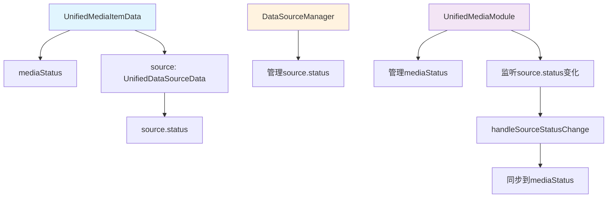
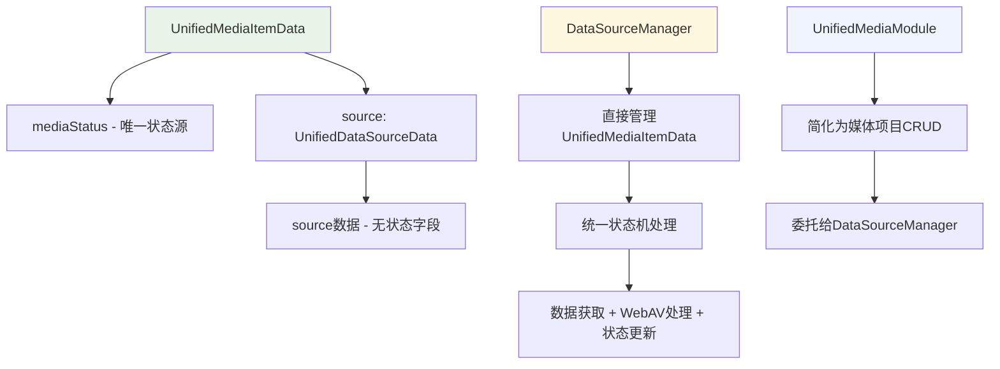
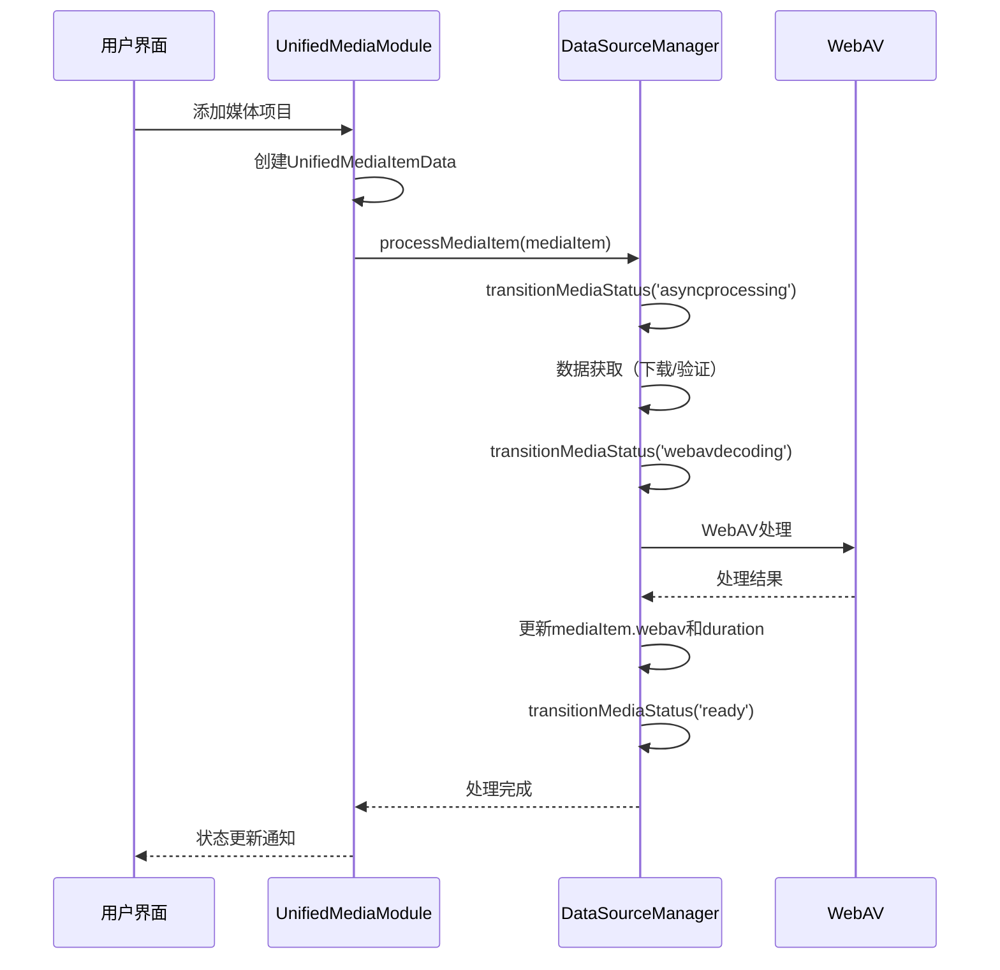
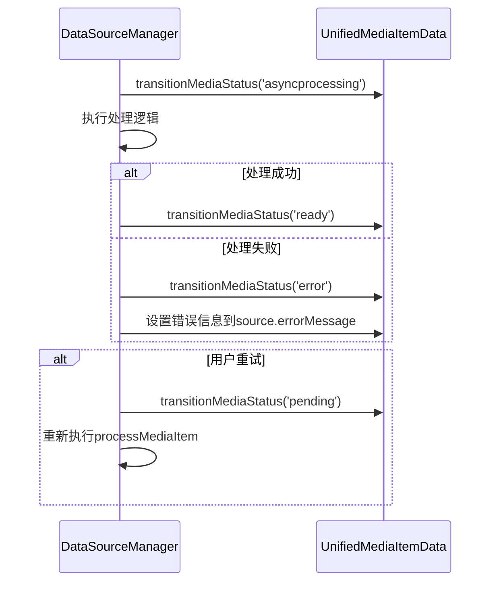

# 统一媒体项目数据源管理器重构方案

## 当前架构分析

### 现有架构问题
当前架构存在**双重状态管理**的问题：

1. **UnifiedMediaItemData层面的状态管理**：
   - `mediaStatus`: 'pending' | 'asyncprocessing' | 'webavdecoding' | 'ready' | 'error' | 'cancelled' | 'missing'
   - 由UnifiedMediaModule管理

2. **数据源层面的状态管理**：
   - `source.status`: 'pending' | 'acquiring' | 'acquired' | 'error' | 'cancelled' | 'missing'
   - 由各种DataSourceManager管理

3. **状态同步复杂性**：
   - UnifiedMediaModule需要监听数据源状态变化
   - 通过`handleSourceStatusChange`方法进行状态映射和同步
   - 存在状态不一致的风险

### 当前架构流程图



## 新架构设计方案

### 核心设计理念

**让数据源管理器直接管理UnifiedMediaItemData，从UnifiedMediaItemData层面统一处理状态机，消除双重状态管理。**

### 设计原则

1. **保持类型结构不变**：UnifiedMediaItemData和UnifiedDataSourceData的结构层级保持不变
2. **提升管理层级**：数据源管理器从管理数据源状态提升到管理整个媒体项目
3. **统一状态机**：只在UnifiedMediaItemData层面维护一套状态机
4. **简化状态同步**：消除状态映射和同步逻辑

### 新架构流程图



## 详细设计方案

### 1. 修改现有数据源管理器

```typescript
// 修改现有的BaseDataSourceManager
abstract class DataSourceManager<T extends UnifiedDataSourceData> {
  // 新增：直接管理UnifiedMediaItemData
  protected mediaItems: Map<string, UnifiedMediaItemData> = new Map()
  
  // 新增：核心方法，处理完整的媒体项目生命周期
  abstract processMediaItem(mediaItem: UnifiedMediaItemData): Promise<void>
  
  // 新增：统一状态机方法
  protected transitionMediaStatus(
    mediaItem: UnifiedMediaItemData,
    status: MediaStatus
  ): void {
    mediaItem.mediaStatus = status
    console.log(`🔄 [${this.getManagerType()}] 媒体状态转换: ${mediaItem.name} -> ${status}`)
  }
  
  // 保留原有的任务管理逻辑...
}
```

### 2. 状态机简化

**移除数据源状态字段**：
```typescript
// 原来的数据源运行时状态
interface DataSourceRuntimeState {
  status: DataSourceStatus  // ❌ 删除
  progress: number         // ✅ 保留
  errorMessage?: string    // ✅ 保留
  taskId?: string         // ✅ 保留
  file: File | null       // ✅ 保留
  url: string | null      // ✅ 保留
}
```

**统一使用媒体项目状态**：
```typescript
// 只在UnifiedMediaItemData层面维护状态
interface UnifiedMediaItemData {
  mediaStatus: MediaStatus  // 唯一的状态源
  // ... 其他字段保持不变
}
```

### 3. 管理器职责重新分配

#### 3.1 DataSourceManager职责扩展
- **完整生命周期管理**：从数据获取到WebAV处理的完整流程
- **统一状态机**：直接更新UnifiedMediaItemData的mediaStatus
- **错误处理**：统一的错误处理和重试机制
- **进度报告**：通过UnifiedMediaItemData.source.progress报告进度

#### 3.2 UnifiedMediaModule职责简化
- **媒体项目CRUD**：创建、删除、查询媒体项目
- **委托处理**：将处理任务委托给对应的DataSourceManager
- **集合管理**：维护媒体项目集合和索引

### 4. 具体实现方案

#### 4.1 修改RemoteFileManager

```typescript
class RemoteFileManager extends DataSourceManager<RemoteFileSourceData> {
  // 新增：处理完整的媒体项目生命周期
  async processMediaItem(mediaItem: UnifiedMediaItemData): Promise<void> {
    try {
      // 1. 设置为处理中状态
      this.transitionMediaStatus(mediaItem, 'asyncprocessing')
      
      // 2. 执行下载
      await this.downloadFile(mediaItem.source as RemoteFileSourceData)
      
      // 3. 设置为WebAV解析状态
      this.transitionMediaStatus(mediaItem, 'webavdecoding')
      
      // 4. 执行WebAV处理
      await this.processWithWebAV(mediaItem)
      
      // 5. 设置为就绪状态
      this.transitionMediaStatus(mediaItem, 'ready')
    } catch (error) {
      this.transitionMediaStatus(mediaItem, 'error')
      mediaItem.source.errorMessage = error instanceof Error ? error.message : '处理失败'
    }
  }
  
  // 新增：WebAV处理逻辑
  private async processWithWebAV(mediaItem: UnifiedMediaItemData): Promise<void> {
    // 从UnifiedMediaModule中移动WebAV处理逻辑到这里
    // 设置mediaItem.webav和duration
  }
  
  // 保留原有的下载逻辑，但去掉状态管理部分
  private async downloadFile(source: RemoteFileSourceData): Promise<void> {
    // 下载逻辑，只更新source.progress，不管理状态
  }
}
```

#### 4.2 修改UserSelectedFileManager

```typescript
class UserSelectedFileManager extends DataSourceManager<UserSelectedFileSourceData> {
  // 新增：处理完整的媒体项目生命周期
  async processMediaItem(mediaItem: UnifiedMediaItemData): Promise<void> {
    try {
      // 1. 设置为处理中状态（文件验证）
      this.transitionMediaStatus(mediaItem, 'asyncprocessing')
      
      // 2. 验证文件
      await this.validateFile(mediaItem.source as UserSelectedFileSourceData)
      
      // 3. 设置为WebAV解析状态
      this.transitionMediaStatus(mediaItem, 'webavdecoding')
      
      // 4. 执行WebAV处理
      await this.processWithWebAV(mediaItem)
      
      // 5. 设置为就绪状态
      this.transitionMediaStatus(mediaItem, 'ready')
    } catch (error) {
      this.transitionMediaStatus(mediaItem, 'error')
      mediaItem.source.errorMessage = error instanceof Error ? error.message : '处理失败'
    }
  }
  
  // 新增：WebAV处理逻辑
  private async processWithWebAV(mediaItem: UnifiedMediaItemData): Promise<void> {
    // 从UnifiedMediaModule中移动WebAV处理逻辑到这里
    // 设置mediaItem.webav和duration
  }
  
  // 保留原有的验证逻辑，但去掉状态管理部分
  private async validateFile(source: UserSelectedFileSourceData): Promise<void> {
    // 验证逻辑，只更新source.progress，不管理状态
  }
}
```

### 5. 数据流重构

#### 5.1 新的数据流



#### 5.2 错误处理流程



### 6. 迁移策略

#### 6.1 阶段一：修改现有管理器
1. 在`BaseDataSourceManager`中添加`processMediaItem`方法
2. 修改`RemoteFileManager`和`UserSelectedFileManager`，实现新的处理流程
3. 将WebAV处理逻辑从`UnifiedMediaModule`移动到各个管理器中

#### 6.2 阶段二：重构UnifiedMediaModule
1. 修改`startMediaProcessing`方法，调用管理器的`processMediaItem`
2. 移除`handleSourceStatusChange`和`startWebAVProcessing`方法
3. 简化状态同步逻辑

#### 6.3 阶段三：清理数据源状态
1. 从`DataSourceRuntimeState`中移除`status`字段
2. 更新相关的类型定义和查询函数
3. 清理不再需要的状态映射代码

#### 6.4 阶段四：测试和优化
1. 全面测试新的状态管理机制
2. 性能优化和错误处理完善
3. 清理旧的状态同步代码

### 7. 优势分析

#### 7.1 架构优势
- **消除双重状态管理**：只在UnifiedMediaItemData层面维护状态
- **简化状态同步**：无需状态映射和同步逻辑
- **提高一致性**：减少状态不一致的风险
- **增强内聚性**：相关逻辑集中在一个管理器中

#### 7.2 开发优势
- **降低复杂性**：开发者只需关注一套状态机
- **易于调试**：状态变化路径更清晰
- **便于扩展**：新增数据源类型更简单
- **减少bug**：消除状态同步相关的bug

#### 7.3 维护优势
- **代码更简洁**：移除大量状态同步代码
- **逻辑更清晰**：每个管理器负责完整的处理流程
- **测试更容易**：状态变化更可预测

### 8. 风险评估

#### 8.1 技术风险
- **重构范围较大**：需要修改多个核心模块
- **状态机复杂性**：需要仔细设计状态转换逻辑
- **向后兼容性**：需要确保现有功能不受影响

#### 8.2 缓解措施
- **分阶段实施**：逐步迁移，降低风险
- **充分测试**：每个阶段都进行全面测试
- **保持接口稳定**：尽量保持对外接口不变
- **回滚方案**：准备回滚到原有架构的方案

## 实施计划

### 第一阶段：修改现有管理器（预计1-2周）
- [ ] 在`BaseDataSourceManager`中添加`processMediaItem`抽象方法
- [ ] 在`BaseDataSourceManager`中添加`transitionMediaStatus`方法
- [ ] 修改`RemoteFileManager`，实现`processMediaItem`方法
- [ ] 修改`UserSelectedFileManager`，实现`processMediaItem`方法

### 第二阶段：移动WebAV处理逻辑（预计1-2周）
- [ ] 将`startWebAVProcessing`逻辑从`UnifiedMediaModule`移动到各个管理器
- [ ] 将`generateVideoThumbnail`等工具函数移动到管理器中
- [ ] 更新WebAV处理的错误处理机制
- [ ] 测试WebAV处理逻辑的正确性

### 第三阶段：重构UnifiedMediaModule（预计1周）
- [ ] 修改`startMediaProcessing`方法，调用管理器的`processMediaItem`
- [ ] 移除`handleSourceStatusChange`方法
- [ ] 移除`startWebAVProcessing`方法
- [ ] 简化媒体项目的状态管理逻辑

### 第四阶段：清理数据源状态（预计1周）
- [ ] 从`DataSourceRuntimeState`中移除`status`字段
- [ ] 更新相关的类型定义和查询函数
- [ ] 清理状态映射相关的代码
- [ ] 更新管理器注册中心的相关逻辑

### 第五阶段：测试和优化（预计1周）
- [ ] 集成测试和回归测试
- [ ] 性能测试和优化
- [ ] 用户界面适配测试
- [ ] 文档更新和代码审查

## 📋 使用点分析和具体修改指导

### 1. **主要使用点总结**

从代码分析中，发现了以下关键使用点：

#### **A. 组件层面的使用**
- **UnifiedMediaLibrary.vue** (第550行)：调用 `unifiedStore.startMediaProcessing(mediaItem)`

#### **B. 模块层面的使用**
- **UnifiedMediaModule.ts** (第491行)：`startMediaProcessing` 函数实现
- **UnifiedProjectModule.ts** (第379行)：项目加载时调用 `startMediaProcessing`

#### **C. 存储层面的使用**
- **unifiedStore.ts**：暴露 `startMediaProcessing` 接口

### 2. **具体修改指导**

#### **修改点1：UnifiedMediaModule.ts 的 startMediaProcessing 函数**

**当前实现**（第491-528行）：
```typescript
function startMediaProcessing(mediaItem: UnifiedMediaItemData) {
  // 监听数据源状态变化
  const unwatch = watch(
    () => mediaItem.source.status,
    (newStatus, oldStatus) => {
      handleSourceStatusChange(mediaItem, newStatus, oldStatus)
      // ...
    },
    { immediate: true }
  )

  // 开始数据源获取
  import('@/unified/managers/DataSourceManagerRegistry')
    .then(({ startDataSourceAcquisition }) => {
      const success = startDataSourceAcquisition(mediaItem.source)
      // ...
    })
}
```

**需要修改为**：
```typescript
function startMediaProcessing(mediaItem: UnifiedMediaItemData) {
  console.log(`🚀 [UnifiedMediaModule] 开始处理媒体项目: ${mediaItem.name}`)

  // 🆕 新架构：直接在UnifiedMediaItemData层面管理状态机
  // 不再监听数据源状态，而是让数据源管理器直接更新媒体状态

  // 导入并使用数据源管理器注册中心
  import('@/unified/managers/DataSourceManagerRegistry')
    .then(({ startDataSourceAcquisition }) => {
      // 🆕 传入媒体项目而不是数据源，让管理器直接操作媒体状态
      const success = startDataSourceAcquisition(mediaItem) // 注意：传入整个mediaItem
      if (success) {
        console.log(`✅ [UnifiedMediaModule] 媒体处理任务已启动: ${mediaItem.name}`)
      } else {
        console.error(`❌ [UnifiedMediaModule] 媒体处理任务启动失败: ${mediaItem.name}`)
        // 直接设置媒体项目为错误状态
        UnifiedMediaItemActions.transitionTo(mediaItem, 'error')
      }
    })
    .catch((error) => {
      console.error(`❌ [UnifiedMediaModule] 导入数据源管理器失败: ${mediaItem.name}`, error)
      UnifiedMediaItemActions.transitionTo(mediaItem, 'error')
    })
}
```

#### **修改点2：需要删除的函数**

**删除 handleSourceStatusChange 函数**（第435-485行）：
```typescript
// ❌ 这个函数需要完全删除，因为新架构中数据源管理器直接操作媒体状态
function handleSourceStatusChange(
  mediaItem: UnifiedMediaItemData,
  newSourceStatus: string,
  oldSourceStatus?: string,
) {
  // 整个函数删除
}
```

#### **修改点3：数据源管理器注册中心接口修改**

**DataSourceManagerRegistry.ts 的 startDataSourceAcquisition 函数**需要修改：

**当前接口**：
```typescript
export function startDataSourceAcquisition(source: UnifiedDataSourceData): boolean
```

**需要修改为**：
```typescript
export function startDataSourceAcquisition(mediaItem: UnifiedMediaItemData): boolean {
  const source = mediaItem.source
  
  // 根据数据源类型选择管理器
  if (DataSourceQueries.isUserSelectedSource(source)) {
    const manager = new UserSelectedFileManager()
    // 🆕 传入整个媒体项目，让管理器直接操作媒体状态
    return manager.startProcessing(mediaItem)
  } else if (DataSourceQueries.isRemoteSource(source)) {
    const manager = new RemoteFileManager()
    // 🆕 传入整个媒体项目，让管理器直接操作媒体状态
    return manager.startProcessing(mediaItem)
  }
  
  return false
}
```

#### **修改点4：数据源管理器基类修改**

**BaseDataSourceManager.ts** 需要修改接口：

**当前接口**：
```typescript
abstract class BaseDataSourceManager<T extends UnifiedDataSourceData> {
  abstract startProcessing(source: T): boolean
}
```

**需要修改为**：
```typescript
abstract class BaseDataSourceManager<T extends UnifiedDataSourceData> {
  // 🆕 新接口：直接操作媒体项目
  abstract startProcessing(mediaItem: UnifiedMediaItemData): boolean
  
  // 🆕 新增：直接更新媒体状态的辅助方法
  protected updateMediaStatus(mediaItem: UnifiedMediaItemData, status: MediaStatus): void {
    UnifiedMediaItemActions.transitionTo(mediaItem, status)
  }
  
  // 🆕 新增：启动WebAV处理的辅助方法
  protected startWebAVProcessing(mediaItem: UnifiedMediaItemData): void {
    // 调用UnifiedMediaModule的WebAV处理方法
    // 这里需要通过某种方式访问到WebAV处理函数
  }
}
```

#### **修改点5：具体管理器实现修改**

**UserSelectedFileManager.ts** 和 **RemoteFileManager.ts** 需要修改：

**当前实现模式**：
```typescript
class UserSelectedFileManager extends BaseDataSourceManager<UserSelectedFileSource> {
  startProcessing(source: UserSelectedFileSource): boolean {
    // 更新数据源状态
    source.status = 'acquiring'
    // ...
  }
}
```

**需要修改为**：
```typescript
class UserSelectedFileManager extends BaseDataSourceManager<UserSelectedFileSource> {
  startProcessing(mediaItem: UnifiedMediaItemData): boolean {
    const source = mediaItem.source as UserSelectedFileSource
    
    // 🆕 直接更新媒体状态而不是数据源状态
    this.updateMediaStatus(mediaItem, 'asyncprocessing')
    
    // 处理文件获取
    this.processFile(mediaItem)
      .then(() => {
        // 🆕 直接转换到WebAV解析状态
        this.updateMediaStatus(mediaItem, 'webavdecoding')
        // 🆕 启动WebAV处理
        this.startWebAVProcessing(mediaItem)
      })
      .catch((error) => {
        // 🆕 直接设置错误状态
        this.updateMediaStatus(mediaItem, 'error')
      })
    
    return true
  }
  
  private async processFile(mediaItem: UnifiedMediaItemData): Promise<void> {
    const source = mediaItem.source as UserSelectedFileSource
    // 文件处理逻辑...
    // 更新数据源的file和url属性
    source.file = processedFile
    source.url = processedUrl
  }
}
```

### 3. **调用点无需修改**

以下调用点**无需修改**，因为接口保持一致：

- **UnifiedMediaLibrary.vue** 第550行：`unifiedStore.startMediaProcessing(mediaItem)`
- **UnifiedProjectModule.ts** 第379行：`mediaModule.startMediaProcessing(mediaItem)`
- **unifiedStore.ts**：暴露的接口保持不变

### 4. **迁移步骤建议**

1. **第一步**：修改 `BaseDataSourceManager` 基类接口
2. **第二步**：修改具体的管理器实现（`UserSelectedFileManager`、`RemoteFileManager`）
3. **第三步**：修改 `DataSourceManagerRegistry` 的接口
4. **第四步**：修改 `UnifiedMediaModule` 的 `startMediaProcessing` 函数
5. **第五步**：删除不再需要的 `handleSourceStatusChange` 函数
6. **第六步**：测试验证新的状态管理流程

### 5. **关键优势**

通过这些修改，我们实现了：

- ✅ **消除双重状态管理**：只在 `UnifiedMediaItemData.mediaStatus` 层面管理状态
- ✅ **简化状态同步**：数据源管理器直接操作媒体状态，无需同步
- ✅ **保持接口兼容**：外部调用点无需修改
- ✅ **提高可维护性**：状态管理逻辑更加清晰和集中

## 总结

这个重构方案通过**提升数据源管理器的管理层级**，让其直接管理UnifiedMediaItemData，从而消除了双重状态管理的复杂性。新架构具有更好的内聚性、一致性和可维护性，同时保持了现有的类型结构不变，降低了迁移成本。

通过分阶段的迁移策略和详细的修改指导，可以安全地完成这次重构，最终实现更简洁、更可靠的媒体项目管理架构。

---

**文档版本**: v1.1
**创建日期**: 2025-01-20
**最后更新**: 2025-01-20
**作者**: Kilo Code
**更新说明**: 简化方案，直接修改现有管理器而非创建增强版