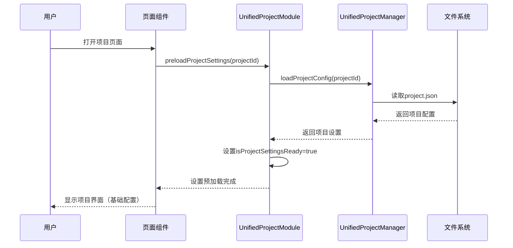
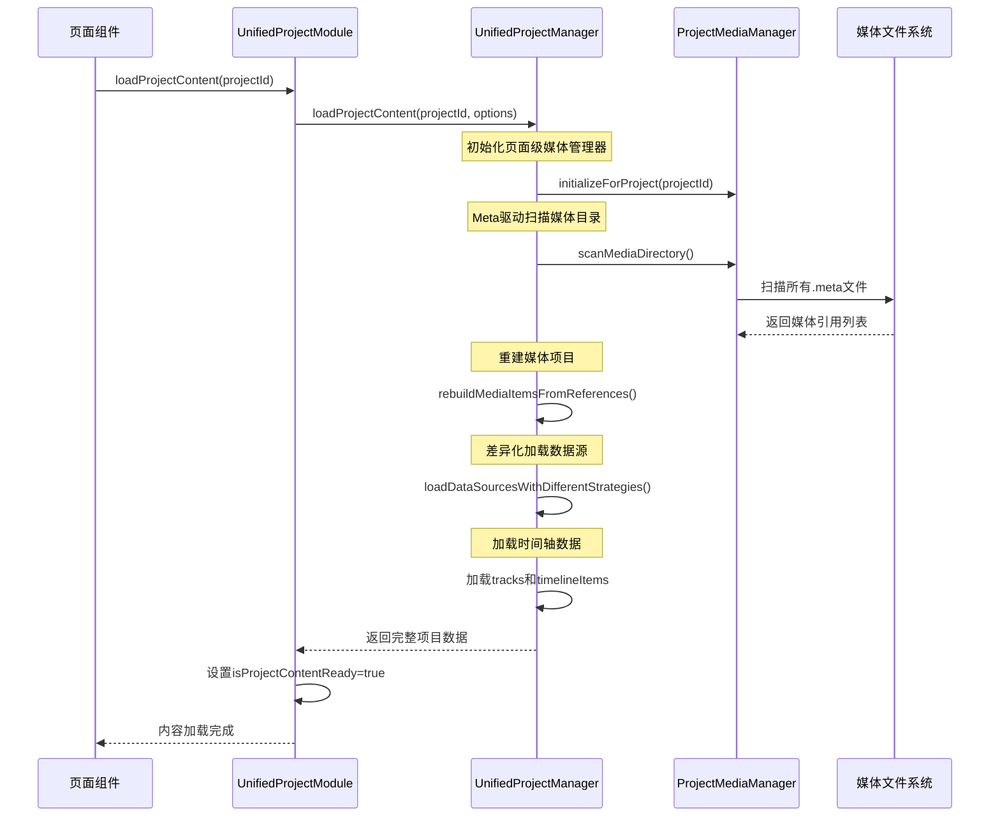
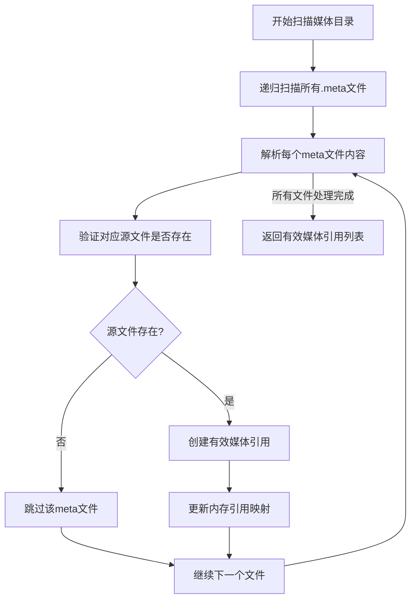
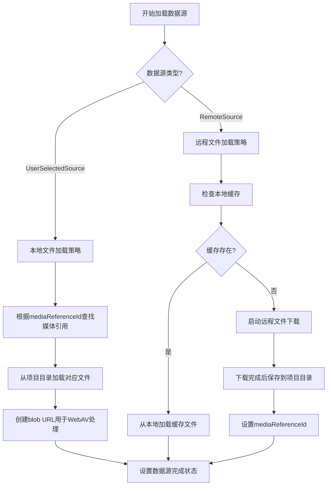
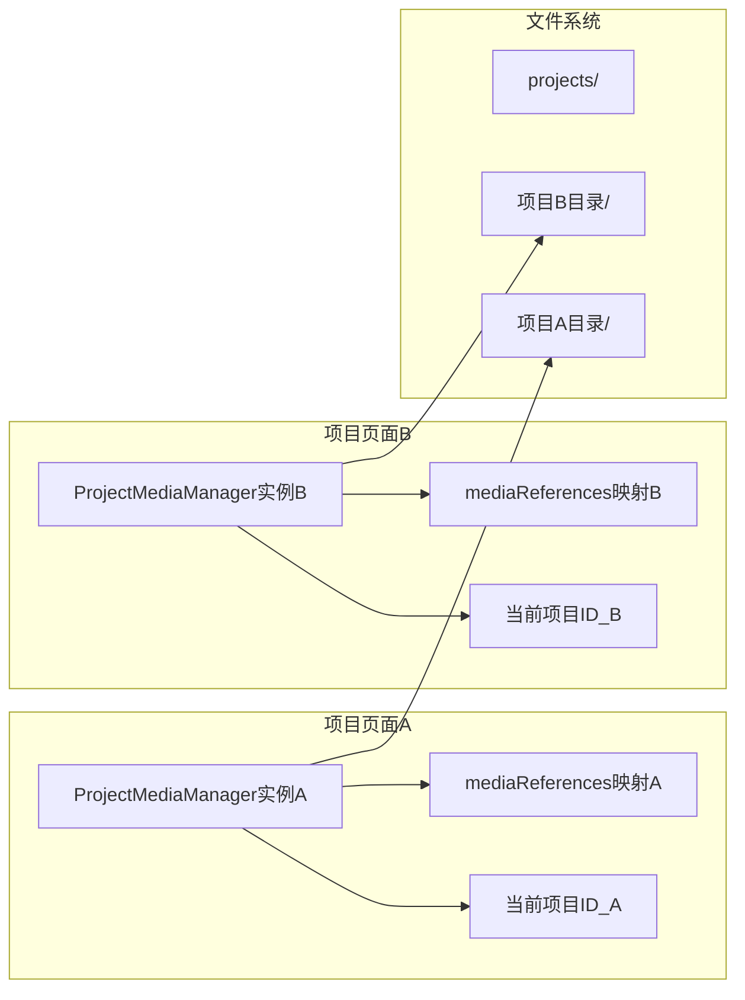
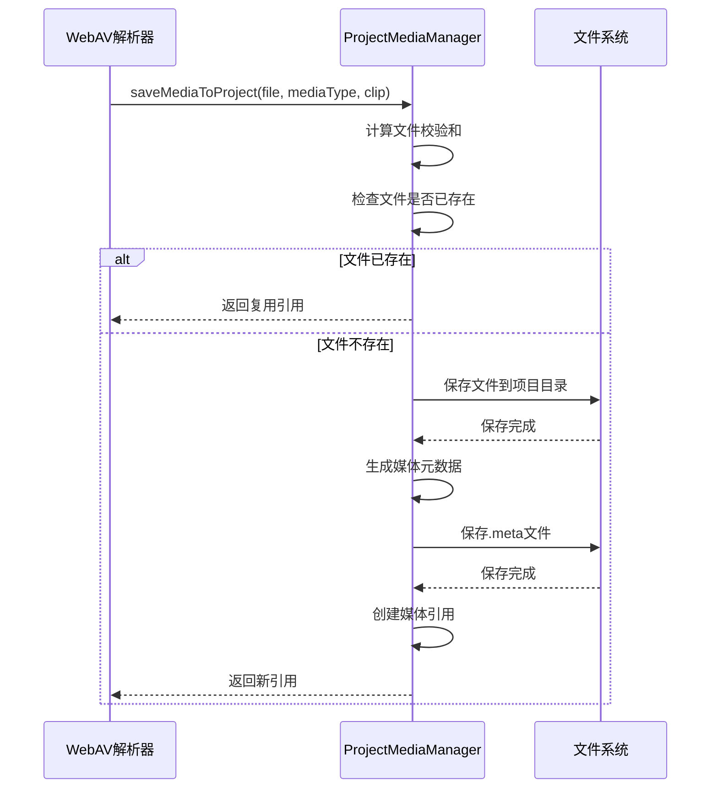

# 新架构项目页面初始化流程分析

根据对代码的分析，新架构中项目页面的初始化流程采用了分阶段加载策略，主要分为两个核心阶段：**项目设置预加载**和**项目内容加载**。这种设计确保了用户能够快速看到项目界面，同时后台继续加载媒体文件等较重的内容。

## 一、整体架构概览

新架构采用了统一类型系统，主要组件包括：
- **UnifiedProjectModule**: 统一项目管理模块
- **UnifiedProjectManager**: 统一项目管理器
- **ProjectMediaManager**: 页面级项目媒体管理器
- **UnifiedStore**: 统一状态管理

## 二、初始化流程详细步骤

### 阶段1：项目设置预加载（轻量级）

这个阶段只加载项目的基本配置信息，不加载媒体文件，确保页面能够快速响应。



**关键代码实现**：
1. `UnifiedProjectModule.preloadProjectSettings()` (frontend/src/unified/modules/UnifiedProjectModule.ts:198-220)
2. `UnifiedProjectManager.loadProjectConfig()` (frontend/src/unified/utils/projectManager.ts:167-210)

**主要功能**：
- 只读取project.json中的settings部分（视频分辨率、帧率、时间轴长度等）
- 不加载媒体文件和时间轴数据
- 快速恢复项目基本配置，使界面可用

### 阶段2：项目内容加载（完整加载）

这个阶段在后台加载项目的完整内容，包括媒体文件、时间轴数据等。



**关键代码实现**：
1. `UnifiedProjectModule.loadProjectContent()` (frontend/src/unified/modules/UnifiedProjectModule.ts:226-266)
2. `UnifiedProjectManager.loadProjectContent()` (frontend/src/unified/utils/projectManager.ts:219-281)
3. `ProjectMediaManager.scanMediaDirectory()` (frontend/src/unified/utils/ProjectMediaManager.ts:366-436)

## 三、Meta驱动架构的核心实现

新架构采用了"Meta驱动"的媒体管理策略，这是初始化流程的核心创新：

### 1. Meta文件扫描流程



**关键实现**：`ProjectMediaManager.scanMediaDirectory()` (frontend/src/unified/utils/ProjectMediaManager.ts:366-436)

### 2. 差异化数据源加载策略

根据不同的数据源类型采用不同的加载策略：



**关键实现**：
- `UnifiedProjectManager.loadDataSourcesWithDifferentStrategies()` (frontend/src/unified/utils/projectManager.ts:383-431)
- `UnifiedProjectManager.loadUserSelectedFileSource()` (frontend/src/unified/utils/projectManager.ts:438-476)
- `UnifiedProjectManager.loadRemoteFileSource()` (frontend/src/unified/utils/projectManager.ts:483-543)

## 四、页面级隔离架构

新架构采用了页面级隔离的设计，每个项目都是独立的页面实例：

### 1. 页面级媒体管理器



**关键实现**：`ProjectMediaManager` (frontend/src/unified/utils/ProjectMediaManager.ts:47-73)

### 2. 即时保存策略

当媒体文件解析成功后，立即保存到项目本地目录：



**关键实现**：`ProjectMediaManager.saveMediaToProject()` (frontend/src/unified/utils/ProjectMediaManager.ts:152-235)

## 五、初始化流程的优势

1. **快速响应**：通过分阶段加载，用户可以快速看到项目界面
2. **数据安全**：即时保存策略确保媒体文件不会丢失
3. **项目隔离**：页面级架构确保项目间完全隔离
4. **Meta驱动**：通过meta文件管理媒体引用，提高加载效率
5. **容错性强**：单个媒体文件加载失败不影响整体项目加载

## 六、关键数据结构

### 1. 媒体引用结构
```typescript
interface UnifiedMediaReference {
  id: string                    // 持久化ID
  originalFileName: string      // 原始文件名
  storedPath: string            // 项目内存储路径
  mediaType: MediaType          // 媒体类型
  fileSize: number              // 文件大小
  mimeType: string              // MIME类型
  checksum: string              // 文件校验和
  metadata: UnifiedMediaMetadata // 完整元数据
}
```

### 2. 项目配置结构
```typescript
interface UnifiedProjectConfig {
  id: string                   // 项目ID
  name: string                 // 项目名称
  settings: {                  // 项目设置
    videoResolution: VideoResolution
    frameRate: number
    timelineDurationFrames: number
  }
  timeline: {                  // 时间轴数据
    tracks: UnifiedTrackData[]
    timelineItems: UnifiedTimelineItemData[]
    mediaItems: UnifiedMediaItemData[]
  }
  media: {}                    // 媒体数据（新架构中为空，通过meta文件管理）
}
```

## 七、总结

新架构的项目初始化流程通过分阶段加载、Meta驱动架构和页面级隔离设计，实现了高效、安全的项目管理。这种架构不仅提高了用户体验，还确保了数据的完整性和项目的可移植性。初始化流程的核心是"轻量级预加载 + 完整内容后台加载"的策略，使用户能够快速开始工作，同时系统在后台继续完成所有必要的数据加载。