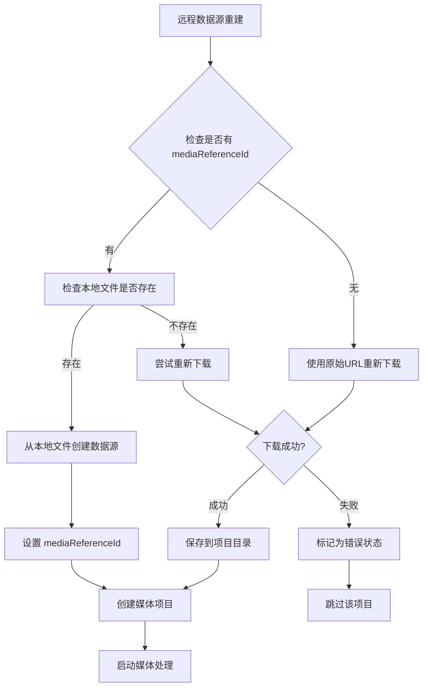

# 远程数据源 mediaReferenceId 重建方案

## 问题背景

当前远程下载的文件在项目重建时，需要重新下载文件，这会导致：
1. 重建时间过长
2. 网络资源浪费
3. 可能因为网络问题导致重建失败

实际上，远程下载的文件在首次下载后已经保存到项目目录中，应该支持从 `mediaReferenceId` 重建，就像用户选择文件一样。

## 当前问题分析

### 1. mediaReferenceId 已在基类中统一管理

```typescript
// mediaReferenceId 已经在 BaseDataSourceData 中定义
// 这是所有数据源的通用概念，统一在基类中管理
interface BaseDataSourceData {
  type: string
  status: DataSourceStatus
  progress: number
  // mediaReferenceId 已在基类中，所有数据源类型都可以使用
  mediaReferenceId?: string
}
```

### 2. 重建时强制重新下载

```typescript
// 当前 rebuildMediaItems 中的远程文件处理
if (DataSourceQueries.isRemoteSource(savedMediaItem.source)) {
  // 总是创建新的远程数据源，会触发重新下载
  source = DataSourceFactory.createRemoteSource(
    savedMediaItem.source.url,
    savedMediaItem.source.config
  )
}
```

## 解决方案设计

### 核心思路

1. **扩展远程数据源**：为 `RemoteFileSource` 添加 `mediaReferenceId` 支持
2. **智能重建策略**：优先从本地文件重建，失败时才重新下载
3. **保持向后兼容**：支持没有 `mediaReferenceId` 的旧项目

### 重建策略流程图



## 具体实现建议

### 1. 确认 mediaReferenceId 在基类中的定义

```typescript
// BaseDataSourceData 已经包含 mediaReferenceId
interface BaseDataSourceData {
  type: string
  status: DataSourceStatus
  progress: number
  errorMessage?: string
  taskId?: string
  file: File | null
  url: string | null
  mediaReferenceId?: string  // 已在基类中定义：所有数据源都可以使用本地文件引用
}

// UserSelectedFileSourceData 继承自基类，自动获得 mediaReferenceId
interface UserSelectedFileSourceData extends BaseDataSourceData {
  type: 'user-selected'
  selectedFile: File
  // mediaReferenceId 继承自基类，无需重复定义
}

// RemoteFileSourceData 也继承自基类，自动获得 mediaReferenceId
interface RemoteFileSourceData extends BaseDataSourceData {
  type: 'remote'
  remoteUrl: string  // 远程URL
  config: RemoteFileConfig  // 包含url和其他配置的完整配置对象
  downloadedBytes: number
  totalBytes: number
  downloadSpeed?: string
  startTime?: number
  // mediaReferenceId 继承自基类，无需重复定义
}
```

### 2. 修改远程文件下载完成后的处理

```typescript
// 在 RemoteFileManager 中，下载完成后设置 mediaReferenceId
class RemoteFileManager {
  async downloadFile(source: RemoteFileSourceData): Promise<File> {
    // ... 下载逻辑
    
    // 下载完成后，保存到项目目录并设置 mediaReferenceId
    const savedFile = await globalProjectMediaManager.saveMediaToProject(
      projectId,
      downloadedFile
    )
    
    // 设置 mediaReferenceId，用于后续重建
    source.mediaReferenceId = savedFile.mediaReferenceId
    
    return savedFile.file
  }
}
```

### 3. 重新设计 RemoteFileConfig 和工厂函数

```typescript
// 重新设计 RemoteFileConfig，包含 url 字段
export interface RemoteFileConfig {
  url: string  // 必需字段：远程文件URL
  headers?: Record<string, string>
  timeout?: number
  retryCount?: number
  retryDelay?: number
}

// 修改 RemoteFileSourceFactory，使用与 UserSelectedFileSource 一致的签名模式
export const RemoteFileSourceFactory = {
  // 统一签名：支持 RemoteFileConfig 或 mediaReferenceId
  createRemoteSource(param: RemoteFileConfig | string): RemoteFileSourceData {
    const baseData = {
      id: generateUUID4(),
      type: 'remote',
      status: 'pending',
      progress: 0,
      file: null,
      url: null,
      downloadedBytes: 0,
      totalBytes: 0,
    }

    if (typeof param === 'string') {
      // 使用 mediaReferenceId 创建（从本地重建）
      return reactive({
        ...baseData,
        mediaReferenceId: param,
        remoteUrl: '', // 临时为空，将在 executeAcquisition 中从媒体引用获取
        config: { url: '' }, // 临时配置，将从媒体引用中恢复
      }) as RemoteFileSourceData
    } else {
      // 使用 RemoteFileConfig 创建（新下载）
      return reactive({
        ...baseData,
        remoteUrl: param.url,
        config: param,
      }) as RemoteFileSourceData
    }
  },
}

// 相应地更新 DataSourceFactory，保持一致的签名模式
export const DataSourceFactory = {
  // File | string 模式
  createUserSelectedSource(param: File | string): UserSelectedFileSourceData {
    return UserSelectedFileSourceFactory.createUserSelectedSource(param)
  },

  // RemoteFileConfig | string 模式
  createRemoteSource(param: RemoteFileConfig | string): RemoteFileSourceData {
    return RemoteFileSourceFactory.createRemoteSource(param)
  },
}
```

### 4. 统一重建逻辑 - 让数据源内部处理

```typescript
async function rebuildMediaItems(
  mediaReferences: UnifiedMediaReference[],
  timelineMediaItems: UnifiedMediaItemData[]
): Promise<void> {
  // ... 前置代码

  for (const savedMediaItem of timelineMediaItems) {
    try {
      let source: UnifiedDataSourceData
      
      if (DataSourceQueries.isUserSelectedSource(savedMediaItem.source)) {
        // 用户选择文件：直接传入 mediaReferenceId，让数据源内部处理文件加载
        const mediaReferenceId = savedMediaItem.source.mediaReferenceId
        if (mediaReferenceId) {
          const mediaRef = mediaRefMap.get(mediaReferenceId)
          if (mediaRef) {
            // 直接传入 mediaReferenceId，让数据源内部在 executeAcquisition 中加载文件
            source = DataSourceFactory.createUserSelectedSource(mediaRef.id)
          } else {
            console.warn(`本地文件缺失，跳过: ${savedMediaItem.name}`)
            continue
          }
        }
      } else if (DataSourceQueries.isRemoteSource(savedMediaItem.source)) {
        // 远程文件：优先使用 mediaReferenceId 重建，失败时才使用原始配置
        const mediaReferenceId = savedMediaItem.source.mediaReferenceId
        if (mediaReferenceId) {
          const mediaRef = mediaRefMap.get(mediaReferenceId)
          if (mediaRef) {
            // 直接传入 mediaReferenceId，让数据源内部优先从本地文件重建
            source = DataSourceFactory.createRemoteSource(mediaRef.id)
          } else {
            // 本地文件缺失，使用原始配置重新下载
            console.warn(`本地文件缺失，将重新下载: ${savedMediaItem.name}`)
            const remoteConfig: RemoteFileConfig = {
              url: savedMediaItem.source.remoteUrl,
              ...savedMediaItem.source.config
            }
            source = DataSourceFactory.createRemoteSource(remoteConfig)
          }
        } else {
          // 旧项目没有 mediaReferenceId，使用原始配置下载
          const remoteConfig: RemoteFileConfig = {
            url: savedMediaItem.source.remoteUrl,
            ...savedMediaItem.source.config
          }
          source = DataSourceFactory.createRemoteSource(remoteConfig)
        }
      } else {
        console.warn(`未知数据源类型: ${savedMediaItem.source.type}`)
        continue
      }

      // 创建媒体项目并启动处理（统一流程）
      const mediaItem = mediaModule.createUnifiedMediaItemData(
        savedMediaItem.id,
        savedMediaItem.name,
        source,
        {
          mediaType: savedMediaItem.mediaType,
          duration: savedMediaItem.duration,
        }
      )

      mediaModule.addMediaItem(mediaItem)
      // startMediaProcessing 会调用对应的数据源管理器
      // 管理器内部会检查 mediaReferenceId，优先使用本地文件
      mediaModule.startMediaProcessing(mediaItem)
      
    } catch (error) {
      console.error(`恢复媒体项目失败: ${savedMediaItem.name}`, error)
    }
  }
}
```

### 5. 修改数据源管理器内部逻辑

```typescript
// RemoteFileManager 内部处理 mediaReferenceId
class RemoteFileManager extends BaseDataSourceManager {
  async processDataSource(source: RemoteFileSourceData): Promise<File> {
    // 优先检查是否有 mediaReferenceId（本地文件重建）
    if (source.mediaReferenceId) {
      try {
        console.log(`🔄 尝试从本地文件重建远程数据源: ${source.mediaReferenceId}`)
        
        // 从项目目录加载本地文件
        const file = await globalProjectMediaManager.loadMediaFromProject(
          this.projectId,
          source.mediaReferenceId
        )
        
        // 设置为已完成状态，避免重新下载
        source.file = file
        source.status = 'acquired'
        source.progress = 100
        
        console.log(`✅ 远程文件从本地重建成功`)
        return file
        
      } catch (error) {
        console.warn(`从本地文件重建失败，需要获取原始URL重新下载:`, error)
        
        // 如果本地文件加载失败，需要从媒体引用中获取原始配置
        try {
          const mediaRef = await globalProjectMediaManager.getMediaReference(source.mediaReferenceId)
          if (mediaRef && mediaRef.originalConfig) {
            // 从媒体引用中恢复完整的 RemoteFileConfig
            source.remoteUrl = mediaRef.originalConfig.url
            source.config = mediaRef.originalConfig
            console.log(`📡 获取到原始配置，将重新下载: ${source.remoteUrl}`)
          } else {
            throw new Error('无法获取原始配置信息')
          }
        } catch (configError) {
          console.error(`获取原始配置失败:`, configError)
          throw new Error('无法重建远程数据源：本地文件缺失且无法获取原始配置')
        }
      }
    }
    
    // 检查是否有有效的远程URL
    if (!source.remoteUrl) {
      throw new Error('远程数据源缺少URL信息')
    }
    
    // 执行下载流程
    console.log(`🌐 开始下载远程文件: ${source.remoteUrl}`)
    return await this.downloadFile(source)
  }
  
  private async downloadFile(source: RemoteFileSourceData): Promise<File> {
    // ... 原有下载逻辑
    
    // 下载完成后，保存到项目目录并设置 mediaReferenceId
    const savedFile = await globalProjectMediaManager.saveMediaToProject(
      this.projectId,
      downloadedFile,
      {
        // 保存完整的 RemoteFileConfig，便于后续重建
        originalConfig: {
          url: source.remoteUrl,
          ...source.config
        } as RemoteFileConfig,
      }
    )
    
    // 设置 mediaReferenceId，用于后续重建
    source.mediaReferenceId = savedFile.mediaReferenceId
    
    return savedFile.file
  }
}

// UserSelectedFileManager 保持现有逻辑不变
class UserSelectedFileManager extends BaseDataSourceManager {
  async processDataSource(source: UserSelectedFileSourceData): Promise<File> {
    // 如果有 mediaReferenceId，优先从本地加载
    if (source.mediaReferenceId) {
      try {
        return await globalProjectMediaManager.loadMediaFromProject(
          this.projectId,
          source.mediaReferenceId
        )
      } catch (error) {
        console.warn(`从本地文件加载失败:`, error)
        // 如果本地文件加载失败，但有原始文件，则使用原始文件
        if (source.selectedFile) {
          return source.selectedFile
        }
        throw error
      }
    }
    
    // 使用原始文件
    if (!source.selectedFile) {
      throw new Error('用户选择文件数据源缺少文件信息')
    }
    return source.selectedFile
  }
}
```

## 优势分析

### 1. 性能提升
- 避免重复下载，大幅提升项目重建速度
- 减少网络带宽消耗

### 2. 可靠性提升
- 不依赖网络状态，提高重建成功率
- 即使原始URL失效，仍可从本地文件重建

### 3. 向后兼容
- 支持没有 `mediaReferenceId` 的旧项目
- 自动回退到重新下载策略

### 4. 一致性
- 远程文件和用户选择文件的重建逻辑趋于一致
- 都优先使用本地缓存文件

## 实施步骤

### 阶段一：确认基类设计
1. 确认 `mediaReferenceId` 已在 `BaseDataSourceData` 中定义
2. 验证所有数据源类型定义正确继承了 `mediaReferenceId`
3. 确认相关的类型守卫和查询函数正常工作

### 阶段二：扩展工厂函数和下载流程
1. 修改 `DataSourceFactory.createRemoteSource` 支持 `mediaReferenceId` 参数
2. 在远程文件下载完成后设置 `mediaReferenceId`
3. 确保远程文件也保存到项目媒体目录
4. 更新 `RemoteFileSourceFactory` 支持通过 `mediaReferenceId` 创建数据源

### 阶段三：实现智能重建
1. 修改 `RemoteFileManager` 内部逻辑，支持 `mediaReferenceId` 优先处理
2. 统一 `rebuildMediaItems` 逻辑，让数据源管理器内部处理本地文件优先
3. 移除外部的重建函数，保持封装性

### 阶段四：测试验证
1. 测试通过 `mediaReferenceId` 创建远程数据源的重建流程
2. 测试本地文件存在时的快速重建（无需下载）
3. 测试本地文件缺失时的原始URL回退下载机制
4. 测试没有 `mediaReferenceId` 的旧项目兼容性（直接使用URL下载）
5. 验证远程文件和用户选择文件重建逻辑的一致性
6. 测试工厂函数的参数重载功能（URL vs mediaReferenceId）

## 风险评估

### 技术风险
- 远程数据源状态管理复杂化
- 可能影响现有的远程下载流程
- 需要确保远程文件重建逻辑与用户选择文件保持一致

### 缓解措施
- 保持向后兼容，确保旧项目正常工作
- 充分的单元测试和集成测试
- 渐进式实施，先实现远程数据源的智能重建
- 保留原有逻辑作为回退方案
- 确保用户选择文件和远程文件的重建逻辑一致性

## 总结

通过为远程数据源添加 `mediaReferenceId` 支持，可以实现智能重建策略：优先从本地文件重建，失败时才重新下载。这将大幅提升项目重建的性能和可靠性，同时保持与用户选择文件一致的处理逻辑。