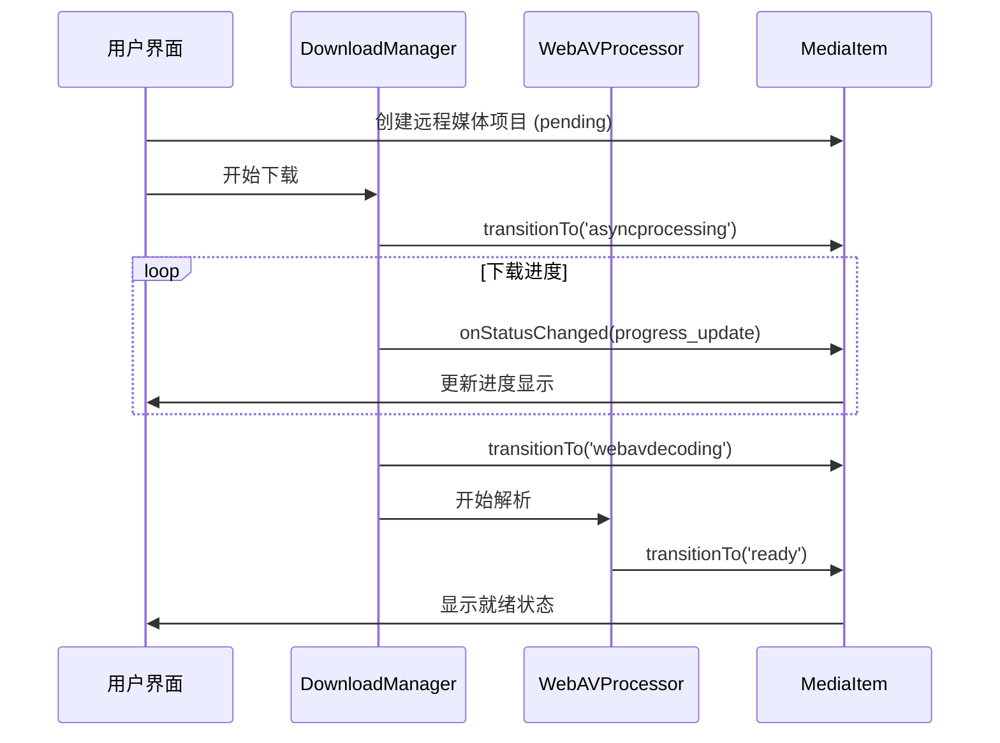
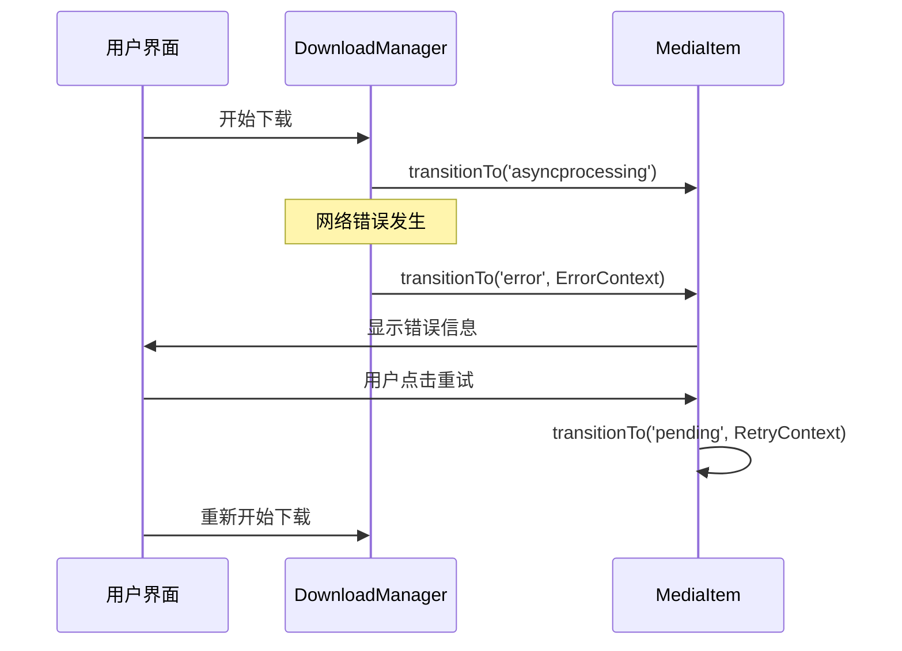

# 媒体类型统一设计 - 转换流程示例

## 概述

本文档展示统一媒体类型的状态转换流程，采用状态机模式，由各个管理器主动驱动状态转换。

## 状态转换由管理器驱动

在状态机模式下，状态转换不再是自动计算，而是由各个管理器主动调用：

### 1. 远程下载管理器

```typescript
// 远程下载管理器
class RemoteDownloadManager {
  async startDownload(item: UnifiedMediaItem) {
    // 开始下载，传递类型安全的上下文
    item.transitionTo('asyncprocessing', {
      type: 'async_processing',
      timestamp: Date.now(),
      source: 'RemoteDownloadManager',
      reason: '开始远程文件下载',
      initialProgress: 0,
      estimatedDuration: this.estimateDownloadTime(item.source.url)
    })

    try {
      const startTime = Date.now()
      const file = await this.downloadFile(item.source.url, (progress, downloadedBytes, totalBytes) => {
        // 下载进度更新（不改变状态，只更新上下文）
        item.onStatusChanged?.('asyncprocessing', 'asyncprocessing', {
          type: 'progress_update',
          timestamp: Date.now(),
          source: 'RemoteDownloadManager',
          reason: '下载进度更新',
          progress,
          progressMessage: `下载中... ${progress}% (${this.formatBytes(downloadedBytes)}/${this.formatBytes(totalBytes)})`,
          estimatedTime: this.calculateETA(progress, startTime),
          downloadSpeed: this.calculateSpeed(downloadedBytes, startTime),
          downloadedBytes,
          totalBytes
        })
      })

      item.source.downloadedFile = file

      // 下载完成，传递类型安全的文件信息
      item.transitionTo('webavdecoding', {
        type: 'download_completed',
        timestamp: Date.now(),
        source: 'RemoteDownloadManager',
        reason: '下载完成，开始WebAV解析',
        downloadedFile: file,
        downloadedUrl: URL.createObjectURL(file),
        fileSize: file.size,
        downloadDuration: Date.now() - startTime,
        averageSpeed: this.calculateAverageSpeed(file.size, Date.now() - startTime)
      })
    } catch (error) {
      // 下载失败，传递类型安全的错误信息
      item.transitionTo('error', {
        type: 'error',
        timestamp: Date.now(),
        source: 'RemoteDownloadManager',
        reason: '下载失败',
        errorMessage: error.message,
        errorCode: error.code || 'DOWNLOAD_ERROR',
        errorDetails: error,
        retryable: this.isRetryableError(error),
        retryCount: (item.retryCount || 0) + 1
      })
    }
  }
}
```

### 2. WebAV处理器

```typescript
// WebAV处理器
class WebAVProcessor {
  async parseFile(item: UnifiedMediaItem) {
    try {
      const startTime = Date.now()
      const webavObjects = await this.parseMediaFile(item)
      const metadata = this.extractMetadata(webavObjects)

      item.webav = webavObjects

      // 解析完成，传递类型安全的解析结果
      item.transitionTo('ready', {
        type: 'parse_completed',
        timestamp: Date.now(),
        source: 'WebAVProcessor',
        reason: 'WebAV解析完成',
        parsedMetadata: {
          duration: metadata.duration,
          resolution: metadata.resolution,
          format: metadata.format,
          bitrate: metadata.bitrate,
          codecInfo: {
            video: metadata.videoCodec,
            audio: metadata.audioCodec
          }
        },
        thumbnailGenerated: !!webavObjects.thumbnailUrl,
        webavObjects,
        parseTime: Date.now() - startTime,
        metadata: {
          objectTypes: Object.keys(webavObjects),
          fileFormat: metadata.format,
          hasVideo: !!webavObjects.mp4Clip,
          hasAudio: !!webavObjects.audioClip
        }
      })
    } catch (error) {
      // 解析失败，传递类型安全的错误信息
      item.transitionTo('error', {
        type: 'error',
        timestamp: Date.now(),
        source: 'WebAVProcessor',
        reason: 'WebAV解析失败',
        errorMessage: `WebAV解析失败: ${error.message}`,
        errorCode: 'WEBAV_PARSE_ERROR',
        errorDetails: error,
        retryable: false, // WebAV解析错误通常不可重试
        retryCount: 0
      })
    }
  }
}
```

## 具体流程示例

### 1. 本地文件流程

```typescript
import { UserSelectedFileSource } from './数据源扩展类型设计'

// 1. 创建媒体项目（初始状态：pending）
const source = new UserSelectedFileSource(file)
const item = new UnifiedMediaItem({
  source,
  mediaStatus: 'pending'
})

// 2. 开始数据源获取（本地文件验证）
source.startAcquisition() // 内部会调用 item.transitionTo('webavdecoding')

// 3. WebAV解析
await webavProcessor.parseFile(item) // 内部调用 item.transitionTo('ready')
```

### 2. 远程文件流程

```typescript
import { RemoteFileSource } from './数据源扩展类型设计'

// 1. 创建媒体项目（初始状态：pending）
const source = new RemoteFileSource(url, { timeout: 30000 })
const item = new UnifiedMediaItem({
  source,
  mediaStatus: 'pending'
})

// 2. 开始下载
source.startAcquisition() // pending → asyncprocessing → webavdecoding

// 3. 下载完成后自动开始WebAV解析
await webavProcessor.parseFile(item) // webavdecoding → ready
```

### 3. 项目加载流程

```typescript
import { ProjectFileSource } from './数据源扩展类型设计'

// 1. 从项目配置恢复媒体项目
const source = new ProjectFileSource({
  filePath: projectConfig.filePath,
  fileName: projectConfig.fileName,
  fileSize: projectConfig.fileSize,
  lastModified: projectConfig.lastModified
})
const item = restoreFromProject(projectConfig, source)

// 2. 开始文件定位
source.startAcquisition() // 内部会检查文件存在性
// 如果文件存在：pending → webavdecoding → ready
// 如果文件缺失：pending → missing
```

### 4. 错误处理和重试

```typescript
// 错误状态可以重试 - 使用类型安全的重试上下文
if (item.mediaStatus === 'error') {
  item.transitionTo('pending', {
    type: 'retry',
    timestamp: Date.now(),
    source: 'UserAction',
    reason: '用户手动重试',
    retryCount: (item.retryCount || 0) + 1,
    previousError: item.lastError?.errorMessage,
    retryDelay: this.calculateRetryDelay(item.retryCount || 0)
  })
  // 重新开始处理流程
}

// 取消状态可以重新开始
if (item.mediaStatus === 'cancelled') {
  item.transitionTo('pending', {
    type: 'retry', // 重新开始也可以视为一种重试
    timestamp: Date.now(),
    source: 'UserAction',
    reason: '用户重新开始下载',
    retryCount: 0, // 重置重试计数
    retryDelay: 0
  })
  // 重新开始下载
}
```

## 状态转换图

```mermaid
stateDiagram-v2
    [*] --> pending: 创建媒体项目

    pending --> asyncprocessing: 远程文件开始下载
    pending --> webavdecoding: 本地文件直接解析
    pending --> missing: 项目加载时文件不存在
    pending --> error: 初始化失败

    asyncprocessing --> webavdecoding: 下载完成
    asyncprocessing --> error: 下载失败
    asyncprocessing --> cancelled: 用户取消

    webavdecoding --> ready: 解析成功
    webavdecoding --> error: 解析失败

    ready --> error: 运行时错误

    error --> pending: 重试
    cancelled --> pending: 重新开始
    missing --> pending: 重新选择文件
    missing --> error: 确认错误
stateDiagram-v2
    [*] --> pending: 创建媒体项目
    
    pending --> asyncprocessing: 远程文件开始下载
    pending --> webavdecoding: 本地文件直接解析
    pending --> missing: 项目加载时文件不存在
    pending --> error: 初始化失败
    
    asyncprocessing --> webavdecoding: 下载完成
    asyncprocessing --> error: 下载失败
    asyncprocessing --> cancelled: 用户取消
    
    webavdecoding --> ready: 解析成功
    webavdecoding --> error: 解析失败
    
    ready --> error: 运行时错误
    
    error --> pending: 重试
    cancelled --> pending: 重新开始
    missing --> pending: 重新选择文件
    missing --> error: 确认错误
```

## 状态转换时序图

### 远程文件完整流程



### 错误处理流程



## 扩展示例

### 添加云同步数据源

```typescript
// 新的数据源类型
type CloudSource = {
  type: 'cloud'
  provider: 'google-drive' | 'dropbox' | 'onedrive'
  fileId: string

  // 云同步状态
  syncStatus: 'pending' | 'syncing' | 'synced' | 'error' | 'cancelled'
  syncProgress: number

  // 同步配置
  config: {
    accessToken: string
    refreshToken?: string
  }

  // 同步过程数据
  startedAt?: string
  completedAt?: string
  errorMessage?: string

  // 同步完成后的本地文件
  syncedFile?: File
  syncedUrl?: string
}

// 云同步管理器
class CloudSyncManager {
  async startSync(item: UnifiedMediaItem) {
    item.transitionTo('asyncprocessing', {
      type: 'cloud_sync',
      timestamp: Date.now(),
      source: 'CloudSyncManager',
      reason: '开始云端文件同步',
      provider: item.source.provider,
      syncProgress: 0,
      syncedBytes: 0,
      totalBytes: 0,
      syncSpeed: '0KB/s'
    })

    // 同步逻辑...
  }
}
```

### 批量处理支持

```typescript
// 批量处理上下文
interface BatchProcessingContext extends BaseTransitionContext {
  type: 'batch_processing'
  batchId: string
  currentIndex: number
  totalCount: number
  batchProgress: number
  failedItems: string[]
}

// 批量处理管理器
class BatchProcessingManager {
  async processBatch(items: UnifiedMediaItem[]) {
    const batchId = generateBatchId()

    for (let i = 0; i < items.length; i++) {
      const item = items[i]

      item.transitionTo('asyncprocessing', {
        type: 'batch_processing',
        timestamp: Date.now(),
        source: 'BatchProcessingManager',
        reason: `批量处理第${i + 1}项`,
        batchId,
        currentIndex: i,
        totalCount: items.length,
        batchProgress: Math.round((i / items.length) * 100),
        failedItems: []
      })

      // 处理单个项目...
    }
  }
}
```

## 总结

通过状态机模式和管理器驱动的设计：

1. **职责清晰**：每个管理器负责特定的状态转换逻辑
2. **类型安全**：转换上下文提供完整的类型信息
3. **易于扩展**：新增数据源或处理逻辑只需添加对应管理器
4. **便于调试**：完整的状态转换历史和上下文信息
5. **用户体验**：丰富的进度信息和错误处理
