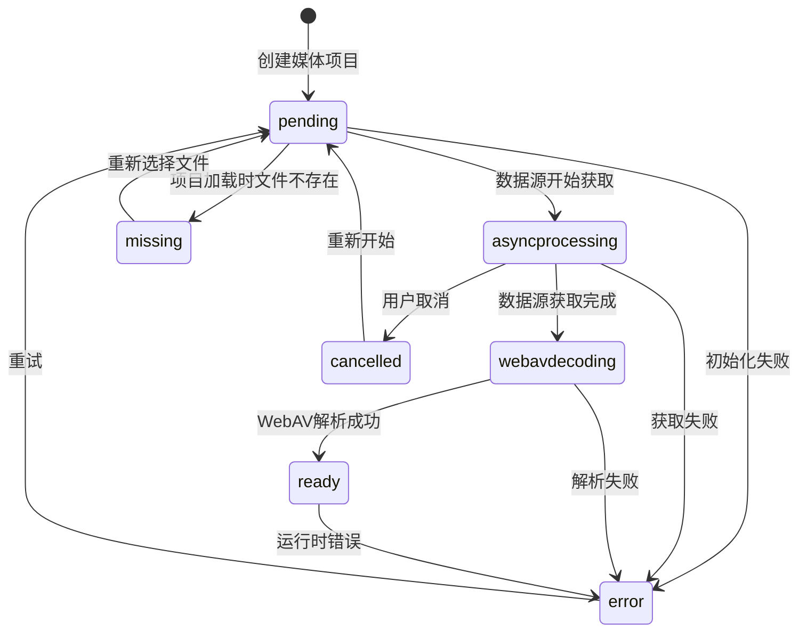

# 媒体类型统一设计 - 转换流程示例（响应式重构版）

## 概述

本文档基于"核心数据与行为分离"的重构方案，展示统一媒体类型的状态转换流程，采用响应式状态机模式，由各个管理器和行为函数主动驱动状态转换。

## 响应式状态转换流程

在响应式架构下，状态转换通过行为函数和数据源管理器协同完成：

### 1. 完整的转换流程（Vue组件）

```vue
<template>
  <div class="media-processing-flow">
    <h2>媒体处理流程演示</h2>

    <!-- 输入区域 -->
    <div class="input-section">
      <input type="file" @change="handleFileSelect" />
      <input v-model="remoteUrl" placeholder="远程文件URL" />
      <button @click="addRemoteFile">添加远程文件</button>
    </div>

    <!-- 流程可视化 -->
    <div class="flow-visualization">
      <div v-for="item in mediaItems" :key="item.id" class="flow-item">
        <!-- ✅ 响应式状态显示 -->
        <div class="flow-header">
          <h3>{{ item.name }}</h3>
          <div class="status-indicator" :class="item.mediaStatus">
            {{ item.mediaStatus }}
          </div>
        </div>

        <!-- ✅ 流程步骤 -->
        <div class="flow-steps">
          <div class="step" :class="{ active: item.mediaStatus === 'pending' }">
            1. 等待开始
          </div>
          <div class="step" :class="{ active: item.mediaStatus === 'asyncprocessing' }">
            2. 数据源获取
            <div v-if="item.mediaStatus === 'asyncprocessing'" class="step-details">
              进度: {{ item.source.progress }}%
              <div v-if="DataSourceQueries.isRemoteSource(item.source)">
                速度: {{ item.source.downloadSpeed || 'N/A' }}
              </div>
            </div>
          </div>
          <div class="step" :class="{ active: item.mediaStatus === 'webavdecoding' }">
            3. WebAV解析
          </div>
          <div class="step" :class="{ active: item.mediaStatus === 'ready' }">
            4. 就绪完成
            <div v-if="item.mediaStatus === 'ready'" class="step-details">
              时长: {{ item.duration }}帧
              <div v-if="getOriginalSize(item)">
                尺寸: {{ getOriginalSize(item)?.width }}x{{ getOriginalSize(item)?.height }}
              </div>
            </div>
          </div>
          <div class="step error" :class="{ active: UnifiedMediaItemQueries.hasError(item) }">
            ❌ 错误状态
            <div v-if="UnifiedMediaItemQueries.hasError(item)" class="step-details">
              {{ UnifiedMediaItemQueries.getError(item) }}
            </div>
          </div>
        </div>

        <!-- ✅ 操作按钮 -->
        <div class="actions">
          <button
            v-if="UnifiedMediaItemQueries.canRetry(item)"
            @click="retryItem(item)"
          >
            重试
          </button>
          <button
            v-if="UnifiedMediaItemQueries.isProcessing(item)"
            @click="cancelItem(item)"
          >
            取消
          </button>
        </div>
      </div>
    </div>
  </div>
</template>

<script setup lang="ts">
import { ref, watch } from 'vue'

const remoteUrl = ref('')
const mediaItems = ref<UnifiedMediaItemData[]>([])

// 处理文件选择
function handleFileSelect(event: Event) {
  const file = (event.target as HTMLInputElement).files?.[0]
  if (!file) return

  // ✅ 创建响应式数据源和媒体项目
  const source = DataSourceFactory.createUserSelectedSource(file)
  const mediaItem = createUnifiedMediaItemData(
    generateUUID4(),
    file.name,
    source
  )

  mediaItems.value.push(mediaItem)

  // ✅ 开始处理流程
  startMediaProcessingFlow(mediaItem)
}

// 添加远程文件
function addRemoteFile() {
  if (!remoteUrl.value) return

  const source = DataSourceFactory.createRemoteSource(remoteUrl.value)
  const mediaItem = createUnifiedMediaItemData(
    generateUUID4(),
    extractFileName(remoteUrl.value),
    source
  )

  mediaItems.value.push(mediaItem)
  startMediaProcessingFlow(mediaItem)

  remoteUrl.value = ''
}

// ✅ 开始媒体处理流程
function startMediaProcessingFlow(item: UnifiedMediaItemData) {
  console.log(`开始处理流程: ${item.name}`)

  // 监听数据源状态变化，自动驱动媒体状态转换
  watch(
    () => item.source.status,
    (newSourceStatus, oldSourceStatus) => {
      handleSourceStatusChange(item, newSourceStatus, oldSourceStatus)
    },
    { immediate: true }
  )

  // 开始数据源获取
  UnifiedDataSourceActions.startAcquisition(item.source)
}
</script>
```

### 2. 状态转换处理函数

```typescript
// ✅ 数据源状态变化处理
function handleSourceStatusChange(
  item: UnifiedMediaItemData,
  newSourceStatus: string,
  oldSourceStatus?: string
) {
  console.log(`数据源状态变化: ${item.name} ${oldSourceStatus} → ${newSourceStatus}`)

  switch (newSourceStatus) {
    case 'pending':
      // 数据源等待中，媒体项目也保持等待
      UnifiedMediaItemActions.transitionTo(item, 'pending')
      break

    case 'acquiring':
      // 数据源获取中，媒体项目进入异步处理状态
      UnifiedMediaItemActions.transitionTo(item, 'asyncprocessing', {
        type: 'async_processing',
        timestamp: Date.now(),
        source: 'DataSourceManager',
        reason: '数据源开始获取'
      })
      break

    case 'acquired':
      // 数据源获取完成，开始WebAV解析
      UnifiedMediaItemActions.transitionTo(item, 'webavdecoding', {
        type: 'async_processing',
        timestamp: Date.now(),
        source: 'DataSourceManager',
        reason: '数据源获取完成，开始WebAV解析'
      })

      // 启动WebAV处理
      startWebAVProcessing(item)
      break

    case 'error':
      // 数据源获取失败，媒体项目也进入错误状态
      UnifiedMediaItemActions.transitionTo(item, 'error', {
        type: 'error',
        timestamp: Date.now(),
        source: 'DataSourceManager',
        reason: '数据源获取失败',
        errorMessage: item.source.errorMessage || '未知错误',
        errorCode: 'DATA_SOURCE_ERROR',
        retryable: true
      })
      break

    case 'cancelled':
      // 数据源被取消，媒体项目也被取消
      UnifiedMediaItemActions.transitionTo(item, 'cancelled', {
        type: 'cancelled',
        timestamp: Date.now(),
        source: 'DataSourceManager',
        reason: '数据源获取被取消',
        cancelReason: '用户取消'
      })
      break
  }
}

// ✅ WebAV处理函数
async function startWebAVProcessing(item: UnifiedMediaItemData) {
  try {
    console.log(`开始WebAV解析: ${item.name}`)

    const startTime = Date.now()

    // 模拟WebAV解析过程
    const webavObjects = await parseMediaFile(item.source.file!)
    const metadata = extractMetadata(webavObjects)

    // 更新媒体项目数据
    item.webav = webavObjects
    item.duration = metadata.duration
    item.mediaType = metadata.mediaType

    // 转换到就绪状态
    UnifiedMediaItemActions.transitionTo(item, 'ready', {
      type: 'parse_completed',
      timestamp: Date.now(),
      source: 'WebAVProcessor',
      reason: 'WebAV解析完成',
      parsedMetadata: {
        duration: metadata.duration,
        resolution: metadata.resolution,
        format: metadata.format,
        bitrate: metadata.bitrate,
        codecInfo: {
          video: metadata.videoCodec,
          audio: metadata.audioCodec
        }
      },
      thumbnailGenerated: !!webavObjects.thumbnailUrl,
      webavObjects,
      parseTime: Date.now() - startTime
    })

    console.log(`WebAV解析完成: ${item.name}`)

  } catch (error) {
    console.error(`WebAV解析失败: ${item.name}`, error)

    // 转换到错误状态
    UnifiedMediaItemActions.transitionTo(item, 'error', {
      type: 'error',
      timestamp: Date.now(),
      source: 'WebAVProcessor',
      reason: 'WebAV解析失败',
      errorMessage: `WebAV解析失败: ${error.message}`,
      errorCode: 'WEBAV_PARSE_ERROR',
      retryable: false // WebAV解析错误通常不可重试
    })
  }
}
```

## 具体流程示例

### 1. 本地文件流程（响应式）

```typescript
// ✅ 1. 创建响应式数据源和媒体项目
const source = DataSourceFactory.createUserSelectedSource(file)
const item = createUnifiedMediaItemData(
  generateUUID4(),
  file.name,
  source
)

// ✅ 2. 设置状态监听
watch(
  () => item.source.status,
  (newStatus) => handleSourceStatusChange(item, newStatus)
)

// ✅ 3. 开始处理流程
UnifiedDataSourceActions.startAcquisition(source)
// 流程: pending → acquiring(瞬间完成) → acquired → webavdecoding → ready

console.log('本地文件处理流程:')
console.log('1. pending - 等待开始')
console.log('2. acquiring - 文件验证（瞬间完成）')
console.log('3. acquired - 验证完成')
console.log('4. webavdecoding - WebAV解析中')
console.log('5. ready - 解析完成，可以使用')
```

### 2. 远程文件流程（响应式）

```typescript
// ✅ 1. 创建远程数据源和媒体项目
const source = DataSourceFactory.createRemoteSource(url, {
  timeout: 30000,
  retryCount: 3
})
const item = createUnifiedMediaItemData(
  generateUUID4(),
  extractFileName(url),
  source
)

// ✅ 2. 设置状态监听
watch(
  () => item.source.status,
  (newStatus) => handleSourceStatusChange(item, newStatus)
)

// ✅ 3. 监听下载进度
watch(
  () => item.source.progress,
  (progress) => {
    if (DataSourceQueries.isRemoteSource(item.source)) {
      console.log(`下载进度: ${progress}%`)
      const stats = RemoteFileQueries.getDownloadStats(item.source)
      if (stats?.downloadSpeed) {
        console.log(`下载速度: ${stats.downloadSpeed}`)
      }
    }
  }
)

// ✅ 4. 开始处理流程
UnifiedDataSourceActions.startAcquisition(source)
// 流程: pending → acquiring(下载过程) → acquired → webavdecoding → ready

console.log('远程文件处理流程:')
console.log('1. pending - 等待开始')
console.log('2. acquiring - 下载中（显示进度）')
console.log('3. acquired - 下载完成')
console.log('4. webavdecoding - WebAV解析中')
console.log('5. ready - 解析完成，可以使用')
```

### 3. 错误处理流程（响应式）

```typescript
// ✅ 错误处理示例
function handleMediaError(item: UnifiedMediaItemData) {
  console.log(`媒体处理出错: ${item.name}`)
  console.log(`错误信息: ${UnifiedMediaItemQueries.getError(item)}`)

  // 检查是否可以重试
  if (UnifiedMediaItemQueries.canRetry(item)) {
    console.log('可以重试，等待用户操作')
  } else {
    console.log('无法重试，需要用户手动处理')
  }
}

// ✅ 重试处理
function retryMediaItem(item: UnifiedMediaItemData) {
  if (!UnifiedMediaItemQueries.canRetry(item)) {
    console.warn('当前状态无法重试')
    return
  }

  console.log(`重试媒体项目: ${item.name}`)

  // 重置状态并重新开始
  UnifiedMediaItemActions.retry(item)

  // 重新开始处理流程
  startMediaProcessingFlow(item)
}

// ✅ 取消处理
function cancelMediaItem(item: UnifiedMediaItemData) {
  if (!UnifiedMediaItemQueries.isProcessing(item)) {
    console.warn('当前状态无法取消')
    return
  }

  console.log(`取消媒体项目: ${item.name}`)
  UnifiedMediaItemActions.cancel(item)
}
```

## 响应式流程优势总结

### 1. 自动化状态同步
- **数据源状态** ↔ **媒体状态**：自动同步，无需手动调用
- **UI更新**：状态变化自动触发界面更新
- **进度显示**：下载进度自动反映到UI

### 2. 类型安全的状态转换
- **编译时检查**：TypeScript确保状态转换的合法性
- **运行时验证**：查询函数验证状态转换条件
- **错误预防**：避免无效的状态转换

### 3. 简化的错误处理
- **统一错误状态**：所有错误都通过相同的机制处理
- **自动重试逻辑**：支持配置化的重试策略
- **用户友好**：清晰的错误信息和操作提示

### 4. 完整的流程追踪
- **状态历史**：完整记录所有状态变化
- **性能监控**：记录各阶段耗时
- **调试支持**：详细的日志和状态信息

## 响应式状态转换图



## 总结

通过响应式状态机模式和行为函数驱动的设计：

### 1. 响应式优势
- **自动UI更新**：状态变化自动触发界面更新
- **实时进度**：下载和处理进度实时显示
- **无缝集成**：与Vue3响应式系统完美配合

### 2. 架构优势
- **职责清晰**：数据源管理器负责获取，行为函数负责状态转换
- **类型安全**：TypeScript确保状态转换的合法性
- **易于扩展**：新增数据源类型只需实现对应的行为函数

### 3. 开发体验
- **简化调试**：完整的状态转换历史和日志
- **错误处理**：统一的错误处理和重试机制
- **用户友好**：清晰的状态显示和操作反馈
