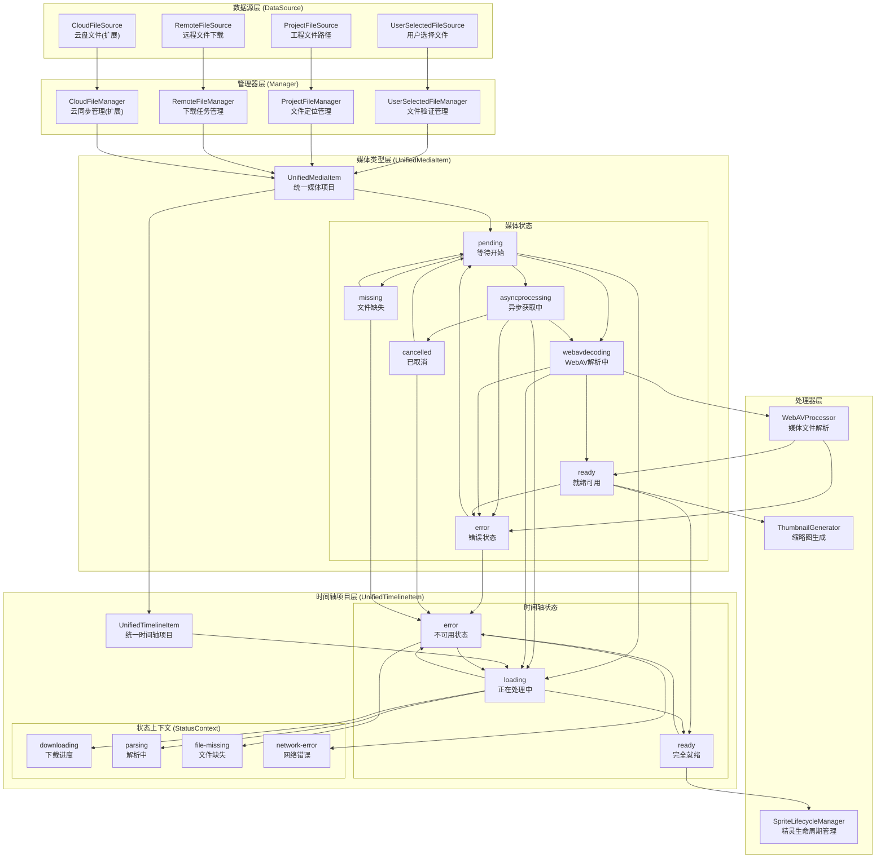
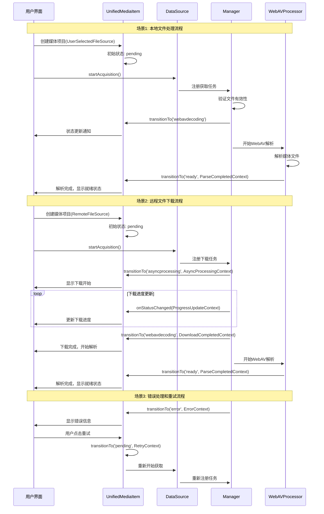
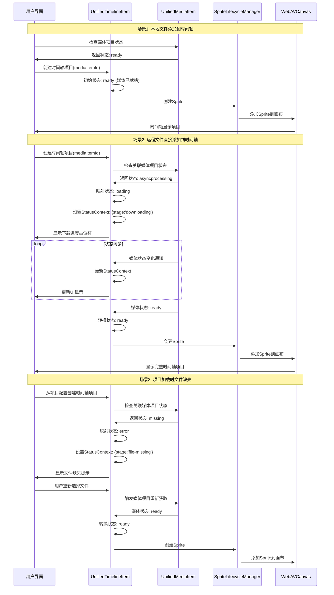
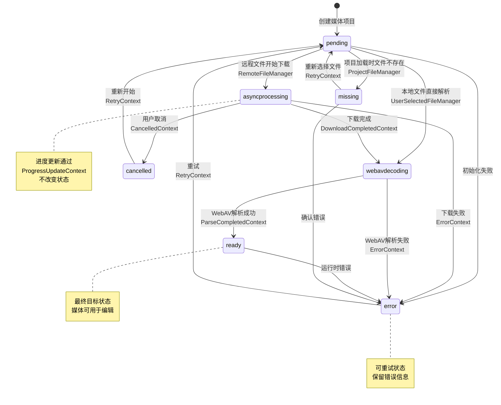
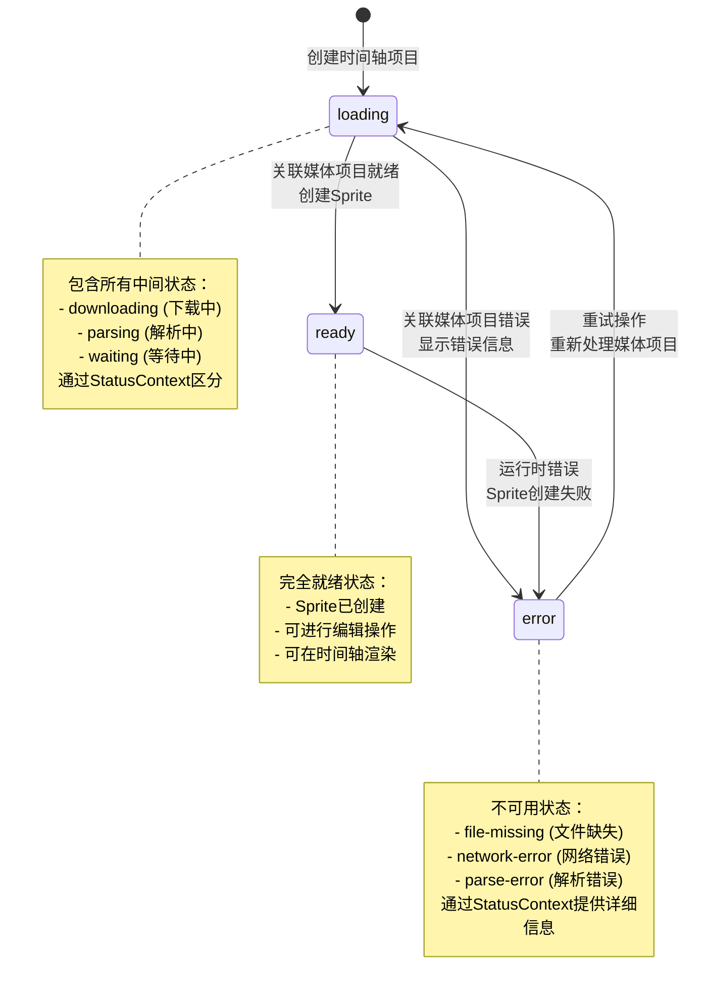
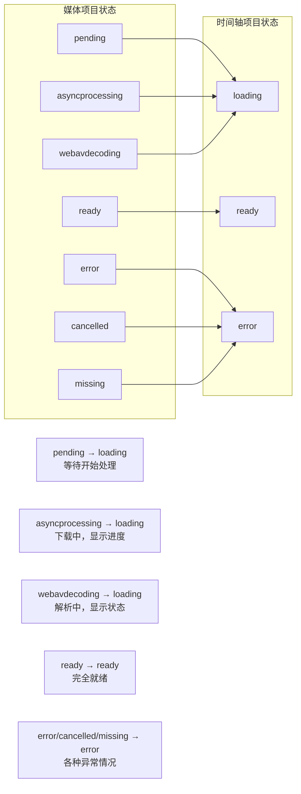

# 数据源——管理器——媒体类型流转过程总结

## 概述

本文档总结了AI视频编辑器重构设计中数据源——管理器——媒体类型的完整流转过程。该重构将原本复杂的双重类型系统（LocalMediaItem 和 AsyncProcessingMediaItem）统一为清晰的三层架构，实现了职责分离和状态驱动的设计模式。

## 核心设计理念

### 1. 职责分离

- **数据源层（DataSource）**：专注文件获取逻辑（下载、同步、验证）
- **管理器层（Manager）**：专注任务调度（并发控制、重试机制、资源管理）
- **媒体类型层（UnifiedMediaItem）**：专注业务逻辑（状态转换、WebAV处理）

### 2. 状态驱动

- 将"本地"和"异步"从**类型区分**改为**状态区分**
- 采用状态机模式，确保状态转换的合法性和可预测性
- 双重状态设计：数据源状态（获取文件）+ 媒体状态（处理文件）

### 3. 管理器驱动

- 状态转换由管理器主动调用，而非自动计算
- 通过TransitionContext提供丰富的上下文信息
- 支持类型安全的状态转换和错误处理

## 架构流转图



## 核心组件说明

### 数据源类型

1. **UserSelectedFileSource**：用户通过文件选择器选择的文件
   - 直接验证File对象有效性
   - 快速转换到webavdecoding状态

2. **ProjectFileSource**：从工程配置中加载的文件路径
   - 处理文件缺失和重新定位
   - 支持missing状态和文件重定位

3. **RemoteFileSource**：需要从网络下载的远程文件
   - 支持下载进度和并发控制
   - 经历完整的asyncprocessing阶段

4. **CloudFileSource**（扩展）：云存储服务文件
   - 支持多种云盘提供商
   - 处理认证和同步逻辑

### 管理器类型

1. **UserSelectedFileManager**：处理用户选择文件的验证
   - 单例模式，统一管理文件验证任务
   - 快速验证，直接进入解析阶段

2. **ProjectFileManager**：处理工程文件的定位和重定位
   - 检查文件存在性
   - 支持文件重新定位功能

3. **RemoteFileManager**：处理远程文件的下载
   - 并发控制和任务队列
   - 进度跟踪和错误重试

4. **CloudFileManager**（扩展）：处理云盘文件的同步
   - 认证管理和令牌刷新
   - 云端同步状态管理

### 媒体状态

- **pending**：等待开始处理
- **asyncprocessing**：异步获取中（下载、同步等）
- **webavdecoding**：WebAV解析中
- **ready**：就绪可用
- **error**：错误状态
- **cancelled**：已取消
- **missing**：文件缺失

### 时间轴项目类型

**UnifiedTimelineItem**：统一的时间轴项目，取代原有的双重类型系统
- 关联UnifiedMediaItem，通过mediaItemId建立关系
- 采用状态驱动设计，自动跟随媒体项目状态变化
- 统一的Sprite生命周期管理

### 时间轴状态（3状态简化设计）

- **ready**：完全就绪，可用于时间轴渲染和编辑
- **loading**：正在处理中，包含下载、解析、等待等所有中间状态
- **error**：不可用状态，包含错误、缺失、取消等异常情况

### 状态上下文（StatusContext）

承载时间轴项目的详细状态信息，用于UI展示和用户反馈：

- **downloading**：下载进度信息（百分比、速度、剩余时间）
- **parsing**：解析状态信息（"正在解析..."、"生成缩略图..."）
- **file-missing**：文件缺失信息（原路径、重新选择选项）
- **network-error**：网络错误信息（错误类型、重试选项）

### 媒体状态到时间轴状态的映射

```
pending → loading          (等待开始处理)
asyncprocessing → loading  (下载/获取中，显示下载进度)
webavdecoding → loading    (解析中，显示"解析中..."文案)
ready → ready             (完全就绪)
error → error             (各种错误状态)
cancelled → error         (用户取消)
missing → error           (文件缺失)
```

## 流转时序图

### 媒体项目处理流程



### 时间轴项目处理流程



## 状态机转换图

### 媒体项目状态转换



### 时间轴项目状态转换（3状态简化设计）



### 媒体状态到时间轴状态的映射关系



## 关键流转过程

### 1. 本地文件处理流程

```
用户选择文件 → 创建UserSelectedFileSource → 创建UnifiedMediaItem(pending)
→ UserSelectedFileManager验证文件 → 转换到webavdecoding
→ WebAVProcessor解析 → 转换到ready状态
```

**特点**：
- 跳过asyncprocessing阶段，直接进入解析
- 处理速度快，用户体验好
- 主要验证文件格式和可读性

### 2. 远程文件下载流程

```
输入远程URL → 创建RemoteFileSource → 创建UnifiedMediaItem(pending)
→ RemoteFileManager开始下载 → 转换到asyncprocessing
→ 下载进度更新（ProgressUpdateContext）
→ 下载完成 → 转换到webavdecoding
→ WebAVProcessor解析 → 转换到ready状态
```

**特点**：
- 经历完整的异步处理阶段
- 支持进度跟踪和用户反馈
- 包含网络错误处理和重试机制

### 3. 项目加载流程

```
加载项目配置 → 创建ProjectFileSource → 创建UnifiedMediaItem(pending)
→ ProjectFileManager检查文件存在性
→ 文件存在：转换到webavdecoding → ready
→ 文件缺失：转换到missing → 等待用户重新选择
```

**特点**：
- 处理文件路径变更和缺失情况
- 支持文件重新定位功能
- 保持项目完整性

### 4. 错误处理和重试流程

```
任何阶段出错 → 转换到error状态 → 记录错误信息
→ 用户选择重试 → 转换到pending状态 → 重新开始流程
```

**特点**：
- 支持自动重试和手动重试
- 保留详细的错误上下文信息
- 指数退避策略避免频繁重试

## 时间轴项目流转过程

### 5. 本地文件添加到时间轴流程（3状态简化版）

```
用户拖拽本地文件 → 创建UnifiedMediaItem(pending)
├─ MediaItem状态: pending → webavdecoding → ready
├─ 在媒体库中显示: loading状态（解析中...）
├─ WebAV解析完成 → MediaItem变为ready（有duration等元数据）
└─ 用户从媒体库拖拽到时间轴 → 创建UnifiedTimelineItem(ready)
   └─ 直接创建sprite，因为MediaItem已经ready
```

**特点**：
- ✅ **分离关注点**：媒体解析 vs 时间轴使用
- ✅ **数据完整性**：只有ready的MediaItem才能创建TimelineItem
- ✅ **用户体验**：媒体库显示解析进度，时间轴只接受ready的媒体
- ✅ **避免错误**：防止没有duration的媒体被添加到时间轴

### 6. 远程文件直接添加到时间轴流程（3状态简化版）

```
输入远程URL → 创建UnifiedMediaItem(pending)
├─ MediaItem状态: pending → asyncprocessing → webavdecoding → ready
├─ 同时创建UnifiedTimelineItem(loading)
├─ TimelineItem监听MediaItem状态变化
├─ StatusContext: {stage:'downloading', progress:{percent:0, speed:'25KB/s'}}
├─ 下载完成 → StatusContext: {stage:'parsing', message:'正在解析...'}
└─ MediaItem变为ready → TimelineItem变为ready → 创建Sprite
```

**特点**：
- ✅ **并行处理**：MediaItem处理下载和解析，TimelineItem显示状态
- ✅ **状态同步**：TimelineItem自动跟随MediaItem的状态变化
- ✅ **进度展示**：通过StatusContext显示下载进度和解析状态
- ✅ **统一管理**：所有异步操作都在MediaItem层面处理

### 7. 项目加载时间轴项目流程（3状态简化版）

```
加载项目配置 → 读取TimelineItem配置 → 查找关联的MediaItem
├─ MediaItem存在且ready？
   ├─ 是：直接创建UnifiedTimelineItem(ready) → 创建Sprite
   └─ 否：创建UnifiedTimelineItem(loading) → 等待MediaItem ready
├─ 源文件存在？
   ├─ 是：创建/恢复UnifiedMediaItem → 解析 → ready
   └─ 否：TimelineItem变为error(StatusContext.stage='file-missing')
```

**特点**：
- ✅ **依赖检查**：先确保MediaItem存在且ready
- ✅ **文件验证**：检查源文件是否存在
- ✅ **状态恢复**：根据MediaItem状态决定TimelineItem初始状态
- ✅ **错误处理**：文件缺失时提供重新选择文件的选项

### 8. Sprite生命周期自动化流程

```
TimelineItem状态变化 → SpriteLifecycleManager监听
├─ loading → ready：创建Sprite → 添加到WebAV画布
├─ ready → error：销毁Sprite → 从画布移除
├─ error → loading：清理旧状态 → 准备重新创建
└─ 任何状态变化：更新UI显示 → 触发重渲染
```

**特点**：
- ✅ **自动化管理**：无需手动管理Sprite生命周期
- ✅ **状态驱动**：基于TimelineItem状态自动创建/销毁Sprite
- ✅ **资源安全**：确保Sprite与状态保持一致，避免内存泄漏
- ✅ **性能优化**：只在必要时创建Sprite，减少资源消耗

## TransitionContext 上下文系统

### 上下文类型

1. **AsyncProcessingContext**：异步处理开始
   - 初始进度、预估时间等信息

2. **ProgressUpdateContext**：进度更新
   - 当前进度、下载速度、剩余时间等

3. **DownloadCompletedContext**：下载完成
   - 文件信息、下载统计、性能数据等

4. **ParseCompletedContext**：解析完成
   - 媒体元数据、WebAV对象、解析时间等

5. **ErrorContext**：错误处理
   - 错误信息、错误代码、重试策略等

6. **RetryContext**：重试操作
   - 重试次数、延迟时间、上次错误等

### 上下文优势

- **类型安全**：每种场景都有明确的上下文结构
- **语义清晰**：通过type字段明确标识上下文类型
- **扩展性强**：新增场景时只需添加新的上下文类型
- **可调试性好**：包含完整的转换信息，便于问题排查

## 设计优势

### 1. 架构清晰

- **单一职责**：每个组件都有明确的职责边界
- **层次分明**：数据源、管理器、媒体类型各司其职
- **接口统一**：所有数据源都实现相同的基础接口

### 2. 扩展性强

- **插件化设计**：新增数据源类型只需继承BaseDataSource
- **管理器注册**：支持动态注册和管理不同类型的管理器
- **状态扩展**：可以轻松添加新的媒体状态和转换规则

### 3. 用户体验优化

- **进度反馈**：详细的下载和处理进度信息
- **错误处理**：友好的错误提示和重试机制
- **状态可视化**：清晰的状态显示和转换动画

### 4. 开发体验提升

- **类型安全**：完整的TypeScript类型定义
- **调试友好**：详细的状态转换日志和上下文信息
- **测试便利**：清晰的状态机便于单元测试

### 5. 性能优化

- **并发控制**：管理器层面的任务队列和并发限制
- **资源管理**：自动清理已完成任务，避免内存泄漏
- **懒加载**：按需创建和初始化组件

## 实现建议

### 1. 开发顺序

1. **实现数据源基础类**：从BaseDataSource开始
2. **实现具体数据源**：UserSelectedFileSource、ProjectFileSource、RemoteFileSource
3. **实现管理器基础类**：DataSourceManager抽象类
4. **实现具体管理器**：各种数据源对应的管理器
5. **实现统一媒体类型**：UnifiedMediaItem和状态转换逻辑
6. **实现统一时间轴项目**：UnifiedTimelineItem和3状态设计
7. **实现Sprite生命周期管理器**：SpriteLifecycleManager自动化管理
8. **实现状态同步机制**：媒体项目到时间轴项目的状态映射
9. **集成和测试**：端到端测试各种场景

### 2. 关键注意事项

- **状态转换安全**：严格按照状态机规则进行转换
- **错误处理完善**：每个阶段都要有适当的错误处理
- **内存管理**：及时清理不再需要的资源
- **并发安全**：管理器层面要处理好并发访问

### 3. 测试策略

- **单元测试**：每个组件的独立功能测试
- **集成测试**：组件间的协作测试
- **状态机测试**：所有状态转换路径的测试
- **错误场景测试**：各种异常情况的处理测试

## 总结

这个重构设计成功地将原本复杂的双重类型系统统一为清晰的四层架构，实现了：

- **概念统一**：将"本地"和"异步"从类型区分改为状态区分
- **职责分离**：数据源、管理器、媒体类型、时间轴项目各司其职
- **状态驱动**：采用状态机模式，确保状态转换的可预测性
- **扩展性强**：支持多种数据源类型和处理场景
- **用户体验优化**：丰富的进度信息和错误处理
- **时间轴统一**：统一的时间轴项目设计，简化Sprite生命周期管理

通过这个设计，项目的可维护性、扩展性和用户体验都得到了显著提升，为后续的功能开发奠定了坚实的基础。

### 核心价值

1. **简化架构**：从双重类型系统简化为单一统一类型
2. **提升可维护性**：清晰的职责分离和状态管理
3. **增强扩展性**：支持未来新增的数据源类型
4. **优化用户体验**：详细的进度反馈和错误处理
5. **提高开发效率**：类型安全和调试友好的设计
6. **统一时间轴管理**：3状态简化设计，自动化Sprite生命周期
7. **状态同步机制**：媒体项目与时间轴项目的自动状态映射

### 未来扩展方向

- **云存储集成**：支持Google Drive、Dropbox、OneDrive等
- **协作功能**：多用户共享和实时同步
- **缓存优化**：智能缓存策略提升性能
- **离线支持**：离线编辑和后台同步
- **批量处理**：大规模文件的批量导入和处理

---

*文档创建时间：2025-01-18*
*基于重构文档版本：v1.0*
*作者：AI助手*
