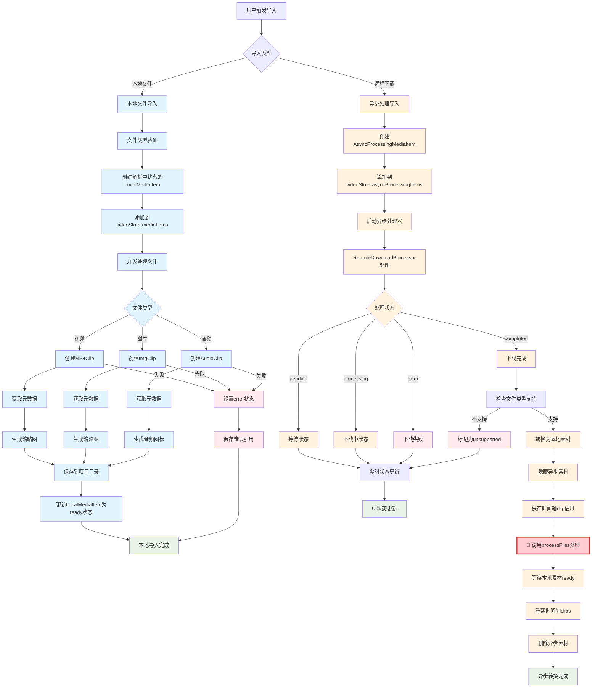
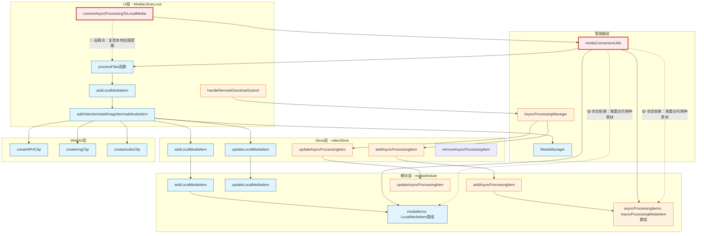

# 素材库导入流程分析

## 概述

素材库支持两种导入方式：
1. **本地素材导入** - 直接处理用户选择的本地文件
2. **异步素材导入** - 通过远程下载等异步处理方式获取素材

## 1. 本地素材导入流程

### 1.1 触发方式
- 拖拽文件到素材库
- 点击导入按钮选择文件
- 右键菜单选择"导入本地文件"

### 1.2 处理流程

#### 阶段1：文件验证和初始化
```typescript
// 文件类型验证
const mediaFiles = files.filter(
  (file) => file.type.startsWith('video/') ||
            file.type.startsWith('image/') ||
            SUPPORTED_AUDIO_TYPES.includes(file.type)
)

// 创建解析中状态的LocalMediaItem
const parsingMediaItem: LocalMediaItem = {
  id: mediaItemId,
  name: file.name,
  status: 'parsing', // 关键状态
  mp4Clip: null,     // 等待解析
  // ...其他属性
}
```

#### 阶段2：并发处理（最大并发数：5）
```typescript
// 根据文件类型分别处理
if (isVideo) {
  await addVideoItem(file, url, mediaItemId, startTime, resolve)
} else if (isImage) {
  await addImageItem(file, url, mediaItemId, startTime, resolve)
} else if (isAudio) {
  await addAudioItem(file, url, mediaItemId, startTime, resolve)
}
```

#### 阶段3：WebAV解析
- **视频文件**：创建MP4Clip，获取元数据（时长、分辨率）
- **图片文件**：创建ImgClip，获取图片尺寸
- **音频文件**：创建AudioClip，获取音频时长

#### 阶段4：缩略图生成
- 视频：从第一帧生成缩略图
- 图片：直接使用图片作为缩略图
- 音频：生成默认音频图标

#### 阶段5：文件保存
```typescript
// 保存到项目目录
mediaReference = await mediaManager.importMediaFiles(
  file, 
  clip, 
  videoStore.currentProjectId, 
  mediaType
)
```

#### 阶段6：状态更新
```typescript
// 更新为ready状态
const readyMediaItem: LocalMediaItem = {
  ...parsingMediaItem,
  status: 'ready',
  mp4Clip: markRaw(mp4Clip),
  thumbnailUrl,
  duration: durationFrames
}
videoStore.updateLocalMediaItem(readyMediaItem)
```

### 1.3 错误处理
- 解析失败时设置`status: 'error'`
- 保留在素材库中显示错误状态
- 保存错误引用到项目文件

## 2. 异步素材导入流程

### 2.1 触发方式
- 右键菜单选择"远程下载"
- 输入下载配置（URL、预计时长等）

### 2.2 处理流程

#### 阶段1：创建异步处理项目
```typescript
const asyncProcessingItem = asyncProcessingManager.createAsyncProcessingMediaItem(
  'remote-download',
  config,
  expectedDuration,
  name
)
```

#### 阶段2：添加到异步处理列表
```typescript
// 添加到videoStore.asyncProcessingItems
videoStore.addAsyncProcessingItem(asyncProcessingItem)
```

#### 阶段3：启动异步处理
```typescript
// 使用RemoteDownloadProcessor处理
asyncProcessingManager.startProcessing(
  asyncProcessingItem,
  (updatedItem) => {
    // 实时状态更新回调
    videoStore.updateAsyncProcessingItem(updatedItem)
  }
)
```

#### 阶段4：状态管理
- **pending**: 等待开始处理
- **processing**: 正在下载，显示进度
- **completed**: 下载完成
- **error**: 下载失败
- **unsupported**: 文件类型不支持

#### 阶段5：转换为本地素材（completed状态）
```typescript
// 检查文件类型支持
if (!asyncProcessingManager.isSupportedMediaType(processedFile)) {
  // 标记为unsupported，保持占位符状态
  return
}

// 转换流程
1. 隐藏异步素材（isConverting: true）
2. 保存时间轴clip信息
3. 调用processFiles处理下载的文件
4. 等待本地素材解析完成
5. 重建时间轴clips
6. 删除异步素材
```

### 2.3 时间轴集成
- 异步处理素材可以拖拽到时间轴
- 创建AsyncProcessingTimelineItem占位符
- 转换完成后自动替换为LocalTimelineItem

## 3. 关键设计特点

### 3.1 状态管理
- **LocalMediaItem**: `parsing` → `ready` / `error`
- **AsyncProcessingMediaItem**: `pending` → `processing` → `completed` / `error` / `unsupported`

### 3.2 并发控制
- 本地文件处理：最大并发数5
- 异步处理：独立的处理队列

### 3.3 错误处理
- 保留错误状态的素材在库中
- 提供详细的错误信息
- 不阻断其他素材的处理

### 3.4 UI响应性
- 实时状态更新
- 进度显示
- 拖拽状态控制

## 4. 潜在改进点

### 4.1 流程清晰度
1. **状态转换逻辑复杂**：两套不同的状态管理系统
2. **转换时机不明确**：异步素材何时转换为本地素材
3. **错误处理不统一**：本地和异步的错误处理方式不同

### 4.2 建议优化
1. **统一状态管理**：考虑使用统一的状态机
2. **明确转换策略**：定义清晰的转换触发条件
3. **改进错误提示**：提供更友好的错误信息和重试机制
4. **优化UI反馈**：改进加载状态和进度显示

## 5. 代码结构

### 5.1 主要文件
- `MediaLibrary.vue` - 主组件，处理UI和流程协调
- `AsyncProcessingManager.ts` - 异步处理管理器
- `MediaManager.ts` - 媒体文件管理器
- `mediaConversionUtils.ts` - 转换工具函数

### 5.2 关键函数
- `processFiles()` - 本地文件处理入口
- `addLocalMediaItem()` - 添加本地素材
- `handleRemoteDownloadSubmit()` - 异步下载处理
- `convertAsyncProcessingToLocalMedia()` - 异步转本地转换

## 6. 流程图与耦合度分析

### 6.1 整体导入流程图



### 6.2 耦合度架构图



## 7. 耦合度分析

### 7.1 耦合度评估

#### 🔴 高耦合区域

**1. 转换逻辑 (`mediaConversionUtils.ts`)**
```typescript
// 异步素材转换时直接调用本地处理函数
export async function convertAsyncProcessingToLocalMedia(
  asyncProcessingItem: AsyncProcessingMediaItem,
  processFiles: (files: File[]) => Promise<void>  // 直接依赖本地处理函数
): Promise<void> {
  // ...
  await processFiles(files)  // 复用本地处理逻辑
}
```

**耦合表现：**
- 异步处理完成后必须通过本地处理流程
- `convertAsyncProcessingToLocalMedia` 函数直接依赖 `processFiles`
- 无法独立修改异步处理逻辑

**2. UI层函数复用 (`MediaLibrary.vue`)**
```typescript
// 异步转换时传入本地处理函数
const convertAsyncProcessingToLocalMedia = async (asyncProcessingItem: AsyncProcessingMediaItem) => {
  const { convertAsyncProcessingToLocalMedia: convertFunction } = await import('../utils/mediaConversionUtils')
  return convertFunction(asyncProcessingItem, processFiles)  // 传入本地处理函数
}
```

#### 🟡 中等耦合区域

**1. Store层状态管理**
```typescript
// videoStore中分别管理两种素材类型
return {
  // 本地素材
  addLocalMediaItem,
  updateLocalMediaItem,
  removeLocalMediaItem,

  // 异步素材
  addAsyncProcessingItem,
  updateAsyncProcessingItem,
  removeAsyncProcessingItem,
}
```

#### 🟢 低耦合区域

**1. 数据存储层 (`mediaModule.ts`)**
```typescript
// 独立的数据存储
const mediaItems = ref<LocalMediaItem[]>([])
const asyncProcessingItems = ref<AsyncProcessingMediaItem[]>([])
```

**2. 处理器层 (`AsyncProcessingManager.ts`)**
```typescript
// 独立的异步处理逻辑
class AsyncProcessingManager {
  private processors = new Map<AsyncProcessingType, AsyncProcessor>()
  // 完全独立的处理流程
}
```

### 7.2 耦合度评分

| 层级 | 本地导入 | 异步导入 | 耦合度 | 评分 |
|------|----------|----------|--------|------|
| UI层 | 独立实现 | 依赖本地处理 | 高 | 7/10 |
| Store层 | 独立API | 独立API | 中 | 4/10 |
| 数据层 | 独立存储 | 独立存储 | 低 | 2/10 |
| 处理层 | WebAV处理 | 独立处理器 | 低 | 2/10 |

**总体耦合度：4/10（中等耦合）**

### 7.3 耦合带来的问题

#### 1. 维护性问题
- 修改本地处理逻辑可能影响异步处理
- 异步处理的错误可能传播到本地处理
- 代码复杂度增加

#### 2. 扩展性问题
- 难以独立优化异步处理流程
- 新增异步处理类型需要考虑本地处理兼容性
- 无法独立部署或测试异步处理模块

#### 3. 性能问题
- 异步素材需要经过额外的转换步骤
- 增加了内存使用（同时存在两种素材状态）
- 可能出现重复的文件处理

### 7.4 解耦建议

#### 1. 短期优化（保持现有架构）
```typescript
// 抽象共同的处理接口
interface MediaProcessor {
  process(file: File): Promise<LocalMediaItem>
}

// 本地处理器
class LocalMediaProcessor implements MediaProcessor {
  async process(file: File): Promise<LocalMediaItem> {
    // 现有的本地处理逻辑
  }
}

// 异步处理器可以直接使用相同接口
```

#### 2. 中期重构（统一处理流程）
```typescript
// 统一的素材处理管道
class MediaProcessingPipeline {
  async processMedia(source: File | AsyncProcessingResult): Promise<LocalMediaItem> {
    // 统一的处理逻辑，支持多种输入源
  }
}
```

#### 3. 长期架构（完全解耦）
```typescript
// 事件驱动架构
class MediaEventBus {
  emit(event: 'media-ready', mediaItem: LocalMediaItem): void
  on(event: 'async-completed', handler: (result: AsyncResult) => void): void
}

// 各模块通过事件通信，完全解耦
```

## 8. 代码结构

### 8.1 主要文件
- `MediaLibrary.vue` - 主组件，处理UI和流程协调
- `AsyncProcessingManager.ts` - 异步处理管理器
- `MediaManager.ts` - 媒体文件管理器
- `mediaConversionUtils.ts` - 转换工具函数

### 8.2 关键函数
- `processFiles()` - 本地文件处理入口（🔴 高耦合点）
- `addLocalMediaItem()` - 添加本地素材
- `handleRemoteDownloadSubmit()` - 异步下载处理
- `convertAsyncProcessingToLocalMedia()` - 异步转本地转换（🔴 高耦合点）

## 9. 总结与建议

### 9.1 现状总结
当前的素材库导入流程存在**中等程度的耦合（4/10）**，主要体现在：
1. 异步处理完成后必须通过本地处理流程
2. UI层需要处理两种不同的素材类型
3. 转换逻辑直接依赖本地处理函数

### 9.2 优化建议
1. **立即行动**：标识和文档化所有耦合点
2. **短期优化**：抽象 `MediaProcessor` 接口，统一处理逻辑
3. **中期重构**：建立统一的 `MediaProcessingPipeline`
4. **长期架构**：采用事件驱动架构，实现完全解耦

### 9.3 优先级
1. **高优先级**：解决 `convertAsyncProcessingToLocalMedia` 的强依赖问题
2. **中优先级**：统一状态管理和错误处理机制
3. **低优先级**：重构为事件驱动架构

